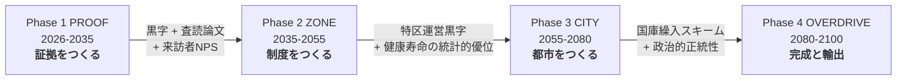

<!--
  提出フォーム項目とREADMEの対応メモ（公開情報のみ記載する方針）
  - 記載する : 1-1 チーム名 / 1-8 メンバー構成と役割 / 1-9 運用体制（任意） /
               2-1 課題の種類 / 2-2 作品名 / 2-3 サービスの詳細 / 2-4 着目した課題・背景 /
               2-5 解決方法 / 3-1 技術選定の理由 / 3-2 生成AI等の活用 / 3-7 ハードウェア有無 /
               4-1 利用データ一覧 / 5-2 画面キャプチャ
  - 条件付き : 3-3 デモURL（3-6が「はい」のときのみ）/ 3-8 デモ操作動画URL / 5-1 プレゼン資料（公開可なら）
  - 記載しない: 1-2〜1-7（個人情報・応募区分）/ 3-5 その他のURL（非公開指定）/ 6 収録日予約 / 7 同意事項
  - フォームは各310文字制限。READMEを原本として書き、フォームにはその要約を転記する。
-->

# 作品名（未定）

> 都知事杯オープンデータ・ハッカソン2026 応募作品 ｜ 課題の種類: 自由課題 / テーマあり（いずれかを残す）

<!-- TODO: サービスを1〜2文で。フォーム 2-3 の要約としてそのまま使える長さにする -->
（キャッチコピー・一行説明をここに）

## 目次

- [サービス概要](#サービス概要)
- [着目した課題・背景](#着目した課題背景)
  - [1. 前提となる現状](#1-前提となる現状)
  - [2. 目指す未来のコンセプト](#2-目指す未来のコンセプト)
  - [3. 現在とのギャップ](#3-現在とのギャップ)
  - [4. 解決するために越える大きな課題](#4-解決するために越える大きな課題)
- [解決アプローチ](#解決アプローチ)
  - [5. 課題をクリアするための具体的な取り組み](#5-課題をクリアするための具体的な取り組み)
  - [本ハッカソンでの位置づけ](#本ハッカソンでの位置づけ)
- [デモ](#デモ)
- [スクリーンショット](#スクリーンショット)
- [利用オープンデータ](#利用オープンデータ)
- [技術構成と選定理由](#技術構成と選定理由)
- [生成AIの活用](#生成aiの活用)
- [セットアップ・実行方法](#セットアップ実行方法)
- [ディレクトリ構成](#ディレクトリ構成)
- [今後の展望・運用体制](#今後の展望運用体制)
- [チーム](#チーム)
- [ライセンス](#ライセンス)
- [調査資料](#調査資料-docsresearch)
- [コンセプトリサーチ](#コンセプトリサーチ-docsconcept-research)

## サービス概要

<!-- フォーム 2-3「サービスの詳細」の詳述版。誰が・何に困っているときに・何をすると・どうなるか -->
（TODO）

**主な機能**

- （TODO）
- （TODO）
- （TODO）

## 着目した課題・背景

<!-- フォーム 2-4。可能な限り一次データ・出典付きで。docs/research の調査レポートを引用できる -->

### 1. 前提となる現状

東京は、世界のどの都市より先に超高齢社会の最深部へ入る。
にもかかわらず、**「2100年の東京」を語るための土台が、公的データとしては分野ごとにバラバラの年で途切れている。**

| 分野 | 公的資料が到達する年 | 代表値 |
| :-- | :-- | :-- |
| **気候** | **21世紀末（2081–2100）** | 年平均気温は20世紀末比で **+1.4℃**（2℃上昇シナリオ）／**+4.3℃**（4℃上昇シナリオ）。猛暑日 約2日/年 → 約8日 または 約30日。熱帯夜 約7日/年 → 約21日 または 約62日 |
| 海面水位 | 21世紀末（日本沿岸平均） | 1986–2005年平均比 **+0.40m**（2℃）／**+0.68m**（4℃） |
| 人口（全国） | 2120年まで長期参考推計あり | 2100年 **62,779千人**（出生中位・死亡中位）。うち65歳以上 25,087千人 |
| **人口（東京都）** | **2050年（IPSS地域推計）／2065年（2050東京戦略）** | 2026-07-01 推計人口 **14,301,986人**。2040年 14,507,419人、2050年 14,399,144人 |
| 経済 | 2045年（就業者予測） | 2023年度 名目都内総生産 **約125.0兆円**（国内総生産の 21.0%）。昼間就業者は2030年 10,461,320人をピークに2045年 9,644,518人へ |
| 住環境 | 2050年（世帯推計）／2030年度（住宅マスタープラン） | 2023年 総住宅数 8,201,400戸・空き家 896,500戸（**空き家率 10.9%**）。単独世帯割合 2020年 50.2% → 2050年 **54.1%** |

**東京都の2100年人口には、現行の公的推計に単一の公式値が存在しない。** かつて「東京の自治のあり方研究会」が 2100年713万人・高齢化率約46% と試算したが、これは2012年前後の仮定に基づく歴史的長期推計であり、現行のIPSS地域推計でも「2050東京戦略」でもない。

> つまり現状は、**気候だけが21世紀末まで見えていて、人・経済・住まいは2045〜2065年で視界が切れている**。
> 75年先を設計するための材料が、公的データの側に用意されていない。

出典と読み方は [2100年の東京：一次情報中心の調査整理](docs/research/population/20260822-tokyo-2100-primary-source-research.md) に整理した。

### 2. 目指す未来のコンセプト

> ### SILVERPUNK // 2100
> **「老い」を都市最大の輸出資源に転換する。**
> 2100年の東京は、高齢者が主役として働き、世界が長寿を体験しに来る都市国家型テーマパークである。

cyberpunk が「ハイテク・ローライフ」への反逆だったように、SILVERPUNK は**自動化・効率至上主義の未来像への反逆**である。世界中の都市がAIと無人化で均質化していく2100年に、東京だけが「人間が、しかも最も経験を積んだ人間が接客する」という逆張りを都市戦略として採る。

価値は独立した柱ではなく、**互いを証明し合う三位一体**として設計する。

| 柱 | 内容 |
| :-- | :-- |
| **体験価値** | 高齢者が現役で働く姿そのものが、最大の展示物になる |
| **医療価値** | 「なぜ彼らは90歳で働けるのか」の答えがエイジング医療であり、働く高齢者全員が生きた臨床エビデンスになる |
| **データ・知財価値** | 就労高齢者の常時バイタルが世界最大級の健康長寿コホートとなり、医療プロトコル・都市運営メソッドとして輸出可能になる |

**2100年に成立しているべき状態**（バックキャストの起点）

- 指定エリアが「超高齢東京特区」として一体運営され、**職・住・医・福が徒歩圏＋無人モビリティ圏で完結**している
- ユニバーサルデザインが建築基準としてデフォルト化し、「バリアフリー対応」という言葉自体が死語になっている
- 全就労者・全居住者が **ウェアラブル＋住環境＋労働環境の三層ヘルスモニタリング** に接続され、異常検知から医療介入までが分単位である
- 高齢就労が「福祉」ではなく **「花形」** として認知され、特区での就労が競争的・選抜的である
- 体調・意欲に応じて **週1時間から働ける完全流動シフト** が標準で、労働と療養がシームレスに切り替わる

これを物理層で支える設計思想が **ユニバーサルアシストデザイン（UAD）** である。バリアフリーが障壁の「除去」、ユニバーサルデザインが「全員が使える受動的な設計」であるのに対し、UAD は**環境・機器・情報の三層が能動的にアシストする**点が決定的に異なる。→ [概念整理](docs/concept-research/20260822-universal-assist-design-mobility-logistics-concept.md)

### 3. 現在とのギャップ

2100年のあるべき姿と2026年の現状の差分は10領域ある。重要なのは、**ギャップの「性質」が3種類に分かれ、打ち手がまったく違う**ことである。

| # | 領域 | ギャップの本質 | 型 |
| :-- | :-- | :-- | :-- |
| G7 | 記憶 | 昭和文化の担い手（1940〜50年代生）が今まさに引退・逝去中。技能・語りのアーカイブは断片的 | **時間切れ** |
| G1 | 制度 | 医療ツーリズム・柔軟就労・建築基準を束ねた包括特区の **立法事実（実証データ）が存在しない** | 実証不足 |
| G2 | 労働 | 「働く」と「療養する」を行き来できる **法的身分がない**。ギグ的高齢就労は法的グレー | 実証不足 |
| G5 | 医療 | 老化研究のシーズと商用医療の間の **「実証フィールド」が国内にない** | 実証不足 |
| G6 | 文化 | 「高齢者を働かせるのか」という批判。**搾取と誇りの境界線を誰も引いていない** | 実証不足 |
| G8 | 資本 | 日本のファンドは10年前後の回収期待。**75年計画に耐える資本設計の前例がほぼない** | 実証不足 |
| G9 | ブランド | 世界観の先行占有（商標・映像・コミュニティ）が未着手 | 実証不足 |
| G3 | 技術 | 部品は存在するが、住宅・職場・医療を跨ぐ **データ統合と個人情報法制が未成立** | 技術成熟待ち |
| G4 | 技術 | 「高齢者が8時間ではなく **2時間×分散** で使う」前提のアシスト機器設計が存在しない | 技術成熟待ち |
| G10 | モビリティ・翻訳 | 自動運転はレベル4限定区域、同時翻訳は実用域手前。相対的に小さい | 技術成熟待ち |

| 型 | 打ち手の性質 |
| :-- | :-- |
| **時間切れ型（G7）** | 待つほど不可逆に失われる → **最優先・即時着手** |
| **実証不足型（G1・G2・G5・G6・G8・G9）** | 技術も資本も存在するが、制度と社会認知を動かす「証拠」がない → **小規模実証で立法事実と投資材料を作る** |
| **技術成熟待ち型（G3・G4・G10）** | 市場が勝手に進む部分が大きい → **要件定義と標準策定で先回りし、自社開発は最小化** |

### 4. 解決するために越える大きな課題

| 優先 | 課題 | 対応ギャップ | 期限感 |
| :-- | :-- | :-- | :-- |
| **P0** | **記憶の緊急アーカイブ** — 昭和〜平成の技能者・語り部の演目収録と継承カリキュラム化 | G7 | 2026〜2032（不可逆） |
| **P1** | **パイロット地区での就労×医療の統合実証** — 高齢者接客業態＋ヘルスモニタリング＋柔軟シフトを1エリアで運用し、健康・経済データを取得 | G1,G2,G3,G5,G6 | 2027着手 / 2032までに初期エビデンス |
| **P2** | **「誇りの労働」ナラティブ構築** — 搾取批判に先回りする倫理憲章・報酬設計・メディア戦略 | G6 | パイロット公表と同時 |
| P3 | 特区パッケージの制度設計 | G1 | 2030年代前半に申請 |
| P4 | 超長期資本スキーム設計（フェーズ別SPV＋段階出口） | G8 | パイロット黒字化計画と同時 |
| P5 | ブランド先行占有（商標・ティザー・コミュニティ） | G9 | 2026〜2027 |
| P6 | 技術要件の標準化（三層モニタリング／高齢者仕様アシスト機器の要件定義を公開しメーカーを誘導） | G3,G4 | 2028まで |

## 解決アプローチ

<!-- フォーム 2-5。課題のどこに効くのか、なぜその方法なのかを説明 -->

### 5. 課題をクリアするための具体的な取り組み

75年を一息には作らない。**各フェーズが単独で投資回収でき、前フェーズの成果を「立法事実」「投資実績」「ブランド資産」として次へ渡す**4段構成にする。



| フェーズ | 目標 | 主な中身 |
| :-- | :-- | :-- |
| **Phase 1 PROOF**<br/>2026–2035 | **「高齢者が働くと、健康になり、客が来て、儲かる」を1地区で証明する** | 数ha規模のパイロット地区を1〜2箇所。高齢キャスト100〜500名。喫茶・銭湯・職人工房・寄席など実演型業態を集積。全キャストに三層モニタリングを導入し、大学・医療機関との共同研究として就労×健康の相関データを取得。P0記憶アーカイブを並走 |
| Phase 2 ZONE<br/>2035–2055 | 特区指定を獲得し「地区」へ拡大 | パイロット実績を立法事実として包括特区を申請。エイジング医療の臨床実証拠点を誘致。**2100年に高齢者となる世代（2015〜2035年生）への演目継承を開始** |
| Phase 3 CITY<br/>2055–2080 | 複数地区を統合した都市スケール運営 | 技術成熟待ち型ギャップが市場側で解消されている前提で調達と統合に徹する。21世紀前半文化の演目化を本格開始 |
| Phase 4 OVERDRIVE<br/>2080–2100 | あるべき姿の達成とメソッド輸出 | アジア・欧州都市への「SILVERPUNK方式」ライセンス供与 |

#### 直近5年（2026–2031）の実行プラン

| 期 | 実行内容 |
| :-- | :-- |
| **Year 0–1**<br/>2026–2027 | 商標出願（日米欧中東アジア）とドメイン・SNS確保／コンセプトブックとティザービジュアル／**パイロット候補地の選定**（高齢者コミュニティ密度・空き店舗率・自治体の特区意欲・交通アクセス・温泉銭湯等の資源）／**記憶アーカイブを先行開始**（助成事業として単独成立可能）／**倫理憲章 v1 策定** |
| **Year 2–3**<br/>2028–2029 | パイロット地区SPV設立と資本構成決定／実演型業態5〜10店舗を開業。**高齢キャスト採用はオーディション形式**とし、選抜性＝誇りの演出をローンチ時から徹底／三層モニタリングMVP＋大学医学部との共同研究契約／海外向け体験ツアー販売開始 |
| **Year 4–5**<br/>2030–2031 | 中間データ公表（健康・経済・来訪者評価）と査読論文／特区提案書ドラフトを関係省庁と非公式協議／**Phase 2 移行判断**（EBITDA黒字・キャスト継続率80%以上・健康指標の有意な改善・海外来訪者比率） |

#### 物理層をどう作るか（UADの導入順）

移動・運搬のアシストは、環境・機器・情報の三層を一体で設計する。**導入順は 層1（環境）→ 層3（情報）→ 層2（機器）が失敗しにくい。** 層3のない層2は「使えるが呼べない」設備になるためである。

投資は **S0（屋内〜20m）〜S2（街区内1.5km）に集中**させる。職住医福が近接した環境の本質的価値は、S3（圏外接続）をS2に圧縮できることにあるからだ。

実証は **Dアプローチ＝最頻経路1本（例：住居↔クリニック）を完全にUAD化** し、効果測定してから横展開する。全域に薄く投資するより、1動線で「完全に動ける状態」を作る方が、効果検証と合意形成の両面で優位に立つ。

**最重要KPIは「断念率」**（行こうとしてやめた回数）。移動時間が短縮されても外出しなければ意味がなく、他のKPIでは検知できない。

#### 倫理上の前提（先に置く）

「高齢者を働かせて見世物にする」という批判は必ず来る。**批判に反論するのではなく、批判が成立しない構造を先に作る。**

- 倫理憲章を**事業開始より先に公開**する（報酬水準・労働時間上限・離脱の自由・モニタリングデータの本人主権）
- **選抜制**により「働きたい人だけが働く」構造にする
- キャスト自身が語るメディア戦略をとる（第三者が代弁しない）
- 三層モニタリング＋即応医療を Phase 1 から実装する。これは医療価値の実証と**同一の投資**である

### 本ハッカソンでの位置づけ

本リポジトリの作品は、**Phase 1 PROOF の入口**にあたる。
75年計画のうち、2026年のオープンデータで**いま検証できる部分**を切り出して動かす。

<!-- TODO: 当日（8/22-23）に実装する「動く1機能」が決まったらここに書く。
     作品名・サービス概要・利用オープンデータ・技術構成の各節と整合させること -->
（当日の実装スコープは決定次第ここに記載。候補の洗い出しとOD実測は [スコープ絞り込みの準備](docs/planning/20260822-hackathon-scope-selection-prep.md) を参照）

---

*本節の出典: [SILVERPUNK // 2100 戦略・作戦計画書](docs/concept-research/20260822-silverpunk2100-strategy-gap-analysis-and-operational-plan.md) ／ [ユニバーサルアシストデザイン概念整理](docs/concept-research/20260822-universal-assist-design-mobility-logistics-concept.md) ／ [2100年の東京：一次情報中心の調査整理](docs/research/population/20260822-tokyo-2100-primary-source-research.md)。§2 の経済指標など数値目標はフェーズ計画で段階目標に分解する目標水準であり、予測値ではない。*

## デモ

| 項目 | URL |
| :-- | :-- |
| デモサイト | （TODO / 一般公開が「いいえ」の場合はこの行を削除） |
| デモ操作動画（60秒以内） | （TODO / 未公開なら削除） |

> 審査用の非公開URLは README に記載せず、提出フォームの「その他のURL」欄にのみ入力する。

## スクリーンショット

提出フォーム 5-2 と同じ画像を `docs/assets/` に置き、下のコメントを外して使う（推奨 1600×900px, 最大3枚）。

<!--
| | |
| :--: | :--: |
|  |  |
| 画面1の説明 | 画面2の説明 |
-->

## 利用オープンデータ

<!-- フォーム 4-1。出典表示義務があるデータは必ずここに明記する -->

| # | データ名 | 提供元 | URL | 取得日 | ライセンス |
| :-- | :-- | :-- | :-- | :-- | :-- |
| 1 | （TODO） | 東京都 | （TODO） | 2026-08-　 | CC BY 4.0 |
| 2 | （TODO） | （TODO） | （TODO） | 2026-08-　 | （TODO） |

- 東京都オープンデータカタログの全件一覧（9,678件・2026-07-04取得）は [`docs/research/data/`](docs/research/data) を参照。

## 技術構成と選定理由

<!-- フォーム 3-1。「何を使ったか」だけでなく「なぜそれを選んだか」を課題と結び付けて書く -->

| レイヤー | 採用技術 | 選定理由 |
| :-- | :-- | :-- |
| フロントエンド | （TODO） | （TODO） |
| バックエンド | （TODO） | （TODO） |
| データ処理 | （TODO） | （TODO） |
| インフラ・ホスティング | （TODO） | （TODO） |

**ハードウェアを含むか**: いいえ（含む場合はこの節に部品表と組立手順を追加）

## 生成AIの活用

<!-- フォーム 3-2（任意）。プロダクト内での利用と、開発プロセスでの利用を分けて書く -->

- **プロダクト内での利用**: （TODO）
- **開発プロセスでの利用**: （TODO）

## セットアップ・実行方法

```bash
git clone https://github.com/masa-san-jp/open-data-hackathon-tokyo-2026.git
cd open-data-hackathon-tokyo-2026
# Cloudflare CLI（Wrangler）が未導入の場合
brew install cloudflare-wrangler

# Cloudflare の認証状態を確認
wrangler whoami

# 公開前のローカル確認
wrangler dev

# Cloudflareへアップロードせず設定だけ検証
wrangler deploy --dry-run

# 公開（アプリ本体の差し替え後に実行）
wrangler deploy
```

### Cloudflare Workers の公開準備

Cloudflare Workers の最小構成をリポジトリ直下に用意している。

- `wrangler.jsonc`: ハッカソン用Cloudflareチームを対象にしたWorkers設定
- `src/index.js`: Workerのエントリポイント
- `public/`: 静的アセット（現在は公開準備ページ）

`public/index.html` を完成した画面に差し替え、必要に応じて `src/index.js` をAPI処理へ拡張してから `wrangler deploy` を実行する。

**必要な環境変数**（`.env.example` をコピーして設定。秘密情報はリポジトリにコミットしない）

| 変数名 | 用途 |
| :-- | :-- |
| （TODO） | （TODO） |

## ディレクトリ構成

```text
.
├── docs/
│   ├── assets/     # スクリーンショット・図版
│   ├── research/   # 事前調査レポート（下記）
│   └── concept-research/   # コンセプト、成立条件、反証、シナリオの調査（下記）
└── ...             # TODO: アプリケーションのディレクトリ
```

## 今後の展望・運用体制

<!-- フォーム 1-9（任意）。誰が・どう継続運用するのか、実装しきれなかった構想を含めて -->
（TODO）

## チーム

**チーム名**: （TODO）

| 氏名 | 役割 |
| :-- | :-- |
| （TODO） | （TODO） |
| （TODO） | （TODO） |

> 連絡先は提出フォームでのみ提出し、README には記載しない。

## ライセンス

- ソースコード: （TODO: MIT など）
- ドキュメント・調査レポート: （TODO）
- 利用オープンデータ: 各データの提供元ライセンスに従う（[利用オープンデータ](#利用オープンデータ)を参照）

---

## 調査資料 (docs/research)

ハッカソンに向けた事前調査の置き場。

| ディレクトリ | 内容 |
| :-- | :-- |
| [`open-data-cases/`](docs/research/open-data-cases) | 世界のオープンデータ活用先駆事例（3本） |
| [`ai-agent-government/`](docs/research/ai-agent-government) | AIエージェントの行政活用・行政経営（3本） |
| [`reasoning-modes/`](docs/research/reasoning-modes) | アブダクション/演繹/帰納/生成AI推論の比較（3本） |
| [`quasi-public/`](docs/research/quasi-public) | 「準公共」概念の理論・制度・オープン性（3本） |
| [`population/`](docs/research/population) | 人口動態予測・人口移動・単身/未婚率、2100年の東京の一次情報整理（9本＋統計CSV2件） |
| [`urban-planning/`](docs/research/urban-planning) | 都市計画の歴史と未来、15分都市（2本） |

作品のコンセプトを設計するための調査・成立条件・反証・シナリオは [`docs/concept-research/`](docs/concept-research) に置く（SILVERPUNK 2100 戦略・UAD概念整理・先行事例調査・転入ゼロ試算のコードとデータ）。
| [`data/`](docs/research/data) | 東京都オープンデータ全カタログ 9,678件（CSV, 2026-07-04取得） |

### open-data-cases

- [世界のオープンデータ活用 先駆事例調査 ― 東京都の「好循環エコシステム」設計への示唆](docs/research/open-data-cases/20260806-global-open-data-pioneer-cases-tokyo-ecosystem.md)
- [オープンデータがつくる都市と社会の好循環：リアル・バーチャル・社会彫刻を横断するグローバル先進生態系の解析](docs/research/open-data-cases/20260806-open-data-virtuous-cycle-real-virtual-social-sculpture.md)
- [世界のオープンデータ活用先駆事例と仮想世界・社会実験・社会彫刻・アートの横断分析](docs/research/open-data-cases/20260806-global-open-data-pioneers-virtual-worlds-civic-art-tokyo-strategy.md)

### ai-agent-government

- [AIエージェントによる行政サービスデザイン・行政経営の世界事例調査](docs/research/ai-agent-government/20260806-ai-agent-government-service-design-global-cases-briefing.md)
- [AIエージェントを用いた行政サービスデザインと行政経営の世界事例調査](docs/research/ai-agent-government/20260806-global-ai-agents-public-service-design-administration-report.md)
- [自律型AIエージェントによる行政サービスデザインと行政経営の世界的進化](docs/research/ai-agent-government/20260806-autonomous-ai-agents-public-service-design-and-management.md)

### reasoning-modes

- [4つの推論様式の比較検証とデータ活用ソリューション開発への応用](docs/research/reasoning-modes/20260806-four-reasoning-modes-comparison-data-solution-development.md)
- [三項推論と生成AIにおける知的メカニズムの比較解明](docs/research/reasoning-modes/20260806-triadic-reasoning-and-generative-ai-comparison.md)
- [比較検証：アブダクション推論、演繹法、帰納法、生成AIの推論](docs/research/reasoning-modes/20260806-systematic-comparison-abduction-deduction-induction-generative-ai-reasoning.md)

### quasi-public

- [「準公共」の比較分析レポート — 経済学の準公共財、デジタル庁の準公共分野、オープンデータ／オープンソースとの比較](docs/research/quasi-public/20260806-quasi-public-comparative-analysis-economics-digital-agency-open-data-oss.md)
- [準公共領域における制度設計論：公共・市場の比較構造とオープンデータ・オープンソースとの機能的相関分析](docs/research/quasi-public/20260806-semi-public-institutional-design-open-data-oss-correlation.md)
- [準公共概念の理論・制度・オープン性に関する比較研究](docs/research/quasi-public/20260806-quasi-public-concept-market-open-data-open-source-analysis.md)

### population

- [2100年の東京の未来予測：公的一次情報を中心とした網羅的整理](docs/research/population/20260822-tokyo-2100-future-forecast-public-primary-sources.md)
- [2100年の東京・日本の地方・国外に関する長期将来情報整理](docs/research/population/20260822-tokyo-japan-global-2100-future-primary-sources-report.md)
- [2100年の東京：一次情報中心の調査整理（環境・人口・都市機能・経済・住環境）](docs/research/population/20260822-tokyo-2100-primary-source-research.md)
- [2100年における地球・日本・東京の人口動態予測とその構造的影響](docs/research/population/20260813-global-japan-tokyo-population-2100-structural-impacts.md)
- [2100年の地球・日本・東京：人口動態予測](docs/research/population/20260813-global-japan-tokyo-population-projections-2100.md)
- [世界・日本・東京の人口動態予測（一次情報・影響因子・予測手法のディープリサーチ）](docs/research/population/20260813-global-japan-tokyo-demographic-projections-deep-research.md)
- [グローバル・日本・東京都における人口動態予測の包括的解析](docs/research/population/20260813-population-projection.md)
- [東京圏・地方間における人口移動の構造的変態と地域・年齢階層別動向](docs/research/population/20260813-tokyo-regional-population-migration-trends.md)
- [日本および東京都における単身構造・未婚率・無子率の動態分析と将来推計](docs/research/population/20260813-japan-tokyo-single-unmarried-rates.md)

### urban-planning

- [東京における都市計画の歴史的展開、現代的再編、ならびに2040–2050年代に向けた構造予測](docs/research/urban-planning/20260813-tokyo-urban-planning-history-and-future.md)
- [都市計画の変遷と「人中心」の未来：歴史的パラダイムシフトと日本版15分都市の構築](docs/research/urban-planning/20260813-urban-planning-human-centered-future-japan-15-minute-city.md)

---

各レポート冒頭の `> 原文: [Google Docs](...)` は変換元ドキュメントへのリンク。

---

## コンセプトリサーチ (docs/concept-research)

作品のコンセプトを設計し、実装・実測へ進む前に、成立条件・先行事例・設計要件・反証・シナリオを整理する場所。
`docs/research/` が「世の中で何が分かっているか」を集めるのに対して、こちらは
「この作品を成立させるには何が必要か」「どの前提が崩れうるか」を作品固有の問いに沿って調査・設計する。

- [書き方と決めごと](docs/concept-research/README.md)

このディレクトリでは、事実・解釈・提案を分け、先行事例の限界や反証、未検証事項も残す。
再現可能な試算やシナリオモデルを置く場合は、入力データ、出典URL、取得日、実行方法、前提と限界を明記する。
