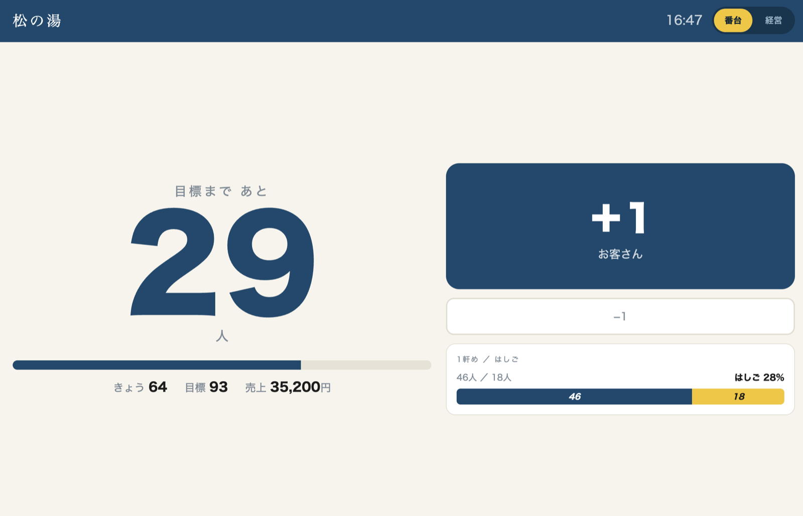
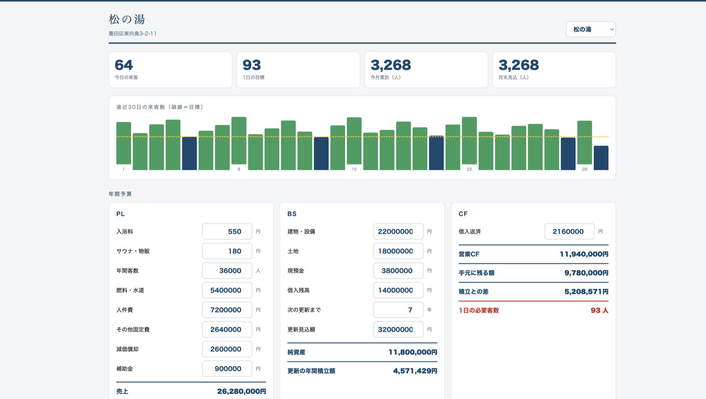
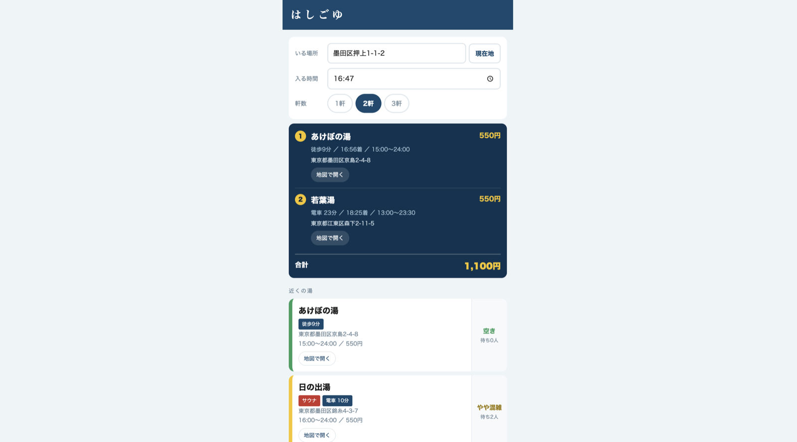

# 都知事杯2026 — SILVERPUNKから「はしごゆ」へ

[都知事杯オープンデータ・ハッカソン2026](https://odhackathon.metro.tokyo.lg.jp/)は、オープンデータや民間データを活用し、東京の課題解決につながるサービスを考え、試作するイベントです。このリポジトリは、チーム **Masa** のエントリーに向けた調査・構想と、制作したプロトタイプをまとめた記録です。

出発点は、超高齢社会の東京を描く **SILVERPUNK // 2100**。その構想から、地域の文化と人の営みを支える銭湯に焦点を絞り、ハッカソンでは **「はしごゆ」** を制作しました。

ファイナリストへの選出には至らず、2026年10月4日にプロジェクトを終了しました。公開デモは停止し、プレゼンテーション動画・コード・設計・調査資料を保存しています。

## 1. 出発点：SILVERPUNK // 2100

> 「老い」を都市最大の輸出資源に転換する。

SILVERPUNKは、2100年の東京で、高齢者の経験・手仕事・接客が都市の魅力になる未来を描いたコンセプトです。自動化と効率を追求する未来像に対して、人が積み重ねた技能や記憶に価値を置き、世界が長寿と文化を体験しに来る都市を構想しました。

体験、健康長寿、そこから得られる知見を結びつけるには、働く場、住まい、医療、移動、文化の継承を一緒に考える必要があります。人口・気候・都市計画などの資料を調べ、構想を成立させる条件と、現在との隔たりを整理しました。

その過程で、遠い未来の構想を支えるためには、今ある地域の文化や、それを担う場所が続くことも必要だと考えました。ハッカソンで具体的な仕組みとして試作したのが、銭湯の継続を支える「はしごゆ」です。

詳しくは、[SILVERPUNKの戦略・作戦計画](docs/concept-research/20260822-silverpunk2100-strategy-gap-analysis-and-operational-plan.md)、[コンセプト調査](docs/concept-research/)、[課題整理・試作対象の検討](docs/planning/)を参照してください。

## 2. ハッカソンで制作したもの：「はしごゆ」

**銭湯ごとに「今日あと何人来れば続けられるか」を見える化し、入浴者にはしご湯ルートを提案するプロトタイプです。**

銭湯は、お客が来る前に湯を沸かし、設備を維持します。来客を増やす取り組みを、日々の営業と将来の設備更新に必要な人数につなげることを目指しました。

「はしごゆ」は、各銭湯の予算から1日の必要客数を計算し、実際の来客数との差を表示します。入浴者の1軒めは近さを優先し、2軒め以降は必要客数に届いていない銭湯を優先して提案します。

| 画面 | 利用者 | できること |
| --- | --- | --- |
| はしごゆ | 入浴者 | 銭湯を探し、時刻・軒数に応じたルートを確認する |
| 番台 | 銭湯の担当者 | 来客数を計上し、今日あと何人必要かを確認する |
| 管理 | 運営・支援側 | 予算や設備更新・現金目標から必要客数を計画し、全湯の状況を見る |

管理で予算を変えると、番台の目標人数と入浴者向けの提案に反映されます。SILVERPUNKの構想を背景に、銭湯の経営と来訪をつなぐ部分を実装しました。

### プレゼンテーション動画

[はしごゆのプレゼンテーションを見る（YouTube）](https://youtu.be/ymgFsucM3dw)

### 画面

| 番台：来客数と今日の目標 | 管理：予算と必要客数 | はしごゆ：ルート提案 |
| --- | --- | --- |
|  |  |  |

### 実装の到達点

React・TypeScriptによる3画面、必要客数の計算、ルート提案、共有ストアによる連動、スマホ・タブレット対応を実装しました。SQLiteスキーマとHonoサーバーの雛形・ヘルスチェックも保存しています。

**銭湯名・住所・人数・金額はすべて架空のサンプルです。** 画面のデータはインメモリで、業務APIによる永続化、実データ接続、認証、QR／POS連携は未実装です。実運用前のプロトタイプとして終了しています。

公開デモは停止済みです。手元での起動方法は[アプリのREADME](apps/hashigoyu/README.md)、終了時の詳細は[終了記録](docs/design/hashigoyu/README.md)を参照してください。

## 3. 没案として保存した試作：まちかどQR

「まちかどQR — ここはどこ」は、街角の印字住所とQRから現在地を大きく表示し、場所を説明しにくい人が家族などへ助けを求められるようにする別案です。候補地を使うデモ、提出フォーム下書き、画面画像、公開準備用の設定を保存しています。実際のステッカー設置や現地経路の検証には至らず、没案として終了しました。

[まちかどQRの保存資料・画面・起動手順](apps/machikado-qr/README.md)

## 4. リポジトリの読み方

| 場所 | 内容 |
| --- | --- |
| [apps/hashigoyu/](apps/hashigoyu/) | 制作した「はしごゆ」のコード・起動手順・画面 |
| [docs/design/hashigoyu/](docs/design/hashigoyu/) | はしごゆの仕様・実装計画・終了記録 |
| [docs/concept-research/](docs/concept-research/) | SILVERPUNKなどの構想・成立条件の調査 |
| [docs/research/](docs/research/) | 人口・気候・住環境・都市計画などの調査資料 |
| [docs/planning/](docs/planning/) | 課題の比較、構想から試作対象を選ぶ過程 |
| [docs/proposal/](docs/proposal/) | エントリーに向けて整理した企画文面 |
| [docs/design/](docs/design/)・[apps/](apps/)のその他のフォルダ | 検討過程で作った別案・試作の記録 |

調査資料には当時の仮説や検討案も含まれます。実装内容と終了時の到達点は、はしごゆのアプリREADMEと終了記録にまとめています。
