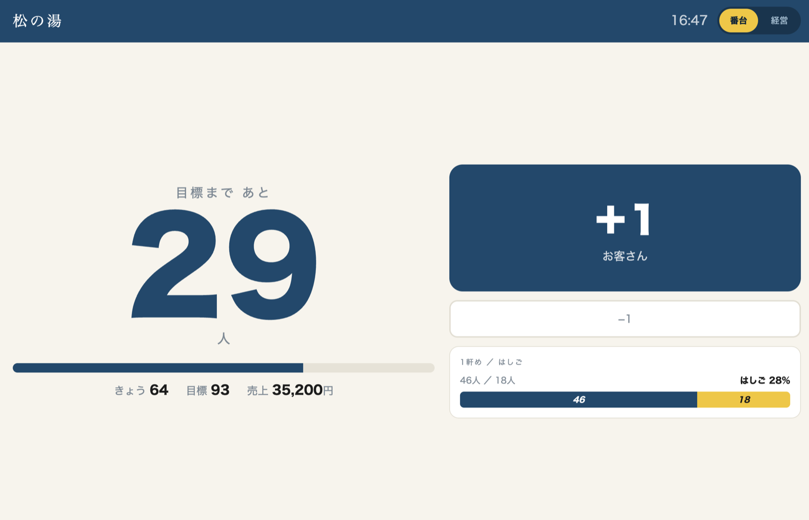
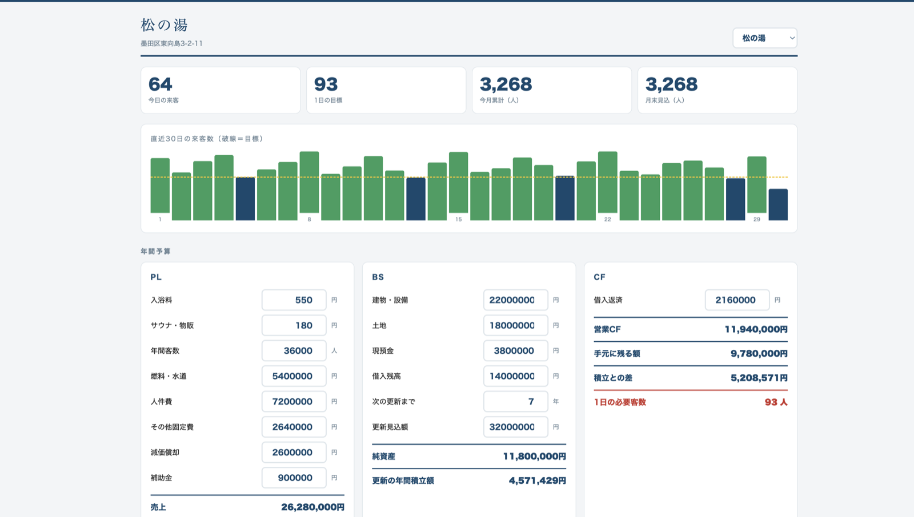
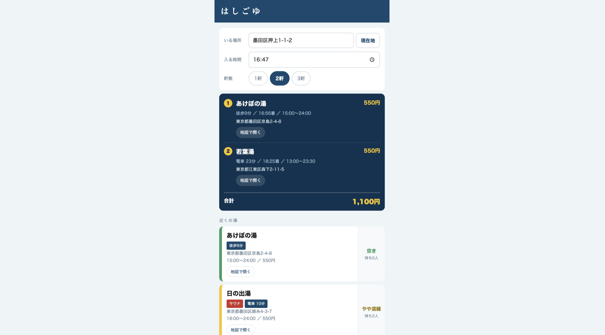

# はしごゆ

銭湯ごとの1日の必要客数を見える化し、入浴者には不足している銭湯を優先したはしご湯ルートを提案するReactプロトタイプです。

本番デモ: <https://hashigoyu.machikado-qr.workers.dev>

## 画面

| 画面 | 対象 | URL |
| --- | --- | --- |
| はしごゆ | 入浴者・スマートフォン | [`/guest/`](https://hashigoyu.machikado-qr.workers.dev/guest/) |
| 番台 | 銭湯・タブレット | [`/counter/`](https://hashigoyu.machikado-qr.workers.dev/counter/) |
| 管理 | 指導センター・組合・PC | [`/admin/`](https://hashigoyu.machikado-qr.workers.dev/admin/) |

旧デモURLの `/kyaku.html`、`/bandai.html`、`/kanri.html` は、それぞれReact画面へ恒久リダイレクトします。

## スクリーンショット

| 番台 | 管理・必要客数計画 | はしご湯ルート |
| --- | --- | --- |
|  |  |  |

## ローカル開発

Node.js 20以降と pnpm 10を使用します。

```bash
cd apps/hashigoyu
corepack pnpm install --frozen-lockfile
pnpm dev
```

個別の開発サーバーは guest が5173、counter が5174、admin が5175です。型検査・ユニットテスト・ビルド・E2Eは次で実行できます。

```bash
pnpm typecheck
pnpm test
pnpm build
pnpm e2e
```

## Cloudflareへの公開

Wranglerの設定は [`wrangler.jsonc`](wrangler.jsonc) にあります。`deploy:prepare` が3画面をビルドし、Cloudflare Static Assets用の `cloudflare/public/` を生成します。この生成ディレクトリはGit管理対象外です。

```bash
cd apps/hashigoyu
pnpm run deploy:dry-run
pnpm run deploy
```

`pnpm deploy` はpnpmの組み込みコマンドとして扱われるため、プロジェクトのスクリプトは `pnpm run deploy` で実行します。

## 構成

```text
apps/hashigoyu/
├── apps/guest/       # 入浴者向けReact画面
├── apps/counter/     # 番台向けReact画面
├── apps/admin/       # 管理向けReact画面
├── packages/domain/  # 型・計算・ルート・改善提案
├── packages/store/   # P1用インメモリ共有ストア
├── cloudflare/       # Workerと公開用静的アセットの入口
└── e2e/              # 3画面と旧URLのPlaywright検証
```

現在はP1〜P2のプロトタイプです。銭湯名・住所・人数・金額はすべて架空のサンプルで、データはインメモリです。SQLite、API、ロール認証、QR/POS連携は未実装です。仕様と実装計画は [`docs/design/hashigoyu/spec.md`](../../docs/design/hashigoyu/spec.md) と [`docs/design/hashigoyu/plan.md`](../../docs/design/hashigoyu/plan.md) を参照してください。
