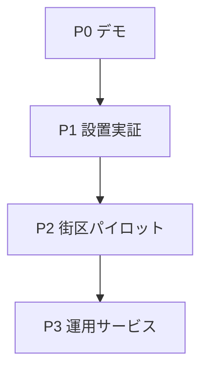

# まちかどQR 実装タスク

更新日: 2026-08-23  
対象仕様: `docs/design/20260823-machikado-qr-design-spec.md` v0.2

## 状態定義

| 状態 | 意味 |
|---|---|
| `READY` | 依存が完了し、エージェントが着手可能 |
| `IN_PROGRESS` | 1エージェントが作業中 |
| `BLOCKED` | 技術・情報の不足。解除条件を記載 |
| `HUMAN_REVIEW` | 実地、法務、契約、外部公開など人間判断が必要 |
| `DONE` | 受け入れ条件と検証を満たした |
| `WONT_DO` | スコープ外。理由を保持 |

同時に `IN_PROGRESS` にしてよいのは、同じファイルを変更せず依存関係がないタスクだけ。完了時は「証跡」欄にコマンド、テスト又は記録へのリンクを追加する。

## 依存関係

## Phase 0 — 即時デモ

| ID | 状態 | タスク | 依存 | 受け入れ条件 | 証跡 |
|---|---|---|---|---|---|
| MQR-001 | `DONE` | 仕様・実装・データのレビュー | なし | P0/P1/P2で指摘し、修正済みと残存を分離 | レビュー文書 |
| MQR-002 | `DONE` | ソースと単体HTML生成物を分離 | なし | `src/`だけを編集し、ビルドで単体HTMLを再現 | `scripts/build_prototype.py`、自動テスト |
| MQR-003 | `DONE` | 場所コード重複を除去 | なし | 全候補地点でコード重複0、武蔵野市と武蔵村山市を区別 | `test_place_codes_are_unique` |
| MQR-004 | `DONE` | 疑わしい交通データを隔離 | MQR-001 | 駅0件を表示し、隔離理由と品質指標を記録 | `data/build-report.json`、隔離テスト |
| MQR-005 | `DONE` | 安全なデモモード | MQR-002 | `demo.html`から起動、電話不発信、警告表示、デモ経路あり | `test_demo_entry_exists`、経路テスト |
| MQR-006 | `DONE` | 自動検証入口 | MQR-002〜005 | `make verify` 1コマンドで生成・構文・テストが成功 | 11テストPASS |
| MQR-007 | `DONE` | エージェントハーネス | MQR-001 | 読書順序、不変条件、停止条件、完了定義を文書化 | `AGENTS.md`、`CLAUDE.md` |
| MQR-008 | `HUMAN_REVIEW` | 実機デモ確認 | MQR-005〜006 | iOS Safari、Android Chrome、200%拡大で主要導線を確認 | 端末・OS・ブラウザ・結果を追記 |

Phase 0のコードは起動可能。公開デモの完了判定にはMQR-008が必要。

## Phase 1 — 設置実証の成立

| ID | 状態 | タスク | 依存 | 受け入れ条件 | 主な成果物 |
|---|---|---|---|---|---|
| MQR-101 | `READY` | 候補地と設置済み台帳を分離 | MQR-008 | `installed_points` は同意・設置日・確認日・状態を必須にし、候補地から自動昇格しない | JSON Schema、台帳サンプル、テスト |
| MQR-102 | `HUMAN_REVIEW` | 設置主体・同意・剥離対応を決定 | MQR-008 | 責任者、同意様式、点検周期、停止連絡、SLAを承認 | 運用責任表、同意書案 |
| MQR-103 | `READY` | 不変な場所ID方式を設計 | MQR-101 | 行追加・並べ替えで既発行IDが変わらず、チェック桁と廃止保持を定義 | ID仕様、移行テスト |
| MQR-104 | `READY` | QR・住所ステッカー生成器 | MQR-101、MQR-103 | `active`な設置済み地点だけPDF/SVG生成、住所がQRより大きい | 生成スクリプト、印刷見本 |
| MQR-105 | `READY` | 出典・ライセンス再確認 | MQR-008 | 原典URL、取得日、改変内容、帰属文、ライセンスを一次情報で固定 | `data/sources.json`更新、証跡 |
| MQR-106 | `READY` | 交通データ再検証 | MQR-105 | 全駅を別一次情報又は現地で照合し、誤差基準と除外理由を記録 | 検証CSV、品質レポート |
| MQR-107 | `READY` | 事前登録UXの実機検証 | MQR-008 | 子ども・高齢者・外国人の代理ユーザー各5名以上で完遂率と誤操作を計測 | テスト計画、匿名結果 |
| MQR-108 | `HUMAN_REVIEW` | 静的公開環境を決定 | MQR-105 | HTTPS、キャッシュ失効、障害時表示、公開責任者を承認 | ADR、公開URL |

## Phase 2 — 1街区フィールドパイロット

| ID | 状態 | タスク | 依存 | 受け入れ条件 | 主な成果物 |
|---|---|---|---|---|---|
| MQR-201 | `BLOCKED` | 5〜20地点へ実設置 | MQR-102〜104、MQR-108 | 全地点が設置済み台帳と一致し、印字住所を現地照合 | 設置記録、写真、点検日 |
| MQR-202 | `BLOCKED` | 点間経路を現地検証 | MQR-201 | 段差、横断、閉鎖時間、照明を含む各辺の通行可否を記録 | 検証済み経路グラフ |
| MQR-203 | `BLOCKED` | 公開経路案内を限定解放 | MQR-202 | 検証済み辺だけを使い、失敗時は移動停止へフォールバック | 経路テスト、監査ログ |
| MQR-204 | `BLOCKED` | QRを読めない状況の試験 | MQR-201 | 印字住所・場所番号だけで第三者へ場所を伝えられるか測定 | 観察記録、改版仕様 |
| MQR-205 | `BLOCKED` | 剥離・移設・廃止訓練 | MQR-201 | 受付から無効化、交換、再確認までSLA内で完了 | 運用訓練記録 |

## Phase 3 — 運用サービス

| ID | 状態 | タスク | 依存 | 受け入れ条件 | 主な成果物 |
|---|---|---|---|---|---|
| MQR-301 | `BLOCKED` | 設置台帳APIと署名付き公開スナップショット | MQR-201 | 認可、監査、ロールバック、改ざん検知を実装 | API仕様、運用手順 |
| MQR-302 | `BLOCKED` | データ更新パイプライン | MQR-105、MQR-301 | 差分を自動隔離し、人間承認後だけ公開 | CI、差分レポート |
| MQR-303 | `BLOCKED` | 匿名・任意の効果測定 | MQR-107、法務承認 | 位置履歴や個人連絡先を収集せずKPIを測れる | DPIA、計測仕様 |
| MQR-304 | `BLOCKED` | 複数自治体運用 | MQR-205、MQR-301 | 責任分界、停止権限、データ品質SLAを自治体間で統一 | 運用協定、SLO |

## 判断待ち

| ID | 判断 | 選択肢 | 解除するタスク |
|---|---|---|---|
| D-001 | 設置・点検の最終責任者 | 自治体／商店会等／事業主体 | MQR-102、MQR-201 |
| D-002 | 場所IDの発行主体 | 東京都単一／自治体分散＋名前空間 | MQR-103 |
| D-003 | 帰る場所の登録方式 | 近隣QR番号／端末GPSで事前登録／認可ジオコーダ | MQR-107 |
| D-004 | 点間案内を製品価値に残すか | 現地検証して残す／地図アプリ連携に限定 | MQR-202、MQR-203 |

## 次にエージェントが着手するタスク

原則として `MQR-101`。ただしMQR-008の実機結果で重大なUI不具合が出た場合は、その修正をP0の新規タスクとして先に追加する。
