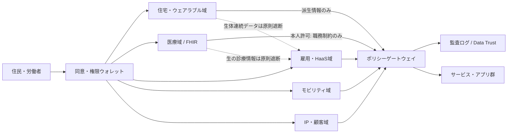
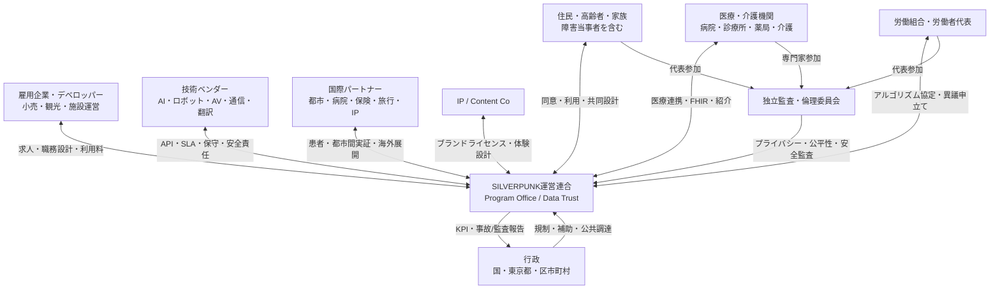

# SILVERPUNK // 2100 — 労働・集客インフラ要件に関するコンセプトリサーチ

**作成日:** 2026-08-22  
**想定主対象:** 東京圏  
**比較対象:** 富山市、柏の葉、シンガポール、コペンハーゲン  
**推奨英語ファイル名:** `20260822-silverpunk-2100-labor-attraction-infrastructure-concept-research.md`  
**Markdownファイル:** [ダウンロード](sandbox:/mnt/data/20260822-silverpunk-2100-labor-attraction-infrastructure-concept-research.md)

## エグゼクティブサマリ

SILVERPUNK // 2100を「高齢化を制約ではなく、経験・健康・移動・コミュニケーションを再設計して長寿社会の生産力と集客力に変える都市・事業OS」と定義すると、実現の鍵は個別の未来技術ではなく、**住まい、仕事、医療・福祉、移動、言語、データを一つのサービス圏として束ねること**にある。日本では国立社会保障・人口問題研究所が2070年までの人口推計と2120年までの長期参考推計を公開しており、高齢化・人口縮小を前提とする長期都市設計は不可避である。東京都でも2050年以降の高齢化率は29％以上で推移し、2065年の生産年齢人口は2020年比19.2％減と推計される。したがって本構想は「高齢者向け福祉」の追加ではなく、**少ない現役世代で都市機能を維持しながら、健康な高齢者を労働・消費・文化の担い手として包摂する供給側改革**として設計すべきである。citeturn21search2turn21search3

結論は、**全面的な“未来都市”を一括建設するのではなく、既存都市に後付けできる共通基盤から始めるべき**である。優先順位は、第一に「健康データを直接人事判断に使わない」AI労働マッチングとテレプレゼンス、第二にユニバーサルデザインとパワー・移動アシスト、第三に限定ODD（運行設計領域）の自動運転、第四に医療ツーリズム・国際集客である。日本では特定自動運行に対応する道路交通法上のLevel 4制度、医療情報のHL7 FHIR標準化、介護テクノロジー導入支援、医療滞在査証、国家戦略特区など既存の制度部品が相当程度そろっているため、技術よりも**データガバナンス、労働者保護、責任分界、運用統合**がボトルネックになる。citeturn7search0turn20search1turn20search4turn17search1turn14search0turn14search1

先行事例は既に部分的な実現性を示している。富山市は公共交通を軸とする「コンパクト＋ネットワーク」を継続し、交通・歩行・健康・医療費のデータを結びつけた研究も行っている。柏の葉では健康測定、社会参加、企業・大学との実証を市民参加型で運用する「まちの健康研究所 あ・し・た」が約3,300人の会員基盤を形成している。シンガポールではCommunity Care Apartmentsが高齢者向け住戸と基礎ケアサービスを一体化し、Punggolでは2026年に自動運転シャトルが一般利用へ移行し、7月時点で11,500人超が利用、LTA調査では回答者の99％が「安全と感じ、推奨する」と回答した。コペンハーゲンは在宅ケア、補助機器、リハビリ、住居を自治体のHealth and Care Administrationが統合的に扱い、Copenhagen Solutions Labが都市実装の共創・実証機能を担う。citeturn5search5turn5search9turn5search0turn6search3turn18search3turn19search13turn19search7

一方、最も強い反証は「監視都市化」「AIによる労働者の自律性喪失」「自動化による雇用喪失」「巨額投資に対する便益不確実性」である。ILOはアルゴリズム管理を、追跡データを用いて仕事の編成・割当・監督・評価を行う仕組みとして整理しており、研究上も制御・監視型アルゴリズムは心理的負担や公正性への懸念を生む。EUのAI Actでは雇用・労働者管理に用いる一部AIを高リスクとして扱う。したがってSILVERPUNKの差別化要件は「AI化の深さ」ではなく、**人間による異議申立て、労働組合・労働者代表の関与、目的別データ分離、監査可能性を製品要件に埋め込むこと**である。citeturn8search5turn8search19turn21search15turn21search18

本調査の概念段階コスト試算では、土地取得・大規模な新築病院・鉄道新設を除き、**小規模実証3〜8億円、中規模の3地区展開20〜60億円、東京圏マルチハブ100〜300億円超**が目安となる。誤差は少なくとも−30％〜+100％を見込むべきである。費用対効果の観点では、初期の自動運転や医療ツーリズムより、既存施設に導入できるAI配置、ウェアラブル、テレプレゼンス、同時翻訳、アシスト機器の方が投資回収を検証しやすい。例えば1,000人の労働者について、配置・移動・申し送り等の削減可能時間を1日20分、年間220日、総労務単価3,000円/時と置くと、理論上の時間価値は約2.2億円/年であり、5,000人規模なら約11億円/年となる。これは効果保証ではなく、プラットフォーム投資のGo/No-Go基準を設定するための感度分析である。

**推奨戦略は「東京一極集中」ではなく「東京コントロールタワー＋分散実装」**である。東京にはIP、資金調達、国際営業、医療コーディネーション、規制折衝、ショーケースを集約し、居住・労働・移動の実証は多摩・八王子、柏の葉、富山等に分散する。経産省の「エンタメ・クリエイティブ産業戦略2026」は2033年の海外売上高20兆円とIP360度展開を掲げており、SILVERPUNKのIP事業と都市インフラ事業を分離する方が、IPのグローバル拡張と、規制産業である医療・雇用・交通のリスク隔離を両立しやすい。citeturn20search2turn20search8

## 前提・評価方法と先行事例

本報告では「HaaS」を確立済みの法令・標準用語とは扱わず、**Human-as-a-Service＝個人の経験、技能、身体的制約、希望時間、場所、対人能力等を“再利用可能な能力単位”として表現し、本人の同意と人間の最終判断の下で仕事・シフト・チームに割り当てる運用概念**と定義する。

病名や生体情報をそのまま人事エンジンに入力する設計は採用せず、医療・健康領域からは「重量物不可」「連続立位60分以内」等の最小限の職務適合制約のみを、本人が許可した場合に限って別系統で提供する。これは、医療・健康情報が要配慮個人情報として強く保護され、労働者の心身情報についても適正管理が求められる日本の現行制度と整合させるためである。citeturn3search0turn3search11turn11search21

評価軸は、①費用対効果、②社会インパクト、③技術成熟度、④規制準備度、⑤社会受容性、⑥可逆性、⑦他要素への波及効果とする。実装優先度はA＝1〜3年で標準導入、B＝1〜3年で限定実証し3〜7年で拡大、C＝3〜7年以降の選択投資、とした。コストは2026年価格水準の本調査による概念見積りであり、既存施設活用を基本とする。大規模再開発、新病院建設、土地購入、鉄道新線は別勘定とする。

| 先行事例 | SILVERPUNKに使える実証知見 | 限界・注意 |
|---|---|---|
| 富山市「コンパクト＋ネットワーク」 | 公共交通沿線への都市機能・居住誘導を進め、交通、歩行、健康、医療費の関係をデータで検証している。職住医福近接を「不動産単体」ではなく交通政策と組み合わせるモデル。citeturn5search5turn5search9 | 東京では地価・権利関係が複雑で、同じ密度政策をそのまま転用できない。 |
| 柏の葉スマートシティ／「あ・し・た」 | 健康測定、社会参加、企業・大学の実証を住民参加型で運用。約3,300人会員というコミュニティ母集団を持ち、健康基盤と新サービス実証を接続。citeturn5search0turn5search11 | 健康増進の参加者は自己選択バイアスを持ちやすい。就労や医療判断へ拡張する場合はガバナンスを強化する必要。 |
| 東京の自動運転実証 | 八王子・青梅・八丈島などで自動運転やAIオンデマンド交通を段階導入。日本には特定自動運行の許可制度がある。citeturn7search0turn7search17turn7search20 | Level 4の制度があることと、都心混合交通で大量展開できることは別問題。 |
| シンガポール Community Care Apartments | 高齢者向け住戸、シニアフレンドリー設備、基礎サービスをパッケージ化し「住み続ける」モデルを制度化。HDB調査では高齢者の85.9％が現住戸に住み続ける意向。citeturn6search3turn6search14 | 公営住宅比重や行政執行力が日本と異なり、東京ではデベロッパー・管理組合を含む合意形成が必要。 |
| シンガポール Punggol AV | 2026年4月から一般利用、7月時点で11,500人超が利用。段階試験、リアルタイム監視、住民フィードバックを組み込む。citeturn18search3turn18search5turn18search7 | 初期段階では安全要員・監視が必要で、人件費削減効果を早期に見込み過ぎてはいけない。 |
| コペンハーゲン | 自治体が在宅ケア、補助機器、リハビリ、住居等を横断管理し、Copenhagen Solutions Labが企業・研究機関との都市実証を担う。citeturn19search13turn19search28turn19search7 | 高税率・自治体サービスの制度背景が異なるため、財源構造は日本向けに再設計が必要。 |
| OriHime / DAWN | ALS等の外出困難者が分身ロボットを遠隔操作して接客する実験事業は、テレプレゼンスを「会議」ではなく接客・社会参加・就労へ拡張できることを示す。citeturn20search0 | 遠隔就労が孤立や低賃金の固定化につながらない職務設計が必要。 |
| NICT / 大阪・関西万博の多言語翻訳 | VoiceTraは33言語、万博では30言語の会話翻訳、13言語の遠隔案内、同時通訳システムが展開され、2026年もNICTがAI同時通訳を実演している。citeturn16search0turn16search2turn16search13 | 医療・契約・安全指示では誤訳コストが高く、人間通訳へのエスカレーションが必須。 |
| 日本の医療滞在査証・特区制度 | 医療滞在査証は90日以内、6か月または1年の滞在枠を持ち、登録医療コーディネーター制度も存在。特区では外国医師の受入れに関する特例の枠組みがある。citeturn14search0turn14search4turn14search1 | 外国医師が自由に診療できる制度ではない。原則は日本の免許が必要で、二国間協定・臨床修練等の限定制度となる。citeturn14search2 |

東京は人口・企業・大学・高度医療・国際交通・資本市場が集中するためショーケースとして有利だが、SILVERPUNKの実装単位は「東京都全域」では大きすぎる。

**徒歩・低速モビリティで15〜20分以内に住宅、診療所・薬局、就労拠点、買物、交流拠点へ到達できる5,000〜30,000人程度のサービス圏**を基本セルとし、それらを広域データ基盤で連邦化する方が検証しやすい。これは本調査の設計仮説であり、富山のコンパクトシティ、シンガポールのHDBタウン、コペンハーゲンの在宅ケアと都市実証の考え方を日本の既成市街地向けに再構成したものである。citeturn15search15turn18search5turn19search28

## 主要分析

以下のコストは本調査の概念見積りで、**初期導入費＋概ね2〜3年の立上げ費**を含む目安である。土地取得、大規模な新築躯体、鉄道新設を除く。受容性は「高・中・低」で相対評価した。

| 対象要素 | 国内外の先行事例 | 技術要件 | 運用要件 | 概算コストレンジ | 法規制・標準 | 社会受容性・主要リスク | 代替案 | 優先 |
|---|---|---|---|---:|---|---|---|---|
| **職住医福近接** | 富山「コンパクト＋ネットワーク」、柏の葉、Singapore HDB。citeturn5search5turn5search0turn6search3 | 都市GIS、徒歩圏分析、需要予測、オンデマンド移動、施設予約API | 医療・介護・商業・雇用の共同KPI、空室・空床・求人の横断運用 | 既成地区改修 **10〜50億円/地区**、新規再開発は別途数百億円級もあり得る | 都市計画法、バリアフリー法、介護・医療各法。国交省は面的バリアフリー基本構想を制度化。citeturn15search15 | **高**。ただし地価上昇・既存住民の押し出し、医療資源の偏在 | 物理近接を弱め、オンデマンド交通＋遠隔医療で代替 | **A** |
| **ユニバーサルデザイン標準** | 国交省の建築設計標準、Singapore EASE。2025年6月に日本の一部建築バリアフリー基準も改正。citeturn15search0turn15search9turn6search5 | 段差ゼロ、広幅員、手すり、視覚・聴覚支援、可変家具、非接触UI、車いす充電 | 当事者参加型レビュー、改修優先順位、点検台帳 | **30〜300万円/戸**、共用部は**0.5〜5億円/地区** | バリアフリー法、建築基準、自治体条例。介護保険の住宅改修支給は一定工事に20万円まで。citeturn15search4 | **高**。便益が高齢者以外にも広い。リスクは過剰仕様・既存ストック改修費 | 移動補助サービスで補完するが、恒久解決になりにくい | **A** |
| **ウェアラブル＋住環境ヘルスモニタリング** | 柏の葉の健康測定、富山の歩行・位置データ研究、Singaporeのageing-in-place。citeturn5search0turn5search9turn6search3 | 心拍・活動・睡眠・転倒等、室温・CO2・人感、エッジ処理、FHIR変換、アラート統合 | 医療用途とウェルネス用途を分離、同意更新、医療者へのエスカレーション、誤報管理 | **5〜30万円/人**＋**0.3〜2万円/月** | 個人情報保護法、医療情報安全管理ガイドライン7.0、SaMD該当性。citeturn3search0turn3search1turn3search3 | **中**。見守り価値は高いが「常時監視」感、家族・保険者・雇用者への目的外提供が最大リスク | 日次自己申告＋定期健診、非装着型センサーのみ | **A** |
| **テレプレゼンス基盤** | OriHime/DAWN、オンライン診療。citeturn20search0turn3search2 | 低遅延映像・音声、遠隔ロボット、字幕・翻訳、ID管理、アクセシビリティ | 遠隔接客・教育・相談の職務標準、現地介助者、障害時代替手段 | **10〜150万円/端末**、地区基盤 **0.3〜3億円** | 医療用途はオンライン診療指針。初診・緊急時等には制約がある。citeturn3search10 | **高**。移動困難者の参加を増やす一方、遠隔要員の二級職化に注意 | 通常ビデオ会議＋現地スタッフ | **A** |
| **AI駆動HaaS／職場・シフト最適アサイン** | ILOがアルゴリズム管理を整理。病院人員配置では予測＋最適化研究が進む。citeturn8search5turn8search4 | スキルグラフ、需要予測、制約充足最適化、説明可能性、バイアス監査、人間承認 | 本人希望をhard constraint化、異議申立て、労組協議、安定シフト、監査ログ | Pilot **3〜15億円**、地区展開 **10〜50億円**、SaaS **0.1〜1万円/人月** | 労基法、安衛法、個人情報保護法。日本はAI事業者ガイドラインv1.2、EUでは一部雇用AIが高リスク。citeturn12search0turn21search15turn21search18 | **中**。効率化余地は大きいが、差別・説明不能・監視・シフト不安定化が最大の反発点 | AIは候補提示のみ、人間コーディネーターが最終配置 | **A（条件付き）** |
| **パワー・移動アシスト標準** | 厚労省・経産省が移乗支援（装着・非装着）を介護テクノロジー重点分野化。HAL等の作業支援用途も存在。citeturn17search1turn17search2 | パッシブ／アクティブ外骨格、個人フィッティング、安全停止、疲労計測 | 作業リスク評価を先に実施し、機器で危険作業を正当化しない、訓練・点検 | **10〜150万円/台**、アクティブ型は月額リースも現実的。HAL腰タイプ個人向け例では約4万円/月の試用価格。citeturn17search6 | 労働安全衛生、製品安全、医療用途なら医療機器規制 | **中〜高**。EU-OSHAは荷重移転、可動制限、筋骨格への長期影響等を指摘。citeturn17search7 | 工程改善、リフト、台車、ロボット化を優先し必要箇所のみ装着型 | **A** |
| **ウェアラブル＋労働環境ヘルスモニタリング** | 職業疲労・人間工学リスクをウェアラブルで連続計測する研究が蓄積。citeturn8search0turn8search15 | 心拍・温熱・姿勢・負荷、危険区域ビーコン、ローカル警告、匿名集計 | 原則「安全改善」に限定、人事評価と技術・組織的に分離、保存期間短縮 | **5〜30万円/人**＋**0.3〜1.5万円/月** | 安衛法104条に基づく心身情報の適正管理、個人情報保護法。citeturn11search21turn3search0 | **低〜中**。監視感が強く、導入失敗時の反発が大きい | 環境センサー中心＋本人端末だけに生体値を保持 | **B** |
| **経験・コミュニケーション中心の職務設計** | 日本は65歳までの雇用確保義務、70歳までの就業機会確保を努力義務化。2025年の70歳措置実施率は34.8％。citeturn13search4turn13search8 | スキル・経験ポートフォリオ、メンタリング市場、遠隔接客、翻訳、ナレッジDB | 年功の延長ではなく「相談・品質保証・教育・顧客関係・文化伝承」へ再設計、短時間勤務 | **10〜50万円/人**の職務再設計・研修を目安 | 高年齢者雇用安定法、労働契約・最低賃金・均等待遇 | **高**。身体負荷を下げやすいが、名目的な低賃金職への追いやりに注意 | 通常再雇用＋外部メンター契約 | **A** |
| **無人モビリティ基盤** | 日本のLevel 4特定自動運行制度、東京実証、Singapore Punggol。citeturn7search0turn7search5turn18search3 | ODD地図、冗長センサー、V2Xは補助、遠隔監視、サイバー対策、車いす乗降、OTA | 段階運行、事故調査、遠隔支援、悪天候・工事時の代替輸送、住民説明 | **5〜20億円/路線実証**、地区Fleet **50〜200億円** | 道路交通法・道路運送法等。Singaporeも専用AV法・サイバー枠組みを検討中。citeturn18search26 | **中**。Punggolでは高評価だが、事故1件で信頼が急落し得る。初期は人員削減効果が小さい | AIオンデマンド有人交通、低速グリーンスローモビリティ | **B** |
| **医療ツーリズム特別区** | 医療滞在査証、登録保証機関、国家戦略特区の国際医療施策。citeturn14search0turn14search4turn14search1 | 多言語患者ポータル、国際決済、医療記録交換、遠隔フォロー、感染管理、通訳品質 | 医療コーディネーター、費用見積り、帰国後連携、国内患者のアクセスを毀損しない容量管理 | 既存病院高度化 **50〜300億円**、新病院は**500〜2,000億円超**もあり得る | 医師法、医療法、入管・査証、外国医師特例、個人情報・越境移転 | **中〜低**。医師不足下で「富裕外国人優先」と受け取られる政治リスク | まず国際医療コンシェルジュ＋既存病院ネットワーク | **C** |
| **同時翻訳インフラ** | NICT VoiceTra、EXPOホンヤク、AI同時通訳。citeturn16search0turn16search2turn16search13 | 音声認識→翻訳→合成、専門辞書、字幕、端末処理、低遅延、ログ制御 | 医療・契約はconfidence thresholdで人間通訳へ切替、固有名詞確認 | 地区 **1〜5億円**＋運用 **0.5〜3億円/年** | 個人情報、録音同意、医療安全。一般用途に一律の翻訳免許制度はないが用途責任は残る | **高**。便利さが明確。医療誤訳と録音への懸念が残る | 人間通訳＋定型多言語UI | **A** |
| **IP・コンテンツ分離** | 経産省は2026戦略で「日本で創り、世界に届け、IP360度展開」を推進。citeturn20search2turn20search14 | 権利台帳、ブランドライセンス、API/データ利用契約、ロイヤルティ会計 | IP Co、Infra OpCo、Employment OpCo、Data Trust/SPVを分離し、ブランド統制委員会で接続 | 設計・法務・システム **1〜5億円** | 著作権・商標・会社法・税務・個人情報。海外展開は移転価格・契約準拠法も要設計 | **高（投資家）／中（運用者）**。責任隔離は強いが組織間摩擦が増える | 一社統合＋事業部別P/L | **A** |
| **東京の機能集約戦略** | 東京は国際金融・スタートアップ・高度医療・コンテンツ政策の集積を強化。citeturn20search12turn20search2 | 共通ID連携、都市データ、国際患者・IP・投資家CRM、BCP | 「本社・IP・資本・国際窓口」は東京、「実装・居住・運行」は複数都市へ分散 | コントロールタワー **50〜300億円**、不動産取得は別 | 都市計画、特区、金融・医療・労働・データ規制 | **中**。採用・営業には有利だが、コストと災害時single point of failureが大きい | 完全分散型フェデレーション | **B：集約ではなくハブ化** |

ここから得られる重要な判断は、**「身体能力を技術で補う」より先に「身体能力をあまり要求しない仕事へ再設計する」**ことである。外骨格・アシストスーツには実用価値があるが、EU-OSHAは身体負荷の移転や長期影響を含む新たなリスクを指摘している。したがって優先順位は「工程除去・機械化 → 職務再設計 → 非装着支援 → 装着型アシスト」であり、アシスト機器を危険作業継続の免罪符にしてはいけない。citeturn17search7turn17search1

AI HaaSも同じで、最適化目的関数を「総労働時間最大化」や「欠員最小化」に置くだけではSILVERPUNKにならない。目的関数には、本人希望、健康制約、連続勤務、通勤負荷、スキル成長、収入安定、チーム相性、公平性を含めるべきである。ILOのアルゴリズム管理研究やEUの高リスクAI制度は、効率指標だけで管理AIを評価することの不十分さを示している。citeturn8search5turn8search17turn21search15

**主要な反証・反論・緩和策**

| 主要な反証 | 反証が強い理由 | 本構想側の反論 | 必須の緩和策／撤退条件 |
|---|---|---|---|
| **実現困難：統合範囲が広すぎる** | 医療、雇用、交通、住宅は規制主体もデータモデルも異なる。 | 一括統合せず「共通ID連携・同意・イベントAPI・監査」だけを共通化し、業務システムはドメイン別に残す。医療では日本もFHIRベースの標準化を進めている。citeturn20search1turn20search10 | 18か月以内に2ドメイン以上で相互運用できなければ全面OS構想を縮小。 |
| **コスト過大：AV・特区・再開発で数百億円になる** | ハードを先に作ると需要不確実性を固定資産化する。 | ソフト・職務・既存住宅改修を先行し、AVと大型医療施設は利用実績に応じてゲート投資する。 | 各段階で「利用率・労働時間削減・健康アウトカム・NPS・事故率」を達成しない限り次フェーズに進まない。 |
| **社会的抵抗：監視都市・高齢者管理社会に見える** | 健康、位置、勤務、生体データを一体化すると権力非対称が極めて大きい。個人情報保護委員会も医療・健康情報を要配慮個人情報として扱う。citeturn3search0 | 「統合DB」を作らず、目的別データ域を分離し、本人が許可した最小限の派生情報のみ共有する。 | 生データの雇用者提供禁止、opt-out可能な非デジタル経路、住民・労働者を含む独立データ倫理委員会。重大な目的外利用1件で該当連携を停止。 |
| **労働市場悪化：AIが高齢者を低賃金ギグ化する** | マイクロシフトは柔軟性と同時に所得不安定化を生み得る。 | HaaSを「ギグ化」ではなく、最低保証時間＋本人選択の追加シフトとして設計する。 | 最低シフト保証、キャンセル補償、アルゴリズム説明・異議申立て、労組・労働者代表による四半期監査。 |
| **自動運転で雇用が消える** | 運転職の需要減少は中長期に現実的な可能性。Singapore政府自身も労働移行を政策課題にしている。citeturn18search13 | 初期は運転者が「遠隔運行、乗客支援、安全監視、保守」へ移行し、無人化は自然減員に合わせる。 | 強制解雇をKPIにしない。1人で複数車両を監督できる段階までは省人効果を事業計画に織り込まない。 |
| **医療ツーリズムは国内医療を圧迫する** | 医療人材が不足する中、富裕層外国人向け優先枠は反発を招く。 | 国内保険診療の供給能力とは別枠の時間帯・施設・コーディネーション能力で開始し、増分収益を地域医療へ還元する。 | 国内患者の待ち時間悪化を測定し、一定閾値を超えたら外国人枠を自動縮小。 |

## 技術・データ・倫理設計

SILVERPUNKの中核アーキテクチャは「一つの巨大データレイク」ではなく、**住宅・健康、医療、雇用、モビリティ、IP/顧客の5ドメインを分離し、同意・ID連携・監査ログだけを共通化するフェデレーション型**が望ましい。日本の電子カルテ情報共有サービスではFHIR記述仕様が採用され、厚労省の標準規格一覧にも処方情報、健診結果、診療情報提供書、退院時サマリー等のHL7 FHIR仕様が位置付けられている。HL7自身もFHIRを電子的な医療情報交換の標準として定義している。citeturn20search4turn20search10turn2search0turn2search2

**相互運用性。** 医療はFHIR/日本の実装仕様を正規インターフェースとし、ウェアラブルはベンダー固有フォーマットを直接全体へ露出させず、共通の「観測値・時刻・品質・単位・由来」モデルへ正規化する。雇用は職種名ではなくスキル、資格、身体制約、希望時間帯、対人役割、教育経験等を機械可読化する。モビリティは予約、乗降、位置、運行状態、アクセシビリティ情報をAPI化する。

最重要点は、**患者ID・従業員ID・顧客IDを同一番号にしない**ことである。リンクは期限付きトークンと目的別同意で行う。医療情報システムは厚労省「安全管理ガイドライン7.0」を最低線とする。citeturn3search1turn20search1

**プライバシー。** 個人情報保護委員会は病歴・健診結果等を要配慮個人情報として扱い、取得や第三者提供には原則として本人同意が必要で、一般的なオプトアウト第三者提供は認められない。したがって「健康スコアを雇用主へ売る」「保険料・採用・シフト優先度へ直接反映する」モデルは避けるべきである。労働側では安衛法上の心身情報管理も加わる。実装要件は、目的限定、データ最小化、端末側処理、短期保存、再同意、アクセスログ本人閲覧、データ持ち出し、削除請求、代理人設定を標準とする。citeturn3search0turn3search11turn11search21

**セキュリティ。** ゼロトラストを前提に、端末証明書、多要素認証、最小権限、ネットワーク分離、暗号化、SBOM、署名済みOTA、鍵ローテーション、24/7監視、インシデント演習を要求する。医療・モビリティは停止時の安全性が重要なため、サイバー攻撃時に「機能継続」より「安全側停止・人間運用への退避」を優先する。

自動運転はODD、遠隔支援、事故・ニアミスの保存、ソフトウェア更新履歴を車両認証と結びつける。Singaporeが専用AV法とライフサイクル全体のサイバー枠組みを検討しているのは、この問題が車両単体認証では足りないことを示している。citeturn3search1turn18search26

**AI倫理・労働者保護。** AI HaaSは「自動決定」ではなく「候補生成＋人間承認」をデフォルトとし、低リスク領域のみ自動化を段階解禁する。利用者には「なぜこの仕事が提案されたか」「どのデータが使われたか」「誰に異議申立てできるか」を表示する。モデル監査では年齢、性別、障害等の属性別に、仕事提案率、時給、キャンセル、希望違反、昇格機会の差を監視する。

日本のAI事業者ガイドラインv1.2も公平性・プライバシー・透明性等のトレードオフを扱っており、EUでは雇用関連の一部AIが高リスク管理対象であるため、SILVERPUNKはEU相当の監査を自主的に採用する方が国際展開にも有利である。citeturn21search1turn21search15turn21search18

**倫理上のレッドライン**は、①生の医療・生体情報を採用・解雇・賃金決定に使わない、②常時位置追跡を雇用継続の条件にしない、③AIだけで不利益処分を確定しない、④高齢者・障害者だけを実験対象にしない、⑤医療翻訳の高リスク発話を無監督AIだけで確定しない、⑥自動運転の安全性KPIを利用率・収益で上書きしない、の6点とする。これは現行法の最低限を超える「社会的ライセンス」の設計であり、監視への抵抗を抑えるうえで事業上も重要である。citeturn3search0turn8search19turn18search13

## 実装ロードマップ

「2100」は世界観・設計寿命として扱い、実投資は20年以内のゲート方式とする。人口・AI・自動運転・医療技術の不確実性が大きいため、20年を超える固定的マスタープランはむしろロックインリスクが高い。国立社会保障・人口問題研究所も複数仮定の推計を提示しているため、長期は単一予測ではなくシナリオで運営するのが妥当である。citeturn21search2turn21search25

| 期間 | 投資規模（概算） | 主な実装 | 主要マイルストーン | 規制・制度アクション | 試験フィールド候補 |
|---|---:|---|---|---|---|
| **短期：1〜3年** | **50〜150億円**（2〜4地区合計） | Data Trust、FHIR連携、HaaS候補提示、テレプレゼンス、翻訳、UD改修、アシスト機器、低速/有人オンデマンド交通 | ①5,000〜10,000人参加、②HaaSは人間承認100％、③健康→雇用は派生制約のみ、④1,000人規模で20分/日以上の非付加価値時間削減を検証、⑤重大なデータ目的外利用0 | 現行法内の実証協定、個人情報DPIA相当評価、労使アルゴリズム協定、自治体バリアフリー基本構想への組込み | **柏の葉**＝健康・住民実証、**多摩ニュータウン/八王子**＝高齢住宅・移動、**大丸有**＝国際就労・翻訳・ショーケース、**富山**＝コンパクトシティ比較 |
| **中期：3〜7年** | **300〜800億円** | 3〜8地区を連邦化、Level 4限定路線、遠隔運行、標準型HaaS、地域医療連携、国際医療コンシェルジュ、IP Co独立 | ①20,000〜50,000人、②地区間ID連携、③AVは限定ODDで商用、④労働者の異議申立て処理SLA、⑤医療翻訳の高リスク発話100％人間確認 | 雇用AIの説明・異議申立て・労使協議ルールを条例/業界コードから法制度へ提案。AV遠隔運行・サイバー責任の制度明確化。国家戦略特区で国際医療の手続簡素化を申請 | **八王子・多摩**、**豊洲/有明**、**羽田〜大田**、**富山駅周辺**、海外ベンチマークとして**Punggol/Tengah**、**Copenhagen/Nordhavn** |
| **長期：7〜20年** | **1,000〜3,000億円超** | 東京圏マルチハブ、広域AV/オンデマンド交通、国際医療ネットワーク、高齢就労市場、IP/体験輸出、地域都市へのライセンス | ①10万人超の利用、②単一ベンダーロックイン解消、③主要サービスの災害時相互代替、④海外2〜5都市へプラットフォーム輸出、⑤公的補助比率を継続費の20％未満へ | 個人の「職務適合制約」を本人主権で携帯できる制度、越境医療データの標準契約、AVライフサイクル認証、AI労働監査の法定化を検討 | 東京は**本社・IP・資本・国際医療窓口**、実運用は多摩・湾岸・地方都市へ分散。海外はSingapore/Copenhagen等との相互運用実証 |

短期で最も重要なのは、**AVを走らせることではなく、データと労働の信頼モデルを完成させること**である。日本には既にLevel 4制度があり、Singaporeも段階導入によって住民受容を形成している一方、AI労働管理や健康データ連携は、社会受容を損なうと後から修復しにくい。自動運転は失敗時に路線を止められるが、信頼を失ったデータ基盤は全サービスへ波及する。citeturn7search0turn18search5turn3search0

**投資ゲートの例**として、各フェーズの追加投資は以下を満たした場合のみ実行する。HaaSは「希望違反率5％未満・人間による覆し可能率100％・属性別の不利益差を継続監視」、健康基盤は「本人同意確認100％・重大漏えい0・誤警報率を用途別に事前設定」、モビリティは「重大有責事故0・車いす乗降成功率99％以上を目標」、翻訳は「医療・契約の重要発話で人間確認100％」とする。数値は法定基準ではなく、SILVERPUNKの内部Go/No-Go基準として設定する。

資金構成は、短期は公共実証・自治体・デベロッパー・事業会社でリスクを共同負担し、**公的30〜40％、デベロッパー/医療・交通事業者30〜40％、技術/IP事業者20〜30％**を目安とする。中期以降はSaaS利用料、施設管理費、モビリティ運賃、法人向け人材配置料、国際医療コーディネーション、IPライセンスへ収益源を分散し、公的補助は標準化・公共財・低所得者アクセスに限定する。

日本では介護テクノロジー、住宅改修、自動運転実証等に既存支援枠があるため、初期CAPEXを全額民間負担にする必要はない。citeturn17search1turn15search4turn7search1

## ステークホルダーマップ

行政は「許可者」だけでなく、道路・医療・福祉・都市計画・データ政策を横断するオーケストレーターになる必要がある。特に東京都と区市町村の役割を分け、都は共通データ・調達・国への規制提案・国際連携を担い、区市町村は住民合意、地域交通、福祉、施設配置を担う。国は個人情報、医療、労働、自動運転、入管等の法制度を担当する。日本の現行制度はこれらが縦割りで存在するため、Program Officeには政策・法務チームを常設する必要がある。citeturn15search2turn7search0turn14search0

医療機関はデータ提供者ではなく臨床責任主体であり、HaaSへ病名や詳細な検査値を渡すべきではない。企業側は「健康な人を選ぶ」のではなく、仕事側の要求を分解し、身体制約に合わせて仕事を再設計する責任を持つ。労働組合・労働者代表は導入後の苦情処理だけでなく、目的関数、評価指標、データ利用範囲を決める設計段階から参加する。EUの政策議論でも、職場AIにおける社会対話・労働者関与の重要性が強調されている。citeturn11search7turn8search5

IP/Content Coは都市インフラから法的・財務的に分離する。

**IP Co**は世界観、名称、キャラクター、映像・ゲーム・イベント、ブランドガイド、ライセンスを保有し、**Infra/Service OpCo**は住宅・モビリティ・健康・雇用サービスを運営する。**Data Trust**は個人データ利用規則と監査を担い、IP Coが個人の健康・労働データをマーケティングへ流用できないよう遮断する。

この分離は、経産省が掲げるIP360度展開を阻害せず、医療・交通等の規制責任をIP資産から隔離するための事業構造である。citeturn20search2turn20search14

## 推奨パッケージ

評価式は、**実現可能性30％＋費用対効果25％＋社会インパクト25％＋規制準備度10％＋可逆性10％**の5点満点加重平均とした。点数は本調査の判断であり、実証データ取得後に更新する。

| ランク | パッケージ | 主構成 | 初期規模 | 概算投資 | 評価 | 推奨理由 |
|---|---|---|---|---:|---:|---|
| **A / 最優先** | **Care & Work OS** | HaaS候補提示、経験中心職務、テレプレゼンス、翻訳、健康データの目的別連携、Data Trust | 1地区、住民5,000人、労働者1,000人 | **3〜8億円** | **4.65/5** | 既存施設で開始でき、規制変更をほぼ待たず検証可能。投資回収の主要因を「労働時間・離職・稼働率」で早期測定できる。 |
| **A− / 拡張** | **Ageing District Stack** | 上記＋UD住宅、アシスト、地域医療、オンデマンド交通、限定AV、住民健康拠点 | 3地区、2〜5万人 | **20〜60億円** | **4.15/5** | 生活圏全体の価値を作れる。富山・柏の葉・Singapore型の知見を統合できるが、交通・不動産調整が増える。 |
| **B / 選択投資** | **Global Silver Hub Tokyo** | 上記＋国際医療コンシェルジュ、特区、東京コントロールタワー、IP360、広域AV、海外都市連携 | 東京圏複数ハブ＋海外連携 | **100〜300億円超** | **2.95/5** | 集客・ブランド・輸出効果は最大だが、医療人材、特区政治、AV成熟度、CAPEXに依存。需要実証後に進めるべき。 |

**Care & Work OS**を最優先とする理由は、SILVERPUNKの本質的仮説――「年齢ではなく能力・希望・経験で仕事を再構成すれば、健康寿命と労働供給を同時に引き上げられる」――を最も安価に検証できるからである。65歳までの雇用確保義務、70歳までの就業機会確保努力義務が既に存在する日本では、制度の次の課題は「働けるか否か」ではなく「どのような仕事なら持続可能に働けるか」である。citeturn13search0turn13search4

**Ageing District Stack**では、住宅改修とモビリティを一体化する。SingaporeのCommunity Care ApartmentsやPunggolの自動運転は、住居・基礎サービス・移動を生活圏単位で構築する実例となる。日本側では富山の「コンパクト＋ネットワーク」と柏の葉の市民参加型健康実証を組み合わせることで、東京だけでなく地方都市へ展開しやすい標準パッケージにできる。citeturn6search3turn18search3turn5search5turn5search0

**Global Silver Hub Tokyo**は最初から「国際医療特区」を建設するのではなく、第一段階を医療コーディネーション、同時翻訳、査証支援、予約・見積り、帰国後フォローのデジタル統合に限定する。日本には既に医療滞在査証と登録保証機関があるため、まず既存制度の摩擦コストを下げる方が合理的である。外国医師の自由診療解禁を前提にすると法的・政治的難度が急上昇する。citeturn14search0turn14search3turn14search4turn14search2

東京の機能集約も「全部を東京へ置く」ことは推奨しない。東京には、①IP/ブランド本社、②国際患者・投資家窓口、③データ・監査標準、④高度医療・研究連携、⑤ショーケースを置き、住宅・介護・モビリティの大量運用は多摩、柏、富山等へ分散する。

これにより、東京の高コストと災害時の単一障害点を抑えつつ、東京の国際的な集積効果を使える。コンテンツ側は経産省が掲げるIP360度展開と連動し、SILVERPUNK自体をゲーム・映像・イベント・観光・都市ライセンスへ展開できる。citeturn20search2turn20search12

## 結論

SILVERPUNK // 2100の実現可能性は、個々の技術だけを見れば高い。ユニバーサルデザイン、ウェアラブル、オンライン診療、テレプレゼンス、介護ロボット、音声翻訳、Level 4自動運転、医療滞在査証、FHIR標準化は既に制度・実装の先行例がある。未解決なのは、それらを**「本人の自律性を損なわずに一つの生活圏として運用するガバナンス」**である。citeturn15search9turn3search2turn20search0turn17search1turn16search13turn7search0turn14search0turn20search4

したがって、事業の勝ち筋は「最も自動化された都市」ではなく、**高齢者が監視対象にならず、労働者がアルゴリズムの従属物にならず、それでも都市全体の人的生産性が上がる設計**にある。

AI HaaSでは生体・医療データを直接人事に使わない。アシスト機器では危険作業を温存しない。AVでは初期から人員削減を収益仮説に置かない。医療ツーリズムでは国内患者のアクセスを侵食しない。これらを明示的なレッドラインとすることで、反対論の多くを「技術への賛否」から「測定可能な運用条件」へ変換できる。citeturn3search0turn17search7turn18search13turn14search2

最終的な推奨は、**2027〜2029年にCare & Work OSを1〜2地区で開始し、2030年代前半にAgeing District Stackへ拡張、Global Silver Hub Tokyoは需要・医療供給・AV安全性のゲートを通過した機能のみ段階追加する**ことである。短期の成功指標は巨大な建設投資ではなく、1,000人以上の実利用者で「働きやすさ、移動時間、健康上の安全、データ信頼、社会参加、事業単位経済性」が同時に改善することに置くべきである。

この順序なら、SILVERPUNKは「2100年のSF的完成図」を先に固定するのではなく、**人口減少下でもアップグレード可能な都市OSとして、東京でブランドと標準を作り、地方都市で運用効率を磨き、海外へIPと実装モデルを輸出する事業**として成立し得る。日本のコンテンツ政策がIP360度展開を、都市・医療・交通政策が標準化と実証をそれぞれ進めている2026年は、両者を別会社・共通ブランドで接続する準備期として合理的なタイミングである。citeturn20search2turn20search4turn7search1