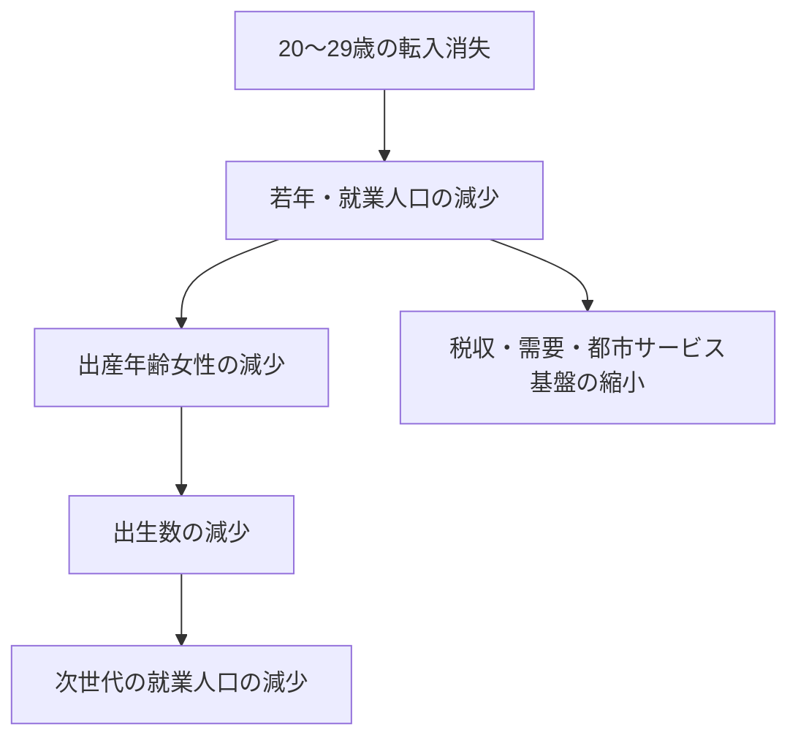

# 世界・日本・東京・東京以外の人口動態と「東京への転入ゼロ」包括レポート

- 作成日：2026年8月22日
- 対象期間：2026～2100年
- 対象地域：日本国外、日本、東京都、東京都以外
- 東京の追加分析：国内転入・国外転入を別々／同時にゼロ化した反実仮想
- 東京モデルの区分：1歳階級 × 性別 × 国籍区分（日本人・外国人）
- 関連プロジェクト：[Open Data Hackathon Tokyo 2026](https://github.com/masa-san-jp/Open-Data-Hackathon-Tokyo-2026)

> 本稿の数値は、実績値、公的将来推計、独自の条件付き試算を組み合わせている。とくに2070年以降と「転入ゼロ」は予言ではなく、出生・死亡・移動の仮定を固定した場合のシナリオである。

## 1. エグゼクティブ・サマリー

1. **世界人口は2080年代半ばまで増加し、その後は緩やかに減少する。** 国連WPP 2024の中位推計では、2026年の約83億人から2050年に約96.6億人、2080年代半ばに約102.9億人でピークを迎え、2100年は101.80億人となる。増加の中心はサブサハラ・アフリカなどへ移る。
2. **日本は総人口より生産年齢人口の縮小が速い。** 社人研の出生中位・死亡中位では、2026年1億2,266万人から2050年1億469万人、2100年6,278万人へ減る。2100年の65歳以上割合は約40％である。
3. **東京都の通常シナリオは、国内・国外からの流入が続くことを前提とする。** 東京都の現行公式推計は2030年約1,426万人でピーク、2050年約1,357万人、2065年約1,231万人。2100年の公式値はなく、既存推計を延長した分析帯は約800万～1,200万人、中心帯は約900万～1,000万人である。
4. **東京への国内転入と国外転入をともにゼロにすると、独自モデルでは2100年43.2万人となる。** これは東京が自然減だけで縮むケースではない。出生・死亡に加え、国内転出と国外転出を2025年の年齢別率で残し、転入だけを切った極端なストレステストである。
5. **東京人口を最も支えているのは国内転入、とくに20～29歳である。** 2025年の国内移動では20～24歳が5万7,263人、25～29歳が2万642人の転入超過だった。若年成人の流入が消えると、当年の人口だけでなく、将来の出生数と労働力人口も連鎖的に小さくなる。
6. **転入を固定した比較モデルにおける2100年の差は、国内転入が約1,268万人、国外転入が約235万人である。** 東京の長期人口に対する国内移動の影響は、国外移動より約5.4倍大きい。ただし、75年間にわたり2025年の転入件数を固定する参照ケースとの比較であり、政策効果の予測値ではない。
7. **「東京以外」は二通りに分けて読む必要がある。** 通常シナリオでは全国人口から通常の東京人口を引く。転入ゼロ試算では全国中位推計から転入ゼロの東京人口を引いた機械的差額であり、他道府県を独立に計算した結果ではない。

## 2. 2026・2030・2050・2075・2100年の全体像

### 2.1 世界と日本国外

単位は億人。日本国外は「世界人口－日本人口」の概算である。世界値は国連WPP 2024中位推計を表示桁に丸め、日本は社人研中位系列を用いたため、基準・推計体系は同一ではない。

| 年 | 世界 | 日本国外 | 主な局面 |
|---:|---:|---:|---|
| 2026 | 約83.0 | 約81.8 | 世界は増加、日本は減少 |
| 2030 | 約85.7 | 約84.5 | 若年人口の地理的偏在が拡大 |
| 2050 | 約96.6 | 約95.6 | 人口増加の中心がアフリカ・南アジアへ移動 |
| 2075 | 約102.6 | 約101.8 | 世界ピークに接近、高齢化が世界的に進行 |
| 2100 | 101.80 | 約101.17 | 世界はピーク後、日本の世界シェアはさらに低下 |

出所：[United Nations, World Population Prospects 2024](https://population.un.org/wpp/)、[UNdata・世界人口](https://data.un.org/Data.aspx?d=PopDiv&f=variableID%3A12%3BcrID%3A900&q=world+population)、[社人研・日本の将来推計人口](https://www.ipss.go.jp/pp-zenkoku/j/zenkoku2023/pp_zenkoku2023.asp)

### 2.2 日本・東京・東京以外：通常シナリオ

単位は万人。東京の2030年・2050年は東京都の現行公式推計、2075年・2100年は2065年公式値を全国人口の減少率等で延長した感度分析の代表値であり、東京都の公式値ではない。

| 年 | 日本 | 東京 | 東京以外 | 東京値の扱い |
|---:|---:|---:|---:|---|
| 2026 | 12,266.1 | 1,427.1 | 10,839.0 | 2026年東京都推計人口を使用 |
| 2030 | 12,011.6 | 約1,426 | 約10,586 | 東京都公式推計 |
| 2050 | 10,468.6 | 約1,357 | 約9,112 | 東京都公式推計 |
| 2075 | 8,251.7 | 約1,109 | 約7,143 | 2065年以降を機械的延長 |
| 2100 | 6,277.9 | 約844 | 約5,434 | 集中率固定の機械的延長 |

東京都の2100年は、次のように幅で扱う方が適切である。

| ケース | 2100年東京都 | 仮定 |
|---|---:|---|
| 集中率固定 | 約844万人 | 2065年以降の東京都シェアを概ね固定 |
| 集中継続 | 約942万人 | 社人研2100年人口の15％が東京都 |
| 国連日本人口＋集中 | 約1,153万人 | 国連の日本中位人口の15％が東京都 |
| 実務上の分析レンジ | 約800万～1,200万人 | 移動・出生の不確実性を含む幅 |

出所：[東京都「人口の予測」](https://www.toukei.metro.tokyo.lg.jp/jinkouyosoku/yj-topindex.htm)、[東京都「2050東京戦略」人口資料](https://www.seisakukikaku.metro.tokyo.lg.jp/basic-plan/choki-plan/data-population)、[社人研・詳細結果表](https://www.ipss.go.jp/pp-zenkoku/j/zenkoku2023/db_zenkoku2023/db_zenkoku2023syosaikekka.html)

### 2.3 東京への国内・国外転入をともにゼロ化した場合

単位は万人。「東京以外」は社人研の全国中位人口から転入ゼロの東京人口を引いた算術上の差額である。

| 年 | 日本 | 東京：両転入ゼロ | 東京以外：差し引き | 東京の65歳以上割合 |
|---:|---:|---:|---:|---:|
| 2026 | 12,266.1 | 1,427.1 | 10,839.0 | 22.4％ |
| 2030 | 12,011.6 | 1,245.2 | 10,766.3 | 26.4％ |
| 2050 | 10,468.6 | 650.5 | 9,818.1 | 53.7％ |
| 2075 | 8,251.7 | 216.4 | 8,035.3 | 72.3％ |
| 2100 | 6,277.9 | 43.2 | 6,234.7 | 70.2％ |

この「東京以外」は、各道府県の出生・死亡・転出入を再計算した地域推計ではない。また、国外から東京へ来るはずだった人が日本の他地域へ移ると仮定しているわけでもない。全国系列と東京都反実仮想を異なるモデルから差し引いた参考値である。

## 3. 東京の転入ゼロ・コーホート要因モデル

### 3.1 問いの定義

「東京への人口流入がない」には、少なくとも次の三つの意味がある。

| 定義 | 転入 | 転出 | 解釈 |
|---|---|---|---|
| 純移動ゼロ | 継続 | 継続し、転入と同数 | 人口移動による純増だけを消す |
| 転入ゼロ | 0 | 継続 | 流入依存度を見る極端なストレステスト |
| 移動ゼロ | 0 | 0 | 閉鎖人口。出生・死亡だけで推移 |

本稿の主シナリオは2番目である。国内・国外からの転入をゼロにする一方、他道府県への転出と国外への転出は2025年の年齢・性別・国籍別率で継続する。

### 3.2 人口区分

人口状態を次の次元に分け、2026年から2100年まで年次更新した。

- 年齢：0～110歳の1歳階級
- 性別：男性・女性
- 国籍区分：日本人・外国人
- 移動：国内転入、国内転出、国外転入、国外転出を別管理

「国籍別」は日本人／外国人の2区分であり、中国、韓国、ベトナム等の個別国籍ではない。

### 3.3 基本式

年齢 \(a\)、性別 \(s\)、国籍区分 \(n\)、年 \(t\) の人口を \(P_{a,s,n,t}\) とすると、概念式は次のとおりである。

$$
P_{a+1,s,n,t+1}
=P_{a,s,n,t}(1-q_{a,s,t})
(I^{dom}_{a+1,s,n,t}-O^{dom}_{a+1,s,n,t})
(I^{int}_{a+1,s,n,t}-O^{int}_{a+1,s,n,t})
$$

実装では、国内・国外転出を人口に対する年齢別率として適用する。出生数は15～49歳女性人口と年齢別出生率から求める。

$$
B_{n,t}=\sum_{a=15}^{49} P_{a,\mathrm{female},n,t} f_{a,n}
$$

出生性比は男児51.2％、女児48.8％とし、出生児の国籍区分は母親の区分に合わせた。

### 3.4 入力データと較正

| 入力 | 採用データ・処理 |
|---|---|
| 基準人口 | 東京都2026年1月1日住民基本台帳。年齢5歳階級・性別・日本人／外国人を使用。住基合計1,407万7,552人を東京都推計人口1,427万748人へ比例較正 |
| 国内転入・転出 | 2025年e-Statの年齢5歳階級・性別・日本人／外国人。東京都ローカル集計の総数へ較正 |
| 国外転入・転出 | 2025年の東京都総数・性別・日本人／外国人。年齢別公表表がないため、同じ性別・国籍区分の国内移動年齢分布を代理適用 |
| 出生 | 2025年東京都の出生数8万9,186人に較正。日本人8万5,106人、外国人4,080人 |
| 死亡 | 社人研の将来生命表。2026～2070年は年次死亡率、2071～2100年は2070年率を固定 |
| 転出 | 2025年の年齢・性別・国籍別人数を基準人口で割った率を固定。人口縮小に応じ転出人数も縮小 |
| その他増減 | 職権消除・登録訂正等は年齢配分できないため除外 |

### 3.5 四つのシナリオ

| シナリオ | 国内転入 | 国外転入 | 国内・国外転出 |
|---|---|---|---|
| S0：両転入ゼロ | 0 | 0 | 2025年率で継続 |
| S1：国内転入ゼロ | 0 | 2025年件数を毎年固定 | 2025年率で継続 |
| S2：国外転入ゼロ | 2025年件数を毎年固定 | 0 | 2025年率で継続 |
| S3：両転入固定参照 | 2025年件数を毎年固定 | 2025年件数を毎年固定 | 2025年率で継続 |

S3は東京都の公式推計ではない。転入の寄与を分解するための機械的な参照ケースである。

## 4. 計算結果

### 4.1 東京総人口のシナリオ比較

| シナリオ | 2026 | 2030 | 2050 | 2075 | 2100 |
|---|---:|---:|---:|---:|---:|
| S0：国内・国外の転入をともにゼロ | 1,427.1万人 | 1,245.2万人 | 650.5万人 | 216.4万人 | 43.2万人 |
| S1：国内転入ゼロ、国外転入継続 | 1,427.1万人 | 1,295.1万人 | 809.2万人 | 432.5万人 | 278.2万人 |
| S2：国外転入ゼロ、国内転入継続 | 1,427.1万人 | 1,410.7万人 | 1,365.1万人 | 1,324.7万人 | 1,311.4万人 |
| S3：2025年の両転入を固定 | 1,427.1万人 | 1,460.6万人 | 1,523.8万人 | 1,540.8万人 | 1,546.4万人 |

S0では、2026年から2100年までに人口が約97.0％減る。

| 年 | 2026年比の残存率 | 2026年比の減少率 |
|---:|---:|---:|
| 2030 | 87.2％ | 12.8％ |
| 2050 | 45.6％ | 54.4％ |
| 2075 | 15.2％ | 84.8％ |
| 2100 | 3.0％ | 97.0％ |

### 4.2 国内転入と国外転入の寄与

転入固定参照とS0の差を分解すると、東京では国内転入の寄与が大きい。

| 年 | 国内転入の累積寄与 | 国外転入の累積寄与 | 国内／国外 |
|---:|---:|---:|---:|
| 2030 | 約165.5万人 | 約49.9万人 | 約3.3倍 |
| 2050 | 約714.6万人 | 約158.7万人 | 約4.5倍 |
| 2075 | 約1,108.3万人 | 約216.1万人 | 約5.1倍 |
| 2100 | 約1,268.2万人 | 約235.0万人 | 約5.4倍 |

ここでいう「寄与」は、固定した転入者本人だけでなく、その生残り、出生、将来の転出を含むモデル内の累積差である。

### 4.3 年齢構成：両転入ゼロ

| 年 | 0～14歳 | 15～64歳 | 65歳以上 | 65歳以上割合 |
|---:|---:|---:|---:|---:|
| 2026 | 152.5万人 | 954.3万人 | 320.2万人 | 22.4％ |
| 2030 | 129.6万人 | 787.4万人 | 328.2万人 | 26.4％ |
| 2050 | 32.0万人 | 269.1万人 | 349.4万人 | 53.7％ |
| 2075 | 7.8万人 | 52.1万人 | 156.5万人 | 72.3％ |
| 2100 | 1.7万人 | 11.2万人 | 30.3万人 | 70.2％ |

2075年から2100年に高齢化率が低下するのは、若返りではない。人口の分母が極端に小さくなり、高齢人口自体も死亡によって急減するためである。

### 4.4 国籍区分：両転入ゼロ

| 年 | 日本人 | 外国人 | 外国人割合 |
|---:|---:|---:|---:|
| 2026 | 1,347.6万人 | 79.4万人 | 5.6％ |
| 2030 | 1,193.4万人 | 51.9万人 | 4.2％ |
| 2050 | 634.6万人 | 15.9万人 | 2.4％ |
| 2075 | 212.6万人 | 3.8万人 | 1.8％ |
| 2100 | 43.1万人 | 0.1万人 | 0.2％ |

外国人がほぼ消滅するのは、国外転入をゼロにし、国外転出率を残し、出生児の国籍区分を母親に合わせているためである。帰化、国籍変更、国際結婚による国籍取得は明示的にモデル化していない。

## 5. なぜ国内転入がこれほど効くのか

### 5.1 2025年の東京の移動規模

| 要因 | 総数 | 日本人 | 外国人 |
|---|---:|---:|---:|
| 他都道府県からの転入 | 451,050人 | 397,246人 | 53,804人 |
| 他都道府県への転出 | 389,443人 | 334,001人 | 55,442人 |
| 国外からの転入 | 150,416人 | 32,447人 | 117,969人 |
| 国外への転出 | 74,903人 | 33,577人 | 41,326人 |
| 出生 | 89,186人 | 85,106人 | 4,080人 |
| 死亡 | 140,428人 | 139,259人 | 1,169人 |

転入ゼロは「転入超過だけをゼロ」にしたものではない。国内転入約45.1万人、国外転入約15.0万人を消し、国内・国外の転出は残す。

### 5.2 若年成人への集中

2025年の国内移動は次の構造だった。年齢別表と総数表には集計定義・不詳処理等による差があるため、モデルでは総数へ較正している。

| 年齢層 | 国内転入 | 国内転出 | 純移動 |
|---|---:|---:|---:|
| 15～19歳 | 23,183人 | 10,239人 | +12,944人 |
| 20～24歳 | 122,288人 | 65,025人 | +57,263人 |
| 25～29歳 | 111,683人 | 91,041人 | +20,642人 |
| 30～34歳 | 59,121人 | 58,577人 | +544人 |
| 35～39歳 | 31,352人 | 33,184人 | -1,832人 |
| 15～39歳計 | 347,627人 | 258,066人 | +89,561人 |

20～29歳だけで国内転入の約51.8％を占める。東京は若年成人を受け入れ、その一部が就業・家族形成・出生へ進むことで、人口と年齢構成を維持している。転入ゼロはこの入口を閉じるため、次の連鎖が起きる。



## 6. 世界・日本・東京・地方の構造比較

| 論点 | 日本国外 | 日本 | 東京 | 東京以外 |
|---|---|---|---|---|
| 総人口 | 2100年まで世界全体では概ね増加 | 一貫して減少 | 移動継続なら減少は全国より遅い | 多くの地域で東京より早く減少 |
| 高齢化 | 地域差が極めて大きい | 2100年に約40％ | 通常は全国より低いが単身高齢化が強い | 高齢化と人口密度低下が同時進行 |
| 労働力 | 増加の重心がアフリカ・南アジアへ | 総人口以上の速度で縮小 | 国内外から吸引できるかが鍵 | 若年流出と地域サービス維持が課題 |
| 人口移動 | 国・地域間で人口を再配分 | 国際移動が減少を緩和 | 国内移動＋国際移動が最大変数 | 東京流出の抑制・還流・外国人定着が変数 |
| インフラ | 増加地域は新設需要、縮小地域は更新選別 | 全国一律維持が困難 | 老朽化・高齢単身化・地域差への再配置 | 交通、医療、学校、上下水道の維持単位再編 |

東京への国内転入が減ることは、日本全体の人口を直接増やさない。国内移動は人口の再配分だからである。ただし、居住地域によって出生率、死亡率、就業、住宅費、家族形成が変わるため、長期には全国人口にも間接影響が生じうる。

国外からの転入は日本全体の人口を直接増やす。したがって、日本の人口政策では国際移動が、東京の人口政策では国内移動と国際移動の双方が重要になる。

## 7. 政策・事業への含意

### 7.1 人口流入

- 東京の人口維持は、20～29歳の国内流入と外国人流入への依存が大きい。
- 転入人数だけでなく、定着年数、家族形成、住宅、教育、言語支援、転出率を追う必要がある。
- 地方から東京への若年流出を抑える政策と、東京の労働力確保政策はトレードオフになりうる。全国最適と東京都最適を分けて評価する必要がある。

### 7.2 技術・生産性

- 生産性向上は人口そのものを増やさないが、労働力減少による供給制約を緩和できる。
- 自動化、AI、ロボティクス、遠隔医療、行政DXは、人口密度低下と担い手不足への適応策である。
- 人口予測と経済予測を接続する際は、人口ではなく「労働投入 × 生産性」で産出を考える必要がある。

### 7.3 エネルギー・インフラ

- 人口減少地域では、需要総量の減少よりネットワーク維持費の一人当たり上昇が問題になる。
- 東京では人口総量より、単身高齢世帯、猛暑、災害、老朽建築物、局地的な需要集中がエネルギー・都市更新を左右する。
- 長期計画は需要の単一予測ではなく、人口密度と地域分布のシナリオで評価する必要がある。

### 7.4 制度設計

- 税・社会保障は、総人口より生産年齢人口と高齢人口の比率に敏感である。
- 行政区域を固定したまま公共サービスを維持する前提は、人口縮小局面で非効率化しやすい。
- 広域連携、サービス拠点化、住宅再編、外国人統合、子育てと就業の両立支援を組み合わせる必要がある。

## 8. 不確実性・限界

| 項目 | 本モデルの扱い | 結果への影響 |
|---|---|---|
| 国外移動の年齢 | 国内移動の年齢分布で代理 | 外国人人口と出生数の長期経路に影響 |
| 国籍 | 日本人／外国人の2区分 | 国籍別の出生・死亡・定着差を表現できない |
| 基準人口 | 5歳階級を1歳へ均等展開 | 単歳の初期分布に近似誤差 |
| 100歳以上 | 裾分布を近似 | 超高齢人口に影響するが総人口への寄与は小さい |
| 死亡率 | 2071年以降は2070年率を固定 | 長寿化が続く場合は高齢人口を過小評価しうる |
| 出生率 | 2025年出生数に較正した形を固定 | 出生率回復・低下を反映しない |
| 転出 | 2025年率を固定 | 雇用・住宅・政策・人口縮小への行動反応を反映しない |
| 転入継続ケース | 2025年件数を毎年固定 | 全国の若年人口縮小や受入能力を反映しない |
| 国籍変更 | 明示モデルなし | 外国人／日本人の長期構成を単純化 |
| その他増減 | 除外 | 登録訂正等による短期差が残る |
| 東京以外 | 全国から東京を差し引き | 他道府県間移動と地域別出生・死亡を再計算していない |

精度の目安は次のとおりである。

| 期間 | 総人口 | 年齢構成 | 地域分布・移動 | 推奨する使い方 |
|---|---|---|---|---|
| ～2030年 | 比較的高い | 高い | 中程度 | 直近計画、感度確認 |
| 2030～2050年 | 中程度 | 中～高 | 中～低 | 複数シナリオ比較 |
| 2050～2070年 | 中～低 | 中程度 | 低い | 方向と幅を重視 |
| 2070～2100年 | 低い | 方向は参考 | 非常に低い | ストレステストとして使用 |

## 9. 次に精度を上げるための実装

1. **国外移動の年齢分布を取得する。** 出入国在留管理統計、在留外国人統計、国勢調査間の残差等を接続し、国内移動代理を置き換える。
2. **外国人を主要国籍・在留資格別に分ける。** 留学、技能実習・育成就労、高度人材、永住、家族滞在では年齢・出生・定着率が異なる。
3. **出生率をシナリオ化する。** 低位、中位、回復の少なくとも3経路を置き、婚姻・初産年齢・住宅費と接続する。
4. **転出率を内生化する。** 人口、雇用、賃金、住宅価格、大学定員、テレワーク率に応じて変わるモデルへ拡張する。
5. **47都道府県を同時推計する。** 国内移動の出発地と到着地を整合させ、東京への転入ゼロが地方人口に与える影響を独立計算する。
6. **区部・多摩・島しょへ分解する。** 東京都内でも人口ピーク、住宅、交通、高齢化の経路が異なる。
7. **バックテストを行う。** 過去年を起点に推計し、2020～2025年実績との誤差から移動率・出生率の補正幅を決める。
8. **確率的シミュレーションへ拡張する。** 出生率、死亡率、国内・国外移動に分布を置き、中央値と80％・95％区間を出す。

## 10. 毎年更新すべき先行指標

### 日本

- 出生数、合計特殊出生率、婚姻数、20～39歳女性人口
- 外国人の純入国、在留期間、永住・家族帯同、帰化
- 年齢別就業率、健康寿命、死亡率
- 2025年国勢調査確報と次回社人研推計

### 東京

- 15～39歳の国内転入・転出、とくに20～24歳と25～29歳
- 近隣3県と地方圏を分けた移動OD
- 外国人の年齢・国籍・在留資格・区市町村別定着
- 出生数、子育て世帯の転出入、住宅費・空室率
- 区部、多摩、島しょの人口、高齢単身世帯、サービス到達性

## 11. 結論

世界人口は今世紀後半まで増える一方、日本は人口・生産年齢人口とも縮小する。東京都は、国内・国外からの流入が続けば全国より遅く縮小し、2100年も800万～1,200万人程度という分析レンジを取りうる。

しかし、国内転入と国外転入をともにゼロにし、転出を残すと、東京人口は2050年650.5万人、2100年43.2万人まで縮む。この結果は現実的な中心予測ではないが、東京の人口・出生・労働力・都市機能が継続的な若年流入に強く依存していることを定量化する。

政策判断では、次の区別が重要である。

- **日本全体の人口規模**を直接動かす移動要因：国際移動
- **東京都の人口規模**を大きく動かす移動要因：国内移動＋国際移動
- **人口減少の経済影響**を緩和する要因：技術・生産性
- **縮小社会の費用とレジリエンス**を左右する要因：エネルギー経路・インフラ再編
- **各要因を実装可能にする条件**：税・社会保障、住宅、教育、外国人統合、広域行政等の制度設計

2100年の一点値ではなく、人口流入・出生・生産性・エネルギー・制度を変えた複数シナリオを並べ、2030年・2050年の先行指標で毎年更新するのが最も実務的である。

## 12. 再現用ファイル

- `20260822-tokyo-zero-inflow-cohort.py`：東京都コーホート要因モデルの再計算コード
- `20260822-tokyo-zero-inflow-cohort.csv`：4シナリオ × 2026～2100年の年次結果
- `20260822-tokyo-zero-inflow-cohort-projection.md`：転入ゼロ試算の元レポート

再計算例：

```bash
python3 20260822-tokyo-zero-inflow-cohort.py \
  --write-csv 20260822-tokyo-zero-inflow-cohort.csv
```

## 13. 主要資料

### 世界

- United Nations, [World Population Prospects 2024](https://population.un.org/wpp/)
- United Nations, [WPP 2024: Summary of Results](https://www.un.org/development/desa/pd/sites/www.un.org.development.desa.pd/files/wpp2024_summary_of_results_final_web.pdf)
- United Nations, [UNdata: Total population, World](https://data.un.org/Data.aspx?d=PopDiv&f=variableID%3A12%3BcrID%3A900&q=world+population)

### 日本

- 国立社会保障・人口問題研究所, [日本の将来推計人口（令和5年推計）](https://www.ipss.go.jp/pp-zenkoku/j/zenkoku2023/pp_zenkoku2023.asp)
- 国立社会保障・人口問題研究所, [詳細結果表](https://www.ipss.go.jp/pp-zenkoku/j/zenkoku2023/db_zenkoku2023/db_zenkoku2023syosaikekka.html)
- 総務省統計局, [人口推計（2024年10月1日現在）](https://www.stat.go.jp/data/jinsui/2024np/index.html)
- 厚生労働省, [令和7年（2025）人口動態統計月報年計（概数）](https://www.mhlw.go.jp/toukei/saikin/hw/jinkou/geppo/nengai25/dl/gaikyouR7.pdf)

### 東京

- 東京都, [住民基本台帳による東京都の世帯と人口（2026年1月、第7表）](https://www.toukei.metro.tokyo.lg.jp/juukiy/2026/jy26q10701.htm)
- 東京都, [人口の動き（2025年中）](https://www.toukei.metro.tokyo.lg.jp/jugoki/2025/ju25q10000.htm)
- 東京都, [住民基本台帳人口移動報告（2025年）](https://www.toukei.metro.tokyo.lg.jp/jidou/2025/ji-data1.htm)
- 総務省e-Stat, [住民基本台帳人口移動報告 年報（2025年）](https://www.e-stat.go.jp/stat-search/files?layout=datalist&lid=000001476215&page=1)
- 東京都, [人口の予測](https://www.toukei.metro.tokyo.lg.jp/jinkouyosoku/yj-topindex.htm)
- 東京都, [「2050東京戦略」人口の推移と予測](https://www.seisakukikaku.metro.tokyo.lg.jp/basic-plan/choki-plan/data-population)
- 国立社会保障・人口問題研究所, [日本の地域別将来推計人口（2023年推計）](https://www.ipss.go.jp/pp-shicyoson/j/shicyoson23/t-page.asp)

### プロジェクト

- GitHub, [Open Data Hackathon Tokyo 2026](https://github.com/masa-san-jp/Open-Data-Hackathon-Tokyo-2026)

## 14. 数値の取り扱いに関する注記

- 世界値は国連WPP 2024、日本値は社人研2023年推計、東京公式値は東京都2025年更新資料、東京転入ゼロ値は本稿の独自モデルであり、基準年・基準人口・移動仮定が異なる。
- 2026年東京都人口は東京都推計人口1,427万748人を使用した。住民基本台帳の構成比をこの総数へ比例較正している。
- 日本の2071年以降は長期参考推計であり、社人研の基本推計期間と同じ確度ではない。
- 世界と日本国外の数値は表示単位に丸めた概数である。
- 合計・割合は、表示値の丸めにより一致しない場合がある。
