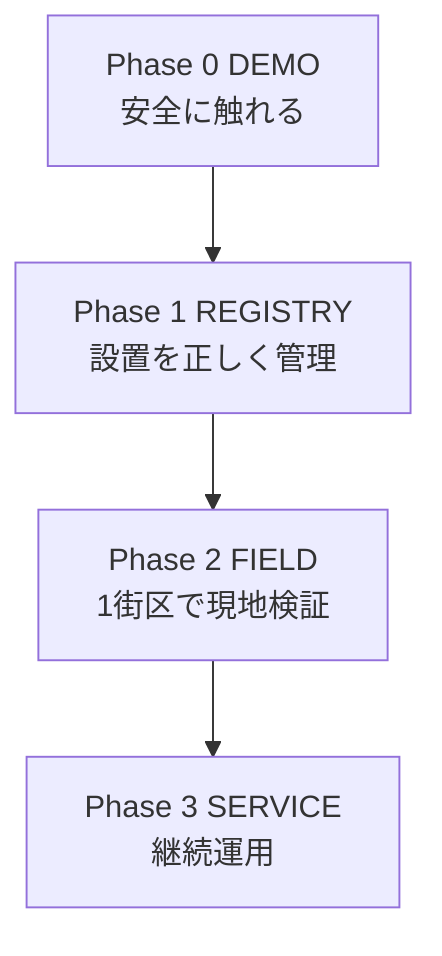

# まちかどQR フェーズ別実装計画

- 作成日: 2026-08-23
- 格納先: `docs/design/`
- 対象仕様: [`20260823-machikado-qr-design-spec.md`](20260823-machikado-qr-design-spec.md) v0.2
- 実行バックログ: [`apps/machikado-qr/TASKS.md`](../../../apps/machikado-qr/TASKS.md)
- エージェント手順: [`apps/machikado-qr/AGENTS.md`](../../../apps/machikado-qr/AGENTS.md)

## 1. 実装方針

最初から運用サービスを作らない。次の四段階を独立したゲートとして進める。



各フェーズは、前段の成果物を再利用するが、前段の仮定を自動的に事実へ昇格させない。特に `candidate → installed`、`直線候補 → 歩行可能経路`、`デモ成功 → 利用者安全` は人間の検証を必須とする。

## 2. フェーズ一覧

| フェーズ | 目的 | 目安 | 主な利用者 | リリース形態 |
|---|---|---:|---|---|
| Phase 0 DEMO | コンセプトと主要導線をすぐ見せる | 当日〜1日 | 審査員・開発者 | ローカル単体HTML |
| Phase 1 REGISTRY | 設置の同意・識別・点検を成立させる | 1〜3週間 | 運用担当・協力店舗 | 関係者限定 |
| Phase 2 FIELD | 5〜20地点で場所伝達と経路を現地検証 | 4〜8週間 | 対象利用者・支援者 | 1街区限定公開 |
| Phase 3 SERVICE | 複数地区で継続可能な運用へ移す | 3〜6か月以上 | 一般利用者・自治体 | SLA付き公開 |

目安は実装工数ではなく、外部同意・実機・現地検証を含む最短レンジ。日付の約束ではない。

## 3. Phase 0 — DEMO

### 3.1 目的

審査・説明の場で、誤発信や誤誘導を起こさず、インストールなしで中核体験を見せる。

### 3.2 実装範囲

| Workstream | 実装 |
|---|---|
| 起動 | `python3 -m http.server` と `demo.html` |
| 現在地 | 住所、目印、場所番号、音声自動試行、再生ボタン |
| 連絡 | デモ用連絡先、発信確認、不発信ガード |
| 緊急 | 110・119を分離、住所付き確認、不発信ガード |
| 帰り道 | 帰る場所番号と次点候補。実歩行禁止を常時表示 |
| 周辺 | 品質ゲートを通った給水スポット最大3件 |
| 多言語 | 日本語、ひらがな、英語、中国語、韓国語 |
| データ | 候補地明示、交通データ隔離、入力ハッシュ・件数レポート |
| 品質 | 1コマンド生成・構文検査・11自動テスト |
| 自律実装 | AGENTS、Claude入口、依存付きタスク、停止条件 |

### 3.3 完了状況

コードと自動検証は完了。次だけ人間確認待ち。

| Gate | 状態 | 実施内容 |
|---|---|---|
| G0-01 自動検証 | PASS | `make verify` |
| G0-02 デモ電話不発信 | コードPASS／実機待ち | 連絡先・110・119を押す |
| G0-03 iOS | 未実施 | Safariでデモ一巡、音声・ダイアログ・地図を確認 |
| G0-04 Android | 未実施 | Chromeで同上 |
| G0-05 200%拡大 | 未実施 | 主要操作、住所、確認画面が欠けないこと |

### 3.4 デモ手順（90秒）

1. `make demo` を実行し、`http://localhost:8000/demo.html` を開く
2. 候補地・不発信・実歩行禁止の二つの警告を示す
3. 特大住所と「住所を音声で聞く」を実演する
4. 「デモ家族に電話」→確認→発信されない通知を示す
5. 「帰り道を確認」→次の候補地点と直線距離デモを示す
6. 「近くの給水スポット」→オープンデータの使い方を示す
7. 110又は119→住所付き確認→発信されないことを示す
8. 言語をひらがな又は英語へ切り替える

### 3.5 ロールバック

生成物は単体HTMLのため、直前に検証済みの `prototype/index.html` と `demo.html` を再配置する。データ更新が原因なら、`build-report.json` の入力ハッシュを前版と比較し、原本と生成物を同時に戻す。

## 4. Phase 1 — REGISTRY

### 4.1 目的

「貼れそうな店舗一覧」を「設置してよい、現地と一致する、廃止できる地点台帳」へ変える。公開Web機能より先に運用事実を作る。

### 4.2 成果物

| 成果物 | 必須内容 |
|---|---|
| 設置済み台帳Schema | 不変ID、候補ID、名称、公式住所、座標、同意主体、設置日、確認日、状態、停止理由 |
| 不変ID仕様 | 発行主体、名前空間、チェック桁、再利用禁止、旧ID別名、廃止保持 |
| 同意フロー | 誰が説明し、誰が同意し、誰が撤回できるか |
| 点検フロー | 点検周期、破損、剥離、移設、閉店、緊急停止、SLA |
| ステッカー生成器 | `installed=active` だけをPDF/SVG化、住所主・QR従 |
| データ帰属表 | 原典、取得日、ライセンス、改変、帰属文、再確認日 |
| 実機UX記録 | 対象者、端末、操作成功、詰まり、改善 |
| 公開ADR | 静的ホスティング、キャッシュ、障害表示、責任者、費用 |

### 4.3 推奨データモデル

```json
{
  "place_id": "不変ID",
  "candidate_source_id": "元候補の参照",
  "display_name": "現地点検済み名称",
  "official_address": "現地点検済み住所",
  "latitude": 35.0,
  "longitude": 139.0,
  "status": "active",
  "consent": {
    "holder": "同意主体ID",
    "approved_on": "YYYY-MM-DD",
    "withdrawal_channel": "連絡経路"
  },
  "installation": {
    "installed_on": "YYYY-MM-DD",
    "last_verified_on": "YYYY-MM-DD",
    "next_verification_on": "YYYY-MM-DD"
  }
}
```

個人名、署名原本、電話番号は公開台帳に含めず、アクセス制御された運用記録と分離する。

### 4.4 実装順

1. MQR-101: 候補と設置済み台帳を分離
2. MQR-103: 不変ID方式を確定
3. MQR-102: 設置責任と同意・撤回を人間が承認
4. MQR-104: ステッカー生成器
5. MQR-105: データ利用条件を一次情報で固定
6. MQR-107: 事前登録UXを対象者別に検証
7. MQR-108: 公開環境を人間承認
8. MQR-106: 交通データは独立して再検証。完了しても必須機能にはしない

### 4.5 Go / No-Go

| Go条件 | No-Go例 |
|---|---|
| 設置責任者と撤回窓口が明記 | 「店舗にお願いする」だけで担当不明 |
| 既発行IDがデータ更新で変わらない | 連番を毎回再計算 |
| activeだけQR生成 | 候補全件を一括印刷 |
| 原典・取得日・帰属文が確認済み | カタログ名だけで公開 |
| iOS・Android実機で主要導線成功 | デスクトップだけで完了扱い |

## 5. Phase 2 — FIELD

### 5.1 目的

1街区、5〜20地点に範囲を限定し、場所伝達、発見、読取、印字、連絡、点検を実世界で検証する。

### 5.2 実証設計

| 項目 | 設計 |
|---|---|
| 地域 | 徒歩で巡回可能、協力主体が明確、既存表示板との比較ができる1街区 |
| 地点 | 5〜20。店舗種別・道路環境・昼夜を分散 |
| 対象者 | 子ども、高齢者、日本語非母語者は本人同意と安全管理の上で代理試験を含める |
| シナリオ | QR成功、QR失敗、音声失敗、連絡先未登録、夜間、剥離、閉店 |
| 計測 | 成功率、時間、誤操作、支援要請、離脱。個人の位置履歴は収集しない |
| 中止 | 誤住所、無断設置、誤発信、危険経路、プライバシー事故のいずれか |

### 5.3 経路案内の実装条件

直線距離ロジックを公開してはならない。現地検証済みグラフを次の形で持つ。

```json
{
  "from": "place-id-a",
  "to": "place-id-b",
  "status": "verified",
  "distance_m": 180,
  "verified_on": "YYYY-MM-DD",
  "constraints": ["daylight_only"],
  "expires_on": "YYYY-MM-DD"
}
```

辺が欠ける、期限切れ、停止中の場合は経路を作らず「その場に留まり連絡」を出す。地図アプリへ渡す場合も、まちかどQR側が安全を保証した表現を使わない。

### 5.4 Phase 2出口

- 全設置地点が台帳と現地で一致
- QR読取不能シナリオを含む場所伝達成功率を取得
- 110・119の実番号を使わず誤発信試験を完了
- 点検・剥離・廃止訓練をSLA内で完了
- 現地検証済み辺以外が経路に使われない自動テスト
- 継続・縮小・点間案内廃止の意思決定資料を作成

## 6. Phase 3 — SERVICE

### 6.1 目的

複数地区で、台帳更新、停止、監査、費用負担を継続できるサービスへ移す。アプリ機能の追加より運用統制を優先する。

### 6.2 必要機能

| 領域 | 必要機能 |
|---|---|
| 台帳 | 認可付き編集、承認、版管理、監査、署名付き公開スナップショット |
| 更新 | 原典差分を自動検出し、全件をまず隔離、人間承認後に公開 |
| 状態 | active / suspended / retired、即時停止、キャッシュ失効 |
| 可用性 | 静的配信、監視、障害時の住所表示、ロールバック |
| 組織 | 自治体・設置先・運営主体のRACI、SLA、費用、問い合わせ |
| 効果測定 | 個人情報を収集しない集計又は任意調査、DPIA、保存期限 |
| セキュリティ | 脅威分析、依存更新、権限棚卸し、インシデント対応 |

### 6.3 非採用の初期案

- LLM電話窓口: 難聴、方言、騒音、緊急責任の検証がなく、中心価値にも不要
- 常時GPS: プライバシー負担が大きく、「固定点で位置を確定」の設計と逆方向
- 全東京一括設置: 点検不能とデータ不整合を拡大する
- 候補店舗の自動QR発行: 設置合意と現地点検を飛ばす

## 7. エージェント実装方式

### 7.1 ハーネス構成

| 文書・機構 | 役割 |
|---|---|
| `AGENTS.md` | 不変条件、作業ループ、停止条件、完了定義 |
| `CLAUDE.md` | Claude系エージェントを正本へ誘導 |
| `TASKS.md` | 状態、依存、受け入れ条件、証跡 |
| `config.json` | 暗黙の閾値を排除し、公開能力を制御 |
| `data/sources.json` | データ出典と利用・隔離状態 |
| `make verify` | 全エージェント共通の受け入れコマンド |
| CI | PRごとに同じ検証を再実行 |

### 7.2 タスク選択

エージェントは最上位の `READY` を1件だけ選ぶ。依存が未完了、実機・現地・契約・法務・公開操作を要する場合は自律完了せず、`HUMAN_REVIEW` 又は `BLOCKED` にする。

### 7.3 変更単位

- 1 PR = 1タスク又は密接な縦切り
- 要件ID、タスクID、テストをPRで結ぶ
- データ変更は入力ハッシュと件数差分を必須記載
- 生成物と正本を同一コミットへ入れる
- 安全フラグの変更を通常のリファクタリングに混ぜない

### 7.4 エージェントが判断してよいこと

- テスト追加、エラーメッセージの明確化、内部リファクタリング
- 既存要件を変えないアクセシビリティ改善
- 品質ゲートを厳しくする変更。ただしデータ減少理由を記録
- ドキュメント間リンク、追跡性、再現性の改善

### 7.5 停止すること

- 電話経路、個人情報送信、設置済み状態、経路安全、公開、費用、外部アカウント、ライセンス判断
- 数値閾値を根拠なしに緩めること
- 実機又は現地試験をコード検査で代替し完了扱いにすること

## 8. テスト計画

### 8.1 自動テスト

| 層 | 検査 |
|---|---|
| データ単体 | 自治体抽出、場所番号一意、許可種別、座標クラスター、デモ経路 |
| ビルド | マーカー置換、JSONのscript脱出防止、再生成成功 |
| UI静的 | 外部script・stylesheetなし、CSP、デモ入口 |
| 構文 | Python compile、Node `--check` |
| 回帰 | 件数範囲、隔離状態、デモ地点存在 |

### 8.2 実機マトリクス

| 端末 | ブラウザ | 幅・拡大 | 音声 | ダイアログ | 地図 | デモ不発信 |
|---|---|---|---|---|---|---|
| iPhone | Safari最新 | 標準 / 200% | 未 | 未 | 未 | 未 |
| Android | Chrome最新 | 標準 / 200% | 未 | 未 | 未 | 未 |
| macOS | Chrome最新 | 375px / 200% | 未 | 未 | 未 | 未 |

### 8.3 現地テスト

自動テストでは代替しない。

- 住所と建物の一致
- QRの読取距離・角度・反射
- 印字だけでの場所伝達
- 子ども・車いす利用者の視点高
- 夜間、雨天、騒音
- 段差、横断歩道、立入・営業時間
- 剥離、汚損、移設、閉店

## 9. CI計画

Phase 0ではGitHub ActionsでPython 3.12を使い、`pip install -r requirements.txt` と `make verify` を実行する。将来の追加ゲート:

1. Playwrightで375px / 390pxの画面スモークテスト
2. axe-coreでアクセシビリティ検査
3. 生成物差分があるのに未コミットなら失敗
4. JSON Schema検証
5. 設置済み台帳の署名検証
6. 期限切れ経路・点検期限超過を公開前に失敗

CI成功は実機・現地・法務ゲートの代替ではない。

## 10. リスク管理

| リスク | 可能性 | 影響 | 対策 | 所有者 |
|---|---:|---:|---|---|
| 誤住所・誤座標 | 高 | 高 | 推定禁止、隔離、現地照合 | データ責任者 |
| 無断設置と誤認 | 高 | 高 | 候補・設置済み分離、同意台帳 | 運用責任者 |
| 未検証経路で事故 | 中 | 高 | 公開フラグOFF、検証済み辺のみ | 安全責任者 |
| デモ中の誤発信 | 中 | 高 | 全電話不発信ガード | 技術責任者 |
| QRを読めない | 高 | 中 | 住所主・QR従、印字単独試験 | UX責任者 |
| 自動音声が出ない | 高 | 中 | 常設手動ボタン | 技術責任者 |
| localStorage漏えい | 中 | 中 | 送信なし、削除、共有端末注意 | プライバシー責任者 |
| 更新で場所ID変化 | 高 | 高 | QR発行前に不変IDへ移行 | 技術＋運用責任者 |
| 点検不能 | 中 | 高 | 小規模開始、SLA、停止状態 | 運用責任者 |

## 11. 直近の実行順

1. MQR-008: iOS / Android / 200%拡大でデモを確認
2. 不具合があればPhase 0タスクとして修正し `make verify`
3. MQR-101: 設置済み台帳Schemaを追加
4. DEC-01とDEC-02を人間が決定
5. MQR-103、MQR-104で不変IDと印刷見本を作る
6. MQR-105で公開帰属文を確定
7. 5〜20地点の協力候補を選び、Phase 2計画を承認

最優先は機能追加ではなく、「候補を設置済みに変える手続き」と「既発行IDが変わらない仕組み」である。
