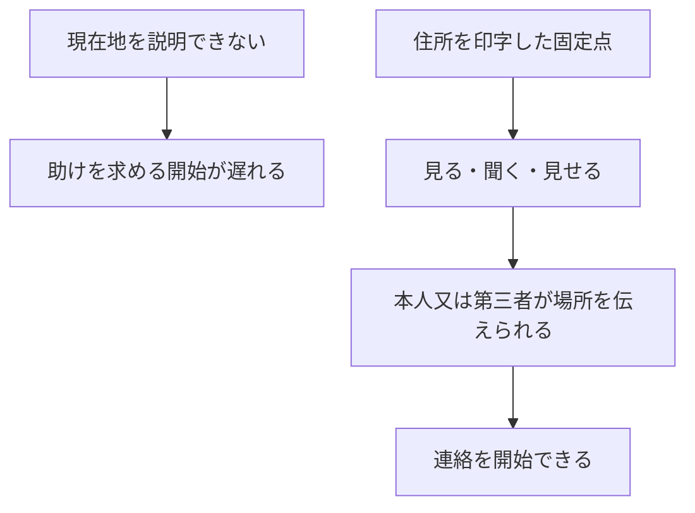
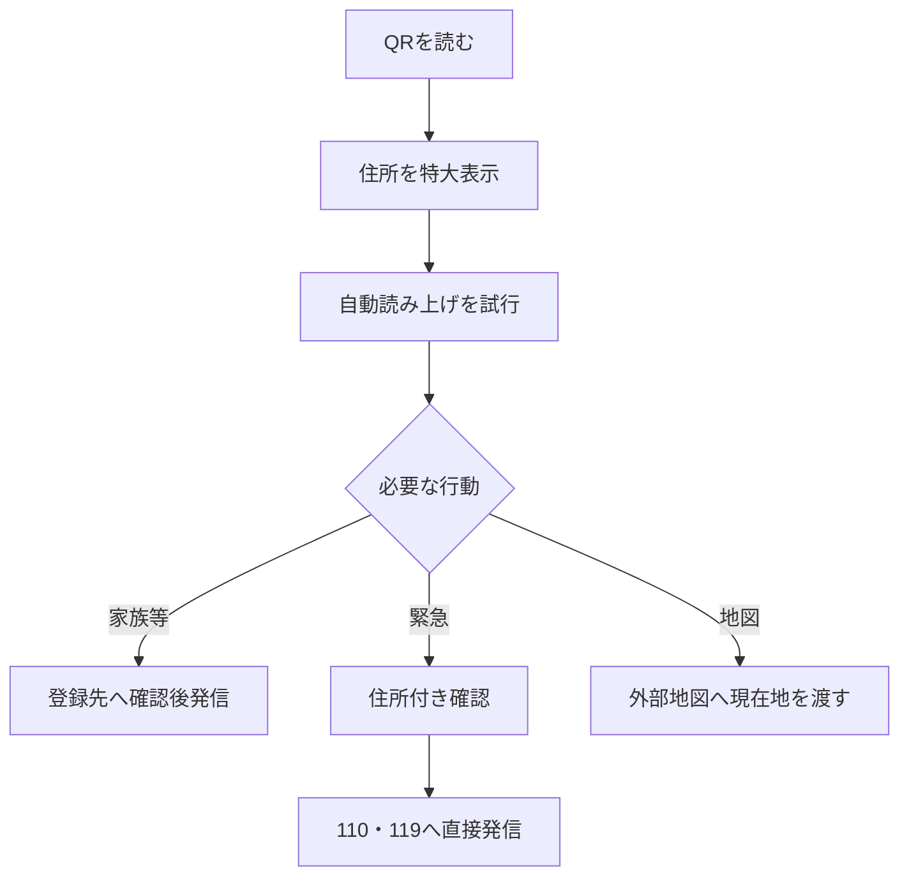
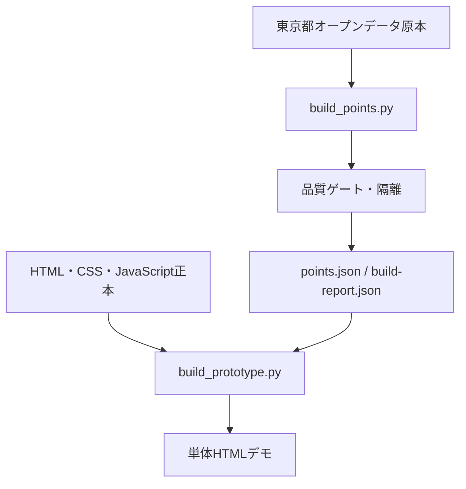
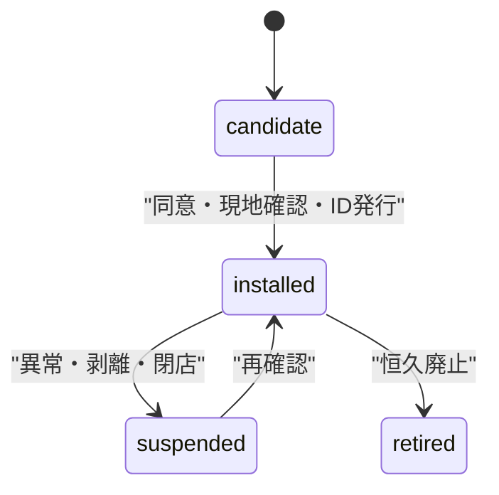
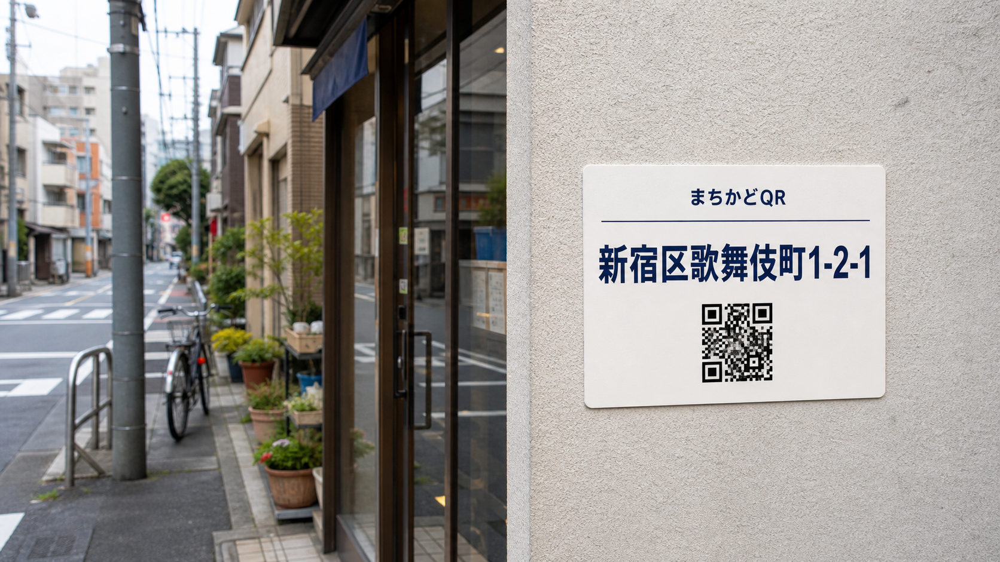

# まちかどQR「ここはどこ」設計仕様書 v0.2

- 作成日: 2026-08-23
- 対象: 都知事杯オープンデータ・ハッカソン2026
- 状態: Phase 0デモ実装済み、公開実証前
- プロダクト正本: [`apps/machikado-qr/`](../../../apps/machikado-qr/)
- 実装計画: [`20260823-machikado-qr-implementation-plan.md`](20260823-machikado-qr-implementation-plan.md)
- レビュー: [`20260823-machikado-qr-review.md`](20260823-machikado-qr-review.md)

## 0. 仕様の結論

まちかどQRは、軒先の **印字住所とQR** を「位置が確定した点」として扱い、現在地を説明しにくい人が、住所を見せる、聞く、家族等へ電話する、110・119へ直接電話するための静的Webアプリである。

価値の中心は経路案内ではなく、次の一文に置く。

> 迷った人を推定位置から救うのではなく、街の中に「住所を確実に名乗れる点」を増やす。

Phase 0は候補地を使う透明なデモに限定する。実在店舗を設置済みとみなさず、未検証の点間歩行を通常利用へ出さない。Phase 1以降で設置同意・不変ID・設置済み台帳を成立させ、Phase 2で初めて現地経路を検証する。

## 1. 解く課題

### 1.1 問題

迷子、認知機能が低下した人、日本語で場所を説明しにくい訪日客、事故の目撃者は、端末を持っていても「自分がどこにいるか」を正確に伝えられない場合がある。位置が確定しなければ、家族への連絡、地図利用、110・119のいずれも開始が遅れる。

### 1.2 因果仮説



本実証で検証するのは「固定点があると場所伝達が改善するか」であり、「救命時間を短縮する」「犯罪を減らす」などの結果は現時点で主張しない。

### 1.3 成果指標

| 指標 | 定義 | Phase 0 | Phase 1–2 |
|---|---|---:|---:|
| 場所伝達成功率 | 住所又は場所番号を第三者へ正しく伝えられた割合 | 模擬確認 | 対象者別に測定 |
| 初回行動時間 | QR読取又はステッカー発見から、場所を口に出す・見せるまで | デモ計時 | 中央値・90パーセンタイル |
| 誤発信率 | 意図せず最終発信操作まで進んだ割合 | デモでは発信不能 | 模擬番号で測定 |
| 読取不能時の成功率 | QRを使わず印字だけで場所を伝えられた割合 | 印刷見本確認 | 実地測定 |
| 設置点健全率 | 台帳上activeかつ現地で読取・印字確認できる割合 | 対象外 | 点検時95%以上を仮置きし検証 |

## 2. 対象とスコープ

### 2.1 優先利用者

| 優先 | 利用者 | 主な制約 | 最短の成功状態 |
|---:|---|---|---|
| 1 | 迷子の子ども | 読字、入力、判断、説明が難しい | 住所を見せる／家族へ電話する |
| 1 | 認知機能が低下した高齢者 | 記憶、操作、視力、聴力に幅がある | 住所を聞く／支援者へ電話する |
| 1 | 日本語で場所を説明しにくい人 | 日本語住所を発音しにくい | 公式住所を画面で第三者へ見せる |
| 2 | 事故・急病の目撃者 | 焦り、片手操作、時間制約 | 印字又は画面の住所を110・119へ伝える |
| 2 | 支援者・家族・宿泊施設 | 事前設定と迎え対応が必要 | 連絡先と帰る場所を事前登録する |

### 2.2 対象機能

- 住所、目印、場所番号の表示
- 日本語住所の音声読み上げ
- 事前登録した連絡先への直接発信
- 現在地の外部地図アプリ連携
- 品質確認済み周辺地点の表示
- 110・119への確認付き直接発信
- 端末内だけの事前登録
- 5言語表示
- デモ専用の点間候補提示

### 2.3 非対象

- 緊急通報や相談の中継
- LLMによる通話応答
- GPSの継続追跡、サーバー側の位置保存
- 自前の地図描画・歩行経路探索
- 住所の推定ジオコーディング
- 未検証座標の補正
- 設置合意、現地点検、法的責任をアプリだけで代替すること

## 3. 不変条件

| ID | 条件 | 理由 |
|---|---|---|
| INV-01 | 110・119は端末から直接発信し、中継を挟まない | 単一障害点と責任の混入を避ける |
| INV-02 | 緊急番号は確認画面を1枚挟む | 誤タップを抑えつつ経路を短く保つ |
| INV-03 | デモモードでは全電話を発信しない | 審査・説明時の誤発信防止 |
| INV-04 | 連絡先・帰る場所・閲覧位置を外部送信しない | 脆弱な利用者の個人情報を収集しない |
| INV-05 | 不明値を推定で埋めない | 誤誘導の損失が欠損表示より大きい |
| INV-06 | 候補地と設置済み地点を別状態にする | 候補店舗にQRがあるとの誤認を防ぐ |
| INV-07 | 未検証経路を通常モードで案内しない | 直線距離は歩行可能性を保証しない |
| INV-08 | 住所をQRより大きく印字する | 読取不能時も第三者へ場所を伝えられる |

## 4. 利用モード

| モード | URL | 用途 | 電話 | 点間案内 | データ表示 |
|---|---|---|---|---|---|
| デモ | `demo.html` 又は `?demo=1` | 審査・説明・開発 | すべて不発信 | 警告付き試算 | 候補地であることを常時表示 |
| 通常プロトタイプ | `?p=<場所番号>` | 端末内挙動確認 | 確認後に `tel:` | 停止 | 候補地であることを常時表示 |
| 公開実証 | Phase 2で新設 | 実設置地点 | 確認後に `tel:` | 検証済み辺だけ | 設置済み台帳だけ |
| 事前登録 | 画面内ダイアログ | 困る前の設定 | 対象外 | 帰る場所番号を登録 | `localStorage`のみ |

「入力させない」は救助時の主画面に対する要件であり、事前登録まで禁止する意味ではない。事前登録と救助時操作を明示的に分ける。

## 5. ユーザーフロー

### 5.1 QRを読める場合



### 5.2 QRを読めない場合

1. ステッカーに大きく印字した住所を見る
2. 住所又は場所番号を周囲の人へ見せる
3. 周囲の人が自身の端末で場所番号を入力又は問い合わせる

Phase 0のWeb画面だけではこの経路を実証できない。Phase 1で印刷物を作り、Phase 2で独立した試験を行う。

## 6. 機能要件

### 6.1 現在地

| ID | 要件 | 受け入れ条件 |
|---|---|---|
| FR-01 | URLの場所番号と台帳の完全一致だけで地点を決める | 不明・欠落時に近傍推定せずエラーを表示 |
| FR-02 | 住所を画面最大級で表示する | 375px幅で横スクロールせず読める |
| FR-03 | 目印と場所番号を住所に添える | 住所より視覚優先度を下げ、両方表示 |
| FR-04 | 読込直後に日本語住所の読み上げを試みる | 対応ブラウザで発話APIを呼ぶ |
| FR-05 | 手動の読み上げボタンを常設する | 自動再生が止められても1タップで再試行可能 |

### 6.2 連絡と緊急

| ID | 要件 | 受け入れ条件 |
|---|---|---|
| FR-06 | 登録連絡先へ電話できる | 発信前確認を表示し、通常モードだけ `tel:` へ遷移 |
| FR-07 | 110・119を他の操作から分離する | 区切り線と独立領域を設ける |
| FR-08 | 緊急確認画面に住所を表示する | 最終ボタンと同じ画面で公式住所を確認可能 |
| FR-09 | デモでは全発信を無効化する | 連絡先・110・119のいずれも `tel:` へ遷移しない |

### 6.3 事前登録

| ID | 要件 | 受け入れ条件 |
|---|---|---|
| FR-10 | 連絡先種別、呼び名、電話番号を登録する | `machikadoQr:profile:v1` だけにJSON保存 |
| FR-11 | 帰る住所と近隣場所番号を任意登録する | 場所番号は台帳完全一致時だけ保存 |
| FR-12 | 端末内データを削除できる | 1操作＋通知で対象キーを削除 |
| FR-13 | 住所だけの場合は方向を出さない | 住所を表示し「方向は計算しない」と明示 |

### 6.4 地図・周辺地点・点間案内

| ID | 要件 | 受け入れ条件 |
|---|---|---|
| FR-14 | 現在地点を外部地図へ渡す | HTTPSの地図URLへ緯度経度を渡す |
| FR-15 | 品質ゲートを通った周辺地点だけ表示する | 許可種別と1.5km以内に限定し近い順で最大3件 |
| FR-16 | 点間案内は公開フラグで制御する | `waypoint_guidance_public=false` なら通常モードで停止 |
| FR-17 | デモの次点は40〜400mかつ帰る場所へ25m以上近づく候補から選ぶ | 条件を満たす候補がなければ移動停止を表示 |
| FR-18 | 2km超の帰る場所へ歩かせない | 次点を出さず連絡先利用を促す |

40m、400m、25m、2kmは実証用設定値であり、安全基準ではない。Phase 2で経路単位の検証結果へ置き換える。

### 6.5 言語

| ID | 要件 | 受け入れ条件 |
|---|---|---|
| FR-19 | 日本語、ひらがな日本語、英語、中国語、韓国語を切替可能 | 主要操作と安全警告が全言語で表示 |
| FR-20 | 公式住所は原文日本語を保持する | 翻訳で住所文字列を置換しない |

## 7. 非機能要件

| ID | 分類 | 要件・基準 |
|---|---|---|
| NFR-01 | 可用性 | 生成済み `index.html` は初期表示にサーバーAPI・CDN・外部フォントを必要としない |
| NFR-02 | 性能 | 低速回線を前提に単体HTMLとし、初期表示でネットワーク要求0。サイズはPhase 0で500KB以下 |
| NFR-03 | アクセシビリティ | 主要タップ領域48px以上、キーボードフォーカス可視、200%拡大、色だけに依存しない |
| NFR-04 | セキュリティ | 動的値は `textContent` で描画し、埋込JSONはscript終了文字をエスケープ |
| NFR-05 | プライバシー | 外部送信0、アクセス解析0、Cookie 0。個人設定は名前空間付きlocalStorageのみ |
| NFR-06 | 再現性 | 同じ入力のビルド結果は同一。入力ファイルSHA-256と除外件数を記録 |
| NFR-07 | データ品質 | 場所番号重複0、候補地1,200〜1,300件の範囲、隔離種別は出力しない |
| NFR-08 | 保守性 | ソースと生成物を分離し、`make verify` を唯一の受け入れ入口とする |
| NFR-09 | 透明性 | 候補地、デモ、隔離中データを画面と出典詳細で明示 |
| NFR-10 | 互換性 | Phase 0対象は最新iOS Safari、Android Chrome、デスクトップChrome。実機確認をリリースゲートにする |

## 8. システム構成



### 8.1 コンポーネント

| コンポーネント | 責務 | 禁止事項 |
|---|---|---|
| `config.json` | 閾値、利用可能種別、公開フラグ、デモ地点 | コード内への重複定義 |
| `data/sources.json` | 出典、原典URL、利用状態、隔離理由 | 出典不明データの登録 |
| `build_points.py` | 読込、形式検査、品質ゲート、候補・表示データ生成 | 推定補正、候補から設置済みへの昇格 |
| `build_prototype.py` | ソースとデータを単体HTMLへ結合 | UIロジックの重複実装 |
| `src/app.js` | UI、端末内保存、距離計算、外部アプリ連携 | `fetch`、位置・個人情報送信 |
| `verify.py` | 構文、自動テスト、受け入れ検証 | 警告を成功に読み替えること |

### 8.2 正本と生成物

- 編集する: `src/`、`scripts/`、`config.json`、`data/sources.json`
- 生成する: `data/points.json`、`data/build-report.json`、`prototype/index.html`、`prototype/demo.html`
- 凍結資料: `docs/design/machikado-qr/20260823-machikado-qr-v0.1.html`

## 9. データ仕様

### 9.1 状態モデル



Phase 0の `points.json` は全件 `candidate`。`installed` はPhase 1で別台帳を導入するまで存在しない。

### 9.2 ランタイムデータ

```json
{
  "schema_version": 1,
  "data_mode": "candidate-demo",
  "capabilities": {
    "waypoint_guidance_public": false,
    "enabled_destination_kinds": ["water"]
  },
  "sources": [],
  "points": [
    {
      "c": "新宿0001",
      "n": "目印名",
      "a": "新宿区…",
      "m": "新宿区",
      "lat": 35.0,
      "lon": 139.0,
      "status": "candidate"
    }
  ],
  "dest": []
}
```

### 9.3 品質ゲート

| Gate | 条件 | 失敗時 |
|---|---|---|
| DG-01 | 原本のヘッダーが期待値と一致 | ビルド停止 |
| DG-02 | 緯度経度が数値かつ東京都本土の矩形内 | 当該行を除外し件数記録 |
| DG-03 | 住所が東京都の自治体名で始まる | 当該行を除外し件数記録 |
| DG-04 | 場所番号が全件一意 | ビルド停止 |
| DG-05 | 候補地点が設定範囲内 | ビルド停止し入力更新をレビュー |
| DG-06 | 周辺地点が住所自治体の候補地点から3km以内 | 当該行を除外。3km自体は暫定値 |
| DG-07 | 同一座標クラスターが設定上限以下 | 超過行を隔離 |
| DG-08 | 種別が許可リストにある | ランタイム出力から隔離 |
| DG-09 | 入力SHA-256と全除外件数を記録 | レポート生成失敗ならビルド失敗 |

### 9.4 2026-08-23の実測結果

| データ | 原本 | 出力 | 主な除外・隔離 |
|---|---:|---:|---|
| 設置候補 | 11,003行（見出し2行を含む） | 1,242 | 範囲外9,738、空行・不正値21 |
| 給水 | 836 | 827 | 住所自治体との近接判定で9件除外 |
| 交通 | 268 | 0 | 最大同一座標クラスター110、全体を利用停止 |

詳細値と入力ハッシュは [`data/build-report.json`](../../../apps/machikado-qr/data/build-report.json) を正本とする。

## 10. 点間候補アルゴリズム

Phase 0のデモロジックは、経路探索ではなく概念確認である。

1. 現在地点 `P` と帰る場所番号 `H` を台帳の完全一致で解決する
2. `P` と `H` の直線距離が2km超なら候補を出さない
3. 全候補 `Q` から、`P→Q` が40〜400mのものを選ぶ
4. `Q→H` が `P→H` より25m以上短いものだけ残す
5. `Q→H` が最短の1点を表示する
6. 候補がなければ移動停止を表示する

この処理は道路、横断歩道、立入禁止、階段、営業時間、照明、工事を見ない。したがって公開利用は `false` のままとする。Phase 2では直線候補を廃止し、現地検証済みの有向辺だけを持つグラフへ置き換える。

## 11. UI・アクセシビリティ

### 11.1 情報優先順位

1. 現在地住所
2. 音声再生
3. 登録連絡先
4. 帰る場所・周辺地点・地図
5. 離隔した110・119
6. 出典詳細

### 11.2 ステッカー要件（Phase 1）

貼付位置と情報量を共有するためのデザイン検討用イメージを置く。画像内のQRはモックであり、実在店舗への設置済み表示や実際の読取可能性を示さない。



- 住所を最大要素、QRを従要素にする
- 場所番号を人が口頭で読みやすい単位に区切る
- 「QRが読めなくても住所を見せてください」を平易な日本語とピクトグラムで示す
- 反射、汚損、車いす・子どもの視点高、夜間照明を試験する
- 候補地には印刷しない。`installed=active` だけを生成対象とする

### 11.3 音声

ブラウザはユーザー操作なしの音声再生を止める場合がある。よって「必ず自動で喋る」とは規定せず、次の二段構成にする。

- 読込時: Web Speech APIで自動再生を試行
- 常設: 48px以上の音声ボタンで再試行

公式住所は日本語音声で読み、導入句だけ選択言語を使う。

## 12. 安全・プライバシー・セキュリティ

### 12.1 安全上の失敗モード

| 失敗 | 危険 | フォールバック |
|---|---|---|
| 場所番号不明 | 別地点を誤表示 | 推定せず再読取を促す |
| 音声自動再生失敗 | 住所を聞けない | 常設の再生ボタン |
| 帰る場所座標なし | 誤方向 | 住所だけ表示し計算しない |
| 次点なし | 無理な移動 | その場に留まり連絡先・地図を使う |
| 遠距離 | 歩行負担・再迷子 | 次点を出さず連絡先を優先 |
| データ異常 | 誤誘導 | 品質ゲートで隔離、補正しない |
| QR破損 | Webを開けない | 印字住所と場所番号を使う |

### 12.2 プライバシー

- 保存キー: `machikadoQr:profile:v1` と言語設定のみ
- 保存内容: 連絡先種別、表示名、電話番号、帰る住所、帰る場所番号
- 保存場所: 同一ブラウザのlocalStorage
- 送信先: なし
- Cookie、解析タグ、広告SDK: なし
- 削除: 事前登録画面から可能

共有端末ではlocalStorageを他者が読めるため、Phase 1では「端末ロックと共有端末非推奨」を利用条件に追加する。より強い保護が必要なら、Web保存をやめOS連絡先への委譲を比較検討する。

### 12.3 Webセキュリティ

- 初期読込のネットワーク通信をCSP `connect-src 'none'` で禁止
- 外部スクリプト、CSS、フォントを使わない
- 動的文字列を `innerHTML` に渡さず `textContent` で描画
- 埋込JSON中の `<`、`>`、`&`、Unicode行区切りをエスケープ
- 電話番号は発信直前に数字と先頭 `+` へ正規化

## 13. オープンデータ

| ID | データ | 提供元 | 原典 | 現在の利用 |
|---|---|---|---|---|
| DS-01 | 都内災害時帰宅支援ステーション協力店舗一覧（令和7年3月31日） | 東京都総務局 | [カタログ](https://catalog.data.metro.tokyo.lg.jp/dataset/t000003d2000001096) | 候補地デモ |
| DS-02 | Tokyowater Drinking Station 一覧 | 東京都水道局 | [カタログ](https://catalog.data.metro.tokyo.lg.jp/dataset/t000019d0000000003) | 周辺地点 |
| DS-03 | 「だれでも東京」交通 | 東京都デジタルサービス局 | [リソース](https://catalog.data.metro.tokyo.lg.jp/dataset/t000029d0000000003/resource/55cea069-8119-4355-b401-07751745c4fc) | 隔離 |

公開前に、各原典の最新ライセンス、取得日、改変内容、必要な帰属文を再確認する。`data/sources.json` の `license_status` が確認済みになるまで公開ゲートを通さない。

## 14. テストと追跡性

| 要件 | 自動検証 | 実機・人間検証 |
|---|---|---|
| FR-01、DG-04 | 場所番号一意テスト、不明地点画面 | QR読取 |
| FR-04、FR-05 | JS構文、ボタン存在 | iOS / Android音声 |
| FR-09 | デモ分岐のコード検査 | 全電話ボタンの不発信 |
| FR-16〜18 | デモ経路候補テスト、公開フラグ | 現地経路はPhase 2 |
| NFR-01 | 外部script・stylesheet不在、CSP | オフライン再読込 |
| NFR-04 | JSON脱出テスト | セキュリティレビュー |
| NFR-06、NFR-07 | 入力ハッシュ、件数、重複、隔離テスト | データ差分承認 |
| NFR-10 | 対象外 | MQR-008実機マトリクス |

共通コマンド:

```bash
cd apps/machikado-qr
make verify
```

## 15. フェーズとリリースゲート

| フェーズ | 到達点 | Go条件 |
|---|---|---|
| Phase 0 DEMO | 審査で安全に触れる単体HTML | 自動テスト、電話不発信デモ、候補表示、実機確認 |
| Phase 1 REGISTRY | 設置同意と不変IDを持つ台帳 | 責任者、ライセンス、設置・点検手順、印刷物試験 |
| Phase 2 FIELD | 1街区5〜20点の限定実証 | 全地点現地照合、経路辺検証、対象者試験、停止手順 |
| Phase 3 SERVICE | 継続運用可能な複数地区サービス | SLA、監査、更新承認、費用・責任分界、効果測定 |

詳細タスク、依存関係、ロールバックは実装計画と `TASKS.md` に置く。

## 16. 未決定事項

| ID | 未決定 | 決定主体 | 期限 |
|---|---|---|---|
| DEC-01 | 設置・点検・撤去の最終責任者 | プロジェクト責任者＋設置先 | Phase 1開始前 |
| DEC-02 | 不変な場所IDの発行主体と形式 | 技術責任者＋運用責任者 | QR印刷前 |
| DEC-03 | 帰る場所の登録方式 | UX責任者＋対象者テスト | Phase 1 |
| DEC-04 | 点間案内を残すか、地図連携だけにするか | 安全責任者 | Phase 2前 |
| DEC-05 | 公開ホスティングと障害時表示 | 運用責任者 | 公開前 |
| DEC-06 | データ帰属文と再配布条件 | データ責任者 | 公開前 |

未決定事項をコードの暗黙値で決着させない。`TASKS.md` の判断待ちに記録し、人間判断が必要な条件ではエージェントを停止する。

## 17. 用語

| 用語 | 定義 |
|---|---|
| 候補地点 | オープンデータ上、設置交渉の候補になり得る地点。QR設置を意味しない |
| 設置済み地点 | 同意、現地住所確認、設置、台帳登録を完了した地点 |
| 場所番号 | QR URLと印字に使う地点識別子。Phase 0の連番は仮ID |
| 次点 | 検証済みの別固定点。Phase 0では概念デモ上の候補にすぎない |
| 品質ゲート | 入力形式・座標・重複・利用状態を検査し、不確かな行を隔離する処理 |
| 公開実証 | 実在の設置済み地点を一般利用者が使う限定運用。Phase 0デモとは別 |
