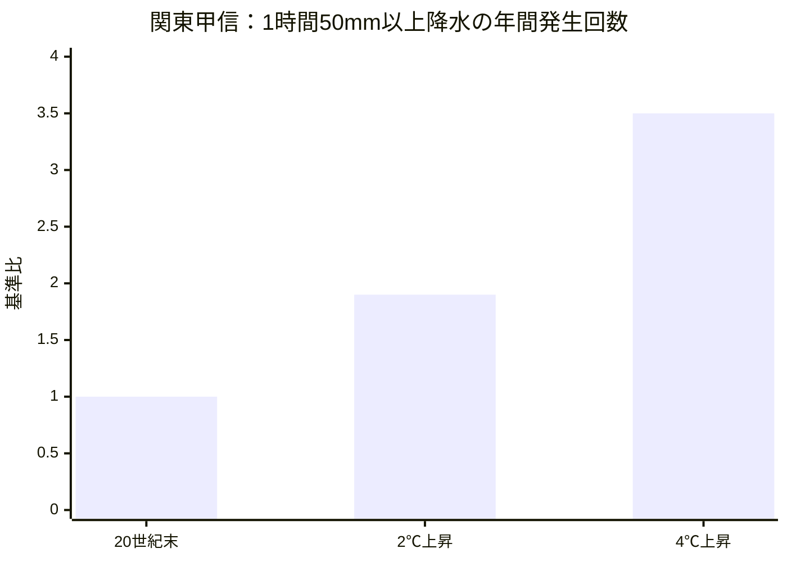
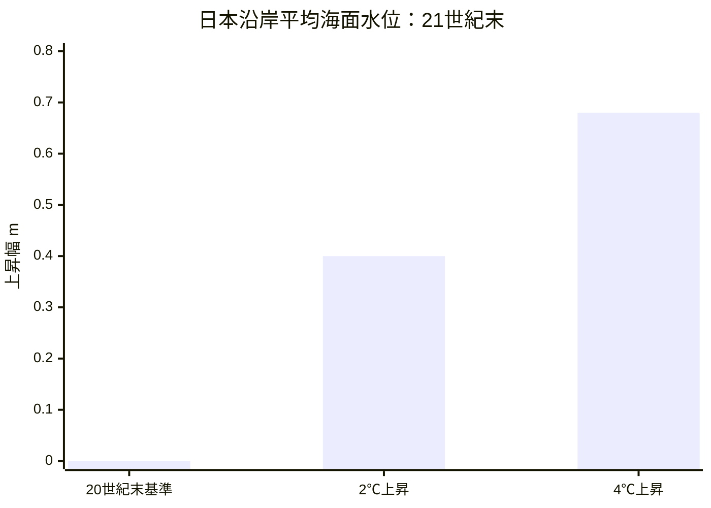
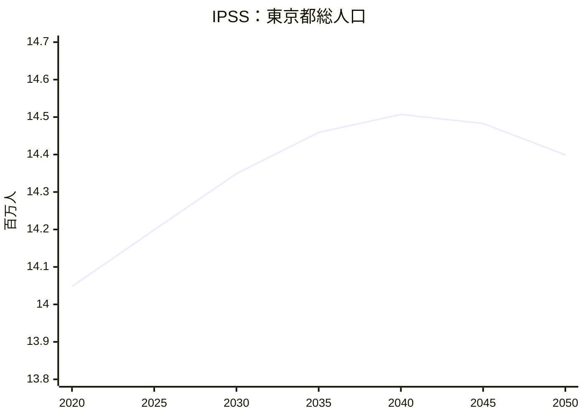
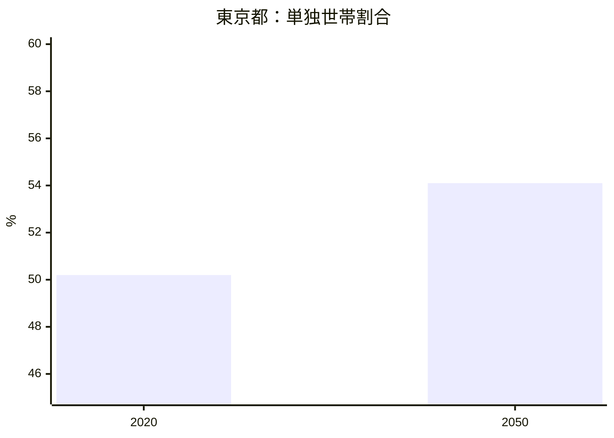
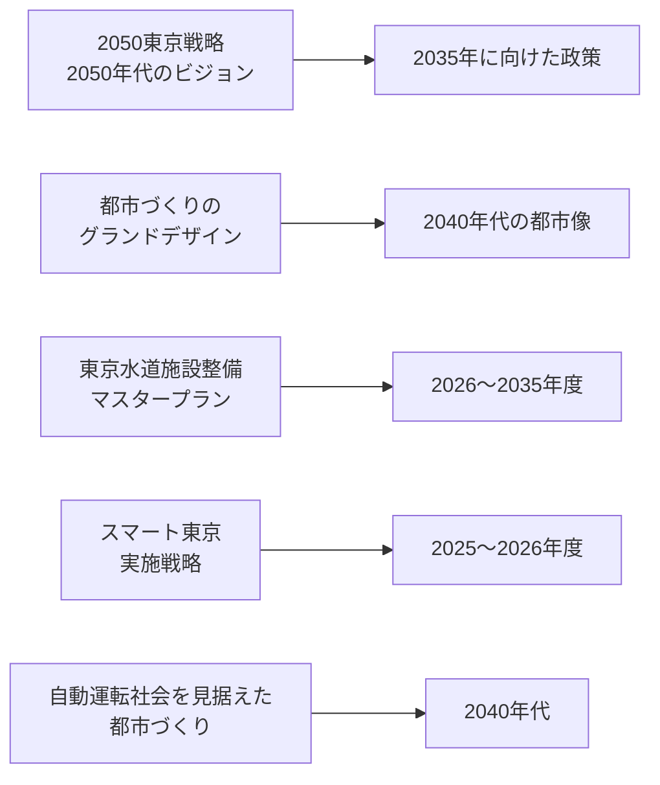
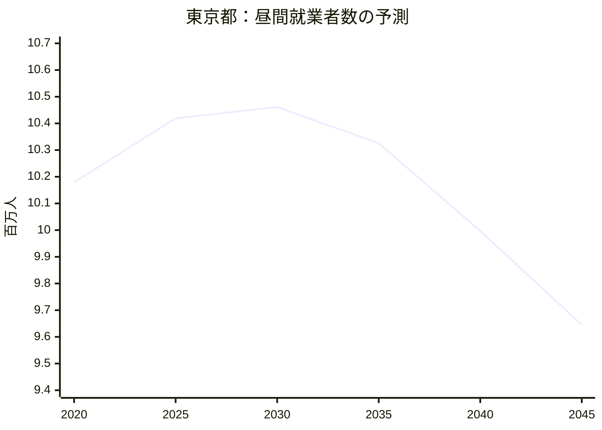
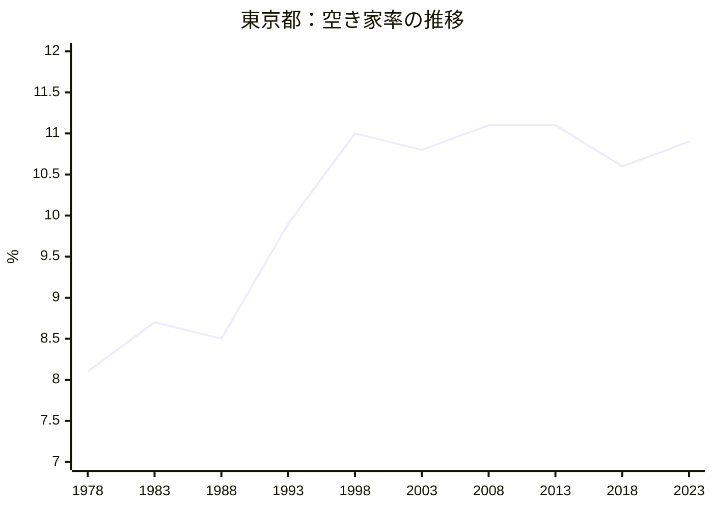
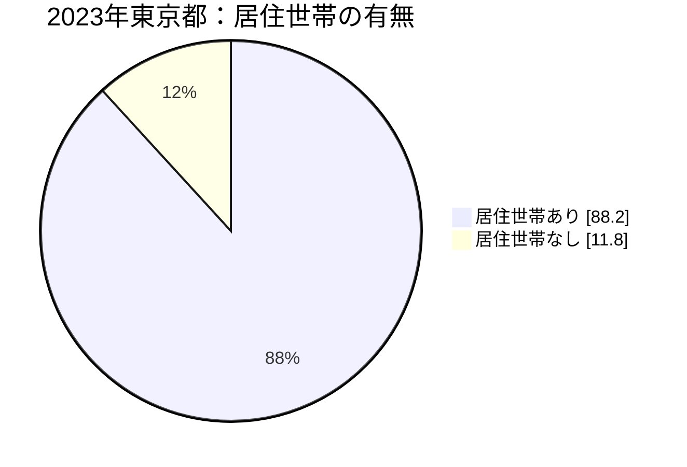
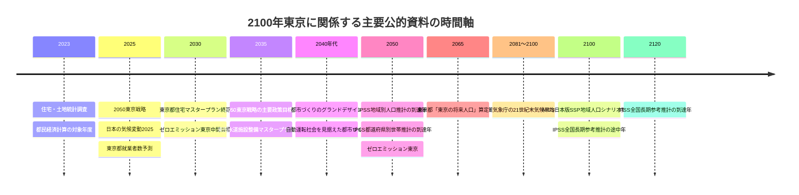

# 2100年の東京：一次情報中心の調査整理

**調査基準日:** 2026年8月22日（日本時間）  
**対象:** 東京都。必要に応じて、関東甲信、日本沿岸、日本全国の公的データを併記。  
**調査方針:** 政府・自治体・国際機関・公的研究機関の一次資料を優先し、観測値、将来推計、政策・計画、技術的対策を整理。独自の将来予測や価値判断は加えない。  
**推奨英語MDファイル名:** `20260822-tokyo-2100-primary-source-research.md`  
**MDファイル:** [20260822-tokyo-2100-primary-source-research.md をダウンロード](sandbox:/mnt/data/20260822-tokyo-2100-primary-source-research.md)

## Executive Summary

2100年の東京について、**21世紀末まで直接数値が公表されている分野は主に気候・環境**である。気象庁・東京管区気象台の2025年版資料では、20世紀末と比べた21世紀末の東京都の年平均気温は、2℃上昇シナリオで約**+1.4℃**、4℃上昇シナリオで約**+4.3℃**。猛暑日は現在の基準値約2日/年から約8日/年または約30日/年、熱帯夜は約7日/年から約21日/年または約62日/年とされる。関東甲信の1時間50mm以上の雨の年間発生回数は約1.9倍または約3.5倍である。citeturn3view0

日本沿岸平均の海面水位について、気象庁は1986～2005年平均を基準として2081～2100年平均を、SSP1-2.6相当の2℃上昇シナリオで**+0.40m**、SSP5-8.5相当の4℃上昇シナリオで**+0.68m**と予測している。可能性の幅はそれぞれ0.30～0.55m、0.56～0.88mである。citeturn20search2

人口について、東京都の推計人口は2026年7月1日時点で**14,301,986人**。IPSS「日本の地域別将来推計人口（令和5年推計）」では、東京都は2020年14,047,594人から2040年14,507,419人、2050年14,399,144人と推計されている。同推計の対象期間は2050年までである。citeturn14search3turn17search0turn19search6

全国についてはIPSS「日本の将来推計人口（令和5年推計）」に2071～2120年の長期参考推計があり、出生中位・死亡中位では2100年の日本人口は**62,779千人**、うち0～14歳5,590千人、15～64歳32,102千人、65歳以上25,087千人である。これは**日本全国の値であり、東京都の2100年人口値ではない**。citeturn17search9turn2view2

東京都の現行資料では、「2050東京戦略 附属資料 東京の将来人口」が人口・世帯数を**2065年まで**算定している。一方、国立環境研究所の日本版SSP市区町村別人口シナリオ第2版は、2015～2100年を5年刻みで、東京23区を区別し、性別・5歳階級別に提供している。SSP1～5および一部移動率固定ケースの計8シナリオであり、気候変動影響・適応評価のための研究用社会経済シナリオとして公表されている。citeturn36view0turn30view0

東京都には2100年を対象とした過去の長期推計も存在する。「東京の自治のあり方研究会」で用いられた2012年前後のベース推計では、当時の仮定に基づき2100年人口を**713万人**、生産年齢人口331万人、高齢化率約46%としていた。ただし、これは現行のIPSS地域推計や「2050東京戦略」の人口推計ではなく、基準年・人口移動・出生等の仮定が古い**歴史的長期推計**である。citeturn35search3turn35search17

都市機能について、東京都の主要な現行計画は「2050東京戦略」が2050年代のビジョンと2035年に向けた政策、「都市づくりのグランドデザイン」が2040年代、「東京水道施設整備マスタープラン」が2026～2035年度、「スマート東京実施戦略2025-2026」が短中期のデジタル施策を扱う。耐震化、無電柱化、木造住宅密集地域の防災性向上、豪雨・洪水対策、水道施設の更新・強靱化、デジタル化、自動運転を見据えた都市整備などが公式施策として位置付けられている。citeturn8search0turn8search1turn8search3turn8search4turn8search13turn21search13

経済について、最新の「都民経済計算 令和5年度年報」では2023年度の東京都の名目都内総生産は約**125.0兆円**で、日本の国内総生産の**21.0%**。実質経済成長率は0.5%である。東京都の最新就業者数予測は2045年までで、東京都の昼間就業者数は2020年10,179,408人、2030年10,461,320人、2045年9,644,518人である。citeturn10search0turn25search0

住環境について、2023年住宅・土地統計調査の東京都結果では、総住宅数**8,201,400戸**、空き家**896,500戸**、空き家率**10.9%**。IPSSの都道府県別世帯推計では、東京都の単独世帯割合は2020年50.2%から2050年54.1%となる。東京都住宅マスタープランは2021～2030年度を計画期間として、住宅セーフティネット、空き家、マンション、高齢者住宅、防災、省エネルギー等を政策対象としている。citeturn27search0turn13view3turn26search0

## 調査範囲と資料の読み方

### 公的資料が到達する将来年

2100年の東京については、分野ごとに公的資料の「将来の到達年」が大きく異なる。気候資料は21世紀末を直接扱う一方、人口・世帯・都市計画・経済計画の多くは2050年前後までである。citeturn3view0turn20search2turn17search0turn21search0turn22search0

| 分野 | 主な公的・研究資料の到達年 | 資料上の位置付け |
|---|---:|---|
| 気候 | 2081～2100年平均、2100年 | 気象庁の正式な21世紀末将来予測。citeturn20search2turn3view0 |
| 東京都人口 | IPSS 2050年 | 最新の国の都道府県別公式人口推計。citeturn17search0 |
| 東京都独自人口資料 | 2065年 | 「2050東京戦略」政策立案用基礎データ。citeturn21search0turn36view0 |
| NIES日本版SSP人口 | 2100年 | 気候影響・適応評価向け研究シナリオ。citeturn30view0 |
| 日本全国人口 | 2120年 | IPSSの2071～2120年長期参考推計。citeturn17search9 |
| 都市計画 | 2035～2050年代 | 「2050東京戦略」、グランドデザイン等。citeturn8search0turn8search1 |
| 就業者 | 2045年 | 東京都の最新就業者数予測。citeturn22search0turn25search0 |
| 世帯 | 2050年 | IPSS都道府県別世帯推計。citeturn17search5turn13view3 |
| 住宅政策 | 2030年度 | 現行東京都住宅マスタープラン。citeturn26search0 |

したがって、本レポートでは「2100年」という同じ年について、**2100年を直接推計する資料**と、**2050～2065年までしか公表されていない現行計画・推計**を分けて表示する。

### 気候シナリオ

気象庁「日本の気候変動2025」は、21世紀末の代表的な将来世界として、2℃上昇シナリオと4℃上昇シナリオを使用している。2℃上昇シナリオはSSP1-2.6相当、4℃上昇シナリオはSSP5-8.5相当で、東京都別リーフレットの地域気候モデル部分ではRCP2.6／RCP8.5表記も用いられている。citeturn3view0turn20search2

IPCC AR6もSSP1-2.6、SSP2-4.5、SSP3-7.0、SSP5-8.5等を用いて全球・地域気候を評価しており、気象庁「日本の気候変動2025」はAR6の知見を踏まえて日本について評価している。citeturn34search0turn20search8

### 人口シナリオ

IPSSの将来人口推計とNIESの日本版SSP人口シナリオは性格が異なる。IPSS地域別推計は2020年国勢調査を出発点として2050年まで都道府県・市区町村人口を推計する現行の公的地域人口推計である。citeturn17search0

NIES日本版SSP第2版は、気候変動影響・適応評価のために作成された社会経済シナリオで、2015～2100年、5年刻み、市区町村別、性別・5歳階級別に整備されている。東京23区については各区別に収録され、SSP1～5と一部の移動率固定ケースを含む8系列が公開されている。citeturn30view0

なお、A-PLATは2026年3月9日、第2版として公開していたリンクが一時期第1版ファイルを配信していた可能性があることを公表し、同日時点でリンクを修正したとしている。本調査では修正後ページを基準とした。citeturn30view0

## 環境

### 主要一次資料

| 機関 | 主要資料 | 対象・特徴 | 公式URL |
|---|---|---|---|
| 気象庁・東京管区気象台 | 東京都「気候変動に関する都県別リーフレット」2025 | 東京都の21世紀末気温、猛暑日、熱帯夜、降水、海面水温等。citeturn3view0 | `https://www.data.jma.go.jp/tokyo/shosai/chiiki/kikouhenka/leaflet2025/pdf/tokyo-l2025.pdf` |
| 気象庁・文部科学省 | 日本の気候変動2025 | 日本全体の大気・陸・海洋の観測・予測評価。citeturn20search8 | `https://www.data.jma.go.jp/cpdinfo/ccj/2025/html_honpen/cc2025_honpen_1.html` |
| 気象庁 | 日本の気候変動2025「海面水位」 | 日本沿岸の2081～2100年平均海面水位をシナリオ別評価。citeturn20search2 | `https://www.data.jma.go.jp/cpdinfo/ccj/2025/html_honpen/cc2025_honpen_9.html` |
| 気象庁 | 日本の気候変動2025「高潮・高波」 | 高潮・高波と平均海面上昇の複合リスク等を評価。citeturn20search7 | 気象庁「日本の気候変動2025」第11章 |
| 環境省 | 気候変動適応計画 | 防災、健康、水環境、農林水産、生態系等の国の適応方針。citeturn2view3 | 環境省公式 |
| 東京都 | 東京都気候変動適応計画 | 2030目標・2050の望ましい状態を設定。citeturn1search3turn1search15 | 東京都公式 |
| 東京都 | ゼロエミッション東京戦略 Beyond カーボンハーフ | 2030・2035・2050の排出削減政策と適応。citeturn1search19 | 東京都公式 |
| IPCC | Sixth Assessment Report | 全球・地域気候変動評価の国際的基礎資料。citeturn34search0 | `https://www.ipcc.ch/assessment-report/ar6/` |
| NIES A-PLAT | 日本版SSP関連データ | 2100年までの気候影響・適応評価用社会経済データ。citeturn30view0 | `https://adaptation-platform.nies.go.jp/data/socioeconomic/` |

### 気温・暑熱

東京管区気象台の東京都版資料によると、20世紀末との比較で21世紀末の東京都の年平均気温は、2℃上昇シナリオで約1.4℃、4℃上昇シナリオで約4.3℃上昇する。観測された東京都の年平均気温の長期変化率については、100年当たり2.6℃の上昇傾向が記載されている。citeturn3view0

| 指標 | 20世紀末等の基準 | 2℃上昇シナリオ | 4℃上昇シナリオ | 地域 |
|---|---:|---:|---:|---|
| 年平均気温の変化 | 基準 | **+約1.4℃** | **+約4.3℃** | 東京都。citeturn3view0 |
| 猛暑日 | 約2日/年 | **約8日/年** | **約30日/年** | 東京都。citeturn3view0 |
| 熱帯夜 | 約7日/年 | **約21日/年** | **約62日/年** | 東京都。citeturn3view0 |

```mermaid
xychart-beta
    title "東京都：猛暑日・熱帯夜の年日数"
    x-axis ["20世紀末", "2℃上昇", "4℃上昇"]
    y-axis "日/年" 0 --> 70
    bar "猛暑日" [2, 8, 30]
    bar "熱帯夜" [7, 21, 62]
```

出典：気象庁・東京管区気象台「東京都の気候変動」2025。citeturn3view0

### 大雨・豪雨

関東甲信について、1時間降水量50mm以上の雨の年間発生回数は、20世紀末と比べ21世紀末に2℃上昇シナリオで約**1.9倍**、4℃上昇シナリオで約**3.5倍**と予測される。一方、無降水日はそれぞれ年間約4日、約10日増えるとされている。citeturn3view0

現在の気候で「100年に1回」に相当する大雨について、気象庁は21世紀末に降水量が1.5℃上昇時約1.6倍、2℃上昇時約2.1倍、4℃上昇時約3.7倍になる評価を示している。東京都について、1976～2023年のデータから算定した現在気候の100年確率日降水量の例として約299mmが掲載されている。citeturn3view0

出典：気象庁・東京管区気象台。citeturn3view0

### 海面水位・海洋

気象庁「日本の気候変動2025」は、日本沿岸の平均海面水位が21世紀中上昇し続けると予測しており、確信度を「高い」と評価している。20世紀末の1986～2005年平均を基準とした上昇幅は、2031～2050年平均でSSP1-2.6が0.17m、SSP5-8.5が0.19m、2081～2100年平均ではそれぞれ0.40m、0.68mである。citeturn20search2

| 期間 | 2℃・SSP1-2.6 | 4℃・SSP5-8.5 |
|---|---:|---:|
| 2031～2050年平均 | +0.17m（0.14～0.21m） | +0.19m（0.16～0.24m） |
| 2081～2100年平均 | **+0.40m（0.30～0.55m）** | **+0.68m（0.56～0.88m）** |

出典：気象庁「日本の気候変動2025」。括弧内は17～83パーセンタイルの可能性の幅。citeturn20search2

東京都沿岸だけの値ではなく、日本沿岸平均値である。気象庁は日本沿岸の平均上昇量について顕著な海域差は見られないとの評価を示している一方、詳細な沿岸影響には地域的な地盤上下動等も関係し、日本沿岸の将来海面評価では地殻上下動の影響は当該見積もりに含まれていないとしている。citeturn20search2turn20search4

関東南方の海面水温については、21世紀末に20世紀末比で2℃上昇シナリオ約+0.97℃、4℃上昇シナリオ約+2.88℃とされている。citeturn3view0

### 台風・高潮・高波

気象庁は、日本付近の台風について、地球温暖化が進む将来に**個々の台風に伴う降水が増える**と評価している。日本周辺の極端な高波については、21世紀末に多くの海域で高くなるが、台風経路変化に依存して場所ごとの差があり、確信度は低いとされる。citeturn3view0turn20search7

また、平均海面水位上昇、高潮、強雨による河川流入が組み合わさることで氾濫の可能性が高くなることについて、気象庁は確信度を「高い」としている。citeturn20search8

### 環境政策・適応策

東京都気候変動適応計画は、主に**自然災害、健康、農林水産業、水資源・水環境、自然環境**を対象として、2030年の目標と2050年の望ましい状態を整理している。浸水・土砂災害リスク、熱中症・感染症・大気汚染、安定的な水供給、生物多様性等が対象に含まれる。citeturn1search3turn1search15

東京都「ゼロエミッション東京戦略 Beyond カーボンハーフ」は、2030年に温室効果ガス排出量50%削減、2035年に少なくとも60%削減（2000年比）、2050年に「ゼロエミッション東京」を掲げ、再生可能エネルギー、省エネルギー、水素、適応策等を組み合わせている。citeturn1search19

国の気候変動適応計画では、将来気候データの高解像度化、数値シミュレーション、ダウンスケーリング、気候変動後の洪水・高潮等の外力評価、A-PLATやDIASを通じたデータ基盤整備などが記載されている。citeturn2view3

## 人口

### 主要一次資料

| 機関 | 資料 | 基準・最新年 | 到達年 | 公式URL |
|---|---|---:|---:|---|
| 東京都総務局統計部 | 東京都の人口（推計） | 2026年7月 | 現況 | 東京都統計サイト。citeturn14search3 |
| 東京都 | 住民基本台帳による世帯と人口 | 2026年 | 現況 | 東京都統計サイト。citeturn7search7 |
| IPSS | 日本の地域別将来推計人口 令和5年推計 | 2020国勢調査 | 2050 | `https://www.ipss.go.jp/pp-shicyoson/j/shicyoson23/t-page.asp` citeturn17search0 |
| 東京都政策企画局 | 2050東京戦略 附属資料 東京の将来人口 | 2020基準、2025改訂 | 2065 | 東京都政策企画局。citeturn21search0turn36view0 |
| IPSS | 日本の将来推計人口 令和5年推計 | 2020基準 | 2070、参考2120 | `https://www.ipss.go.jp/pp-zenkoku/j/zenkoku2023/pp_zenkoku2023.asp` citeturn17search9 |
| NIES A-PLAT | 日本版SSP市区町村別人口シナリオ第2版 | 2015基準 | 2100 | `https://adaptation-platform.nies.go.jp/data/socioeconomic/` citeturn30view0 |
| 東京都総務局 | 東京の自治のあり方研究会 長期人口推計 | 2010前後基準 | 2100 | 東京都総務局アーカイブ。citeturn35search3turn35search9 |

### 最新人口

東京都の2026年7月1日現在の推計人口は14,301,986人で、男性6,993,682人、女性7,308,304人。地域別では23区9,995,823人、市部4,231,783人、郡部52,721人、島部21,659人である。citeturn14search3

住民基本台帳ベースでは2026年1月1日時点で総人口14,077,552人、日本人13,293,851人、外国人783,701人。65歳以上人口割合は22.44%、0～14歳人口は1,504,226人で、割合は10.69%である。推計人口と住民基本台帳人口は統計の定義が異なるため値は一致しない。citeturn7search7

### 東京都人口の現行公的推計

IPSS「日本の地域別将来推計人口（令和5年推計）」は2020年国勢調査を基礎に、2050年まで5年刻みで男女・5歳階級別人口を推計している。東京都の総人口は以下の通りである。citeturn17search0turn19search6

| 年 | 東京都総人口 | 2020年比 |
|---:|---:|---:|
| 2020 | 14,047,594 | 100.0 |
| 2025 | 14,198,914 | 101.1 |
| 2030 | 14,348,591 | 102.1 |
| 2035 | 14,458,983 | 102.9 |
| 2040 | 14,507,419 | 103.3 |
| 2045 | 14,482,741 | 103.1 |
| 2050 | **14,399,144** | **102.5** |

出典：IPSS令和5年地域推計。citeturn17search1turn19search6

東京都政策企画局「2050東京戦略 附属資料 東京の将来人口」は、2020年国勢調査を基準に人口統計学的手法で**2065年まで**人口・世帯数を計算し、政策立案等の基礎資料としている。同資料自身が、推計時までの社会変化の趨勢が継続した場合の数値であり、推計後の社会情勢や政策効果は勘案していないと説明している。citeturn21search0turn36view0

### 2100年を対象とする人口資料

#### 国立環境研究所の日本版SSP

NIESの日本版SSP市区町村別人口シナリオ第2版は、2015年から2100年まで5年刻みで、福島県を除く2015年時点の市区町村、東京23区、性別、5歳階級別に人口を収録する。地域間移動率の違いをSSP別に設定している。citeturn30view0

公開系列は次の通りである。citeturn30view0

| シナリオ | 通常の移動率設定 | 移動率固定ケース |
|---|---|---|
| 日本版SSP1 | あり | SSP2移動率固定版あり |
| 日本版SSP2 | あり | 通常版と同じため別掲載なし |
| 日本版SSP3 | あり | 通常版と同じため別掲載なし |
| 日本版SSP4 | あり | SSP2移動率固定版あり |
| 日本版SSP5 | あり | SSP2移動率固定版あり |

A-PLATはこれらを一つの「最も確からしい人口予測」としてではなく、気候影響・適応評価のための**複数社会経済シナリオ**として提供している。citeturn30view0

#### IPSS全国長期参考推計

IPSSの全国推計は2021～2070年が本推計で、2071～2120年について長期参考推計を行っている。出生中位・死亡中位の場合、2100年の総人口は62,779千人である。citeturn17search9turn2view2

| 年齢区分 | 2100年人口 | 構成比 |
|---|---:|---:|
| 0～14歳 | 5,590千人 | 8.9% |
| 15～64歳 | 32,102千人 | 51.1% |
| 65歳以上 | 25,087千人 | 40.0% |
| **総人口** | **62,779千人** | **100%** |

出典：IPSS、出生中位・死亡中位の長期参考推計。東京都値ではない。citeturn2view2

#### 東京都の旧2100年推計

東京都総務局の旧「東京の自治のあり方研究会」のベース推計では、当時の前提のもと、東京都人口は2020年1,335万人でピークに達し、2100年に713万人になると計算されていた。citeturn35search3turn35search17

同資料の2100年値は、生産年齢人口331万人、高齢化率約46%、75歳以上割合約33%、1世帯当たり人員1.95人。高齢者単身世帯割合は2010年9.8%から2050年19.4%、2100年23.1%と計算されていた。citeturn35search3

これらは**2012～2013年前後の研究会用長期推計**であり、現在のIPSS令和5年推計や2025年改訂「2050東京戦略 附属資料」とは別系列である。東京都の最新人口予測ポータルでは現行のテーマ別人口予測として2050年前後までの資料と2065年までの政策企画局資料が案内されている。citeturn22search4turn21search0

### 世帯・高齢化

IPSS「日本の世帯数の将来推計（都道府県別推計）令和6年推計」は2020～2050年を対象とする。東京都の単独世帯割合は2020年50.2%から2050年54.1%に上昇する。citeturn17search5turn13view3

| 指標 | 2020 | 2050 |
|---|---:|---:|
| 単独世帯割合 | **50.2%** | **54.1%** |
| 総人口に占める単独居住者割合 | 25.8% | 29.8% |
| 世帯主65歳以上の世帯割合 | 28.5% | 35.6% |

出典：IPSS都道府県別世帯推計。citeturn13view3

IPSS資料では東京都の65歳以上の単独世帯は2020年89.0万世帯、2030年103.5万世帯、2050年148.3万世帯とされている。citeturn13view3

なお、東京都独自の人口・世帯推計を用いる政策資料には2050年の高齢化率29.3%、年少人口135万人、生産年齢人口825万人など別系列の数値も掲載されている。推計機関・更新時点・仮定が異なるため、IPSS値とは別系列として扱う必要がある。citeturn21search4

### 人口関連政策

「2050東京戦略」は2050年代の東京像と2035年に向けた政策を示し、その策定基礎資料として人口・世帯推計を使用している。citeturn21search2turn21search0

東京都多文化共生推進指針の資料では、外国人を含む人口構造、高齢化、世帯構造の変化を基礎データとして政策を整理している。citeturn21search4

東京都の2026年福祉政策検討資料でも、2020年22.7%だった高齢化率が2035年24.9%、2050年以降29%台で推移する東京都独自推計が政策前提として使用されている。citeturn21search15

## 都市機能

### 主要一次資料

| 機関 | 資料 | 主な時間軸 | 対象 |
|---|---|---:|---|
| 東京都政策企画局 | 2050東京戦略 | 2035・2050年代 | 都市、交通、防災、上下水道、経済、福祉、デジタル等。citeturn8search0turn21search2 |
| 東京都都市整備局 | 都市づくりのグランドデザイン | 2040年代 | 都市構造、拠点、土地利用、交通等。citeturn8search1turn8search5 |
| 東京都都市整備局 | 自動運転社会を見据えた都市づくりの在り方 | 2040年代 | 自動運転技術と都市・交通空間。citeturn8search13 |
| 東京都デジタルサービス局 | スマート東京実施戦略2025-2026 | 2025～2026、2050戦略と接続 | デジタルを用いた都市・行政サービス。citeturn21search13 |
| 東京都水道局 | 東京水道施設整備マスタープラン | 2026～2035年度 | 浄水・配水・管路、更新、災害・気候対応。citeturn8search3turn8search11 |
| 国・東京都 | 気候変動適応・洪水対策資料 | 2030～将来 | 将来降雨、河川、下水道、高潮、調節池等。citeturn2view3turn8search12 |

### 計画期間の構造

出典：東京都各計画。citeturn8search0turn8search1turn8search3turn8search13turn21search13

### 防災・都市強靱化

「2050東京戦略」の都市強靱化関連資料では、住宅・建築物の耐震化、水道・下水道の耐震化、無電柱化、木造住宅密集地域の不燃化等が施策として記載されている。citeturn8search4

豪雨対策について、東京都の政策レビュー資料では2024年度までに約**268万m³**の調節池容量が稼働し、2024年にはそれらが累計約**115万m³**の洪水を貯留したとしている。citeturn8search12

国の気候変動適応計画では、将来気候予測を用いて洪水・高潮等の将来外力を分析するため、高解像度気候データ、ダウンスケーリング、数値シミュレーション等を整備する方針が記載されている。citeturn2view3

### 上下水道

東京都水道局は2026年に「東京水道施設整備マスタープラン」を改定し、2026～2035年度の10年間について施設整備を計画している。資料では、気候変動・自然災害、労働力人口減少、感染症等の環境変化の中でも浄水施設等を継続運用する課題が記載されている。citeturn8search3turn8search11

主な対象は浄水場、配水施設、管路、耐震化、更新等であり、長期的な水道事業の持続可能性と強靱性が政策対象となっている。citeturn8search7turn8search3

### 交通・モビリティ

東京都都市整備局の「自動運転社会を見据えた都市づくりの在り方」は、2040年代を対象に、自動運転技術を前提とした都市空間・交通結節・道路等のあり方を検討している。citeturn8search13

「都市づくりのグランドデザイン」も2040年代の東京を対象に、都市構造と交通ネットワークを含む都市づくりの方向を示す。citeturn8search1turn8search5

### デジタル都市機能

東京都デジタルサービス局は2026年3月に「スマート東京実施戦略2025-2026」を取りまとめ、「2050東京戦略」が示す「スマート東京」を実現するためのデジタル施策を都庁横断で推進するとしている。citeturn21search13

2026年度事業では、東京都AI戦略に基づくAI利活用、東京アプリによる行政とのデジタル接点なども実施事業として掲載されている。citeturn21search6

### 医療・救急の長期研究

国立環境研究所等の2025年研究では、消防庁・気象庁・総務省等のデータと複数の人口・気候シナリオを使用し、都道府県別の65歳以上の救急搬送を**2099年まで**推計している。全国集計では年間救急搬送件数が2040年代まで増え、その後横ばいまたは減少する一方、人口当たり年間救急搬送発生率は2090年代まで増える結果が報告されている。citeturn32search2

同研究は東京都を含む都道府県別評価を行っているが、本レポートでは東京都単独の数値を一次資料から確定できた項目のみ表中に採用した。citeturn32search2

## 経済

### 主要一次資料

| 機関 | 資料 | 最新・到達年 | 内容 |
|---|---|---:|---|
| 東京都 | 都民経済計算 令和5年度年報 | 2023年度、2026公表 | 都内総生産、所得、需要等。citeturn10search0 |
| 東京都総務局統計部 | 東京都就業者数の予測 | 2045年まで | 区市町村、産業、職業、男女、年齢別。citeturn22search0turn25search0 |
| 東京都 | 2020年東京都産業連関表 | 2025公表 | 産業間取引・経済波及構造。citeturn21search5 |
| 東京都 | 2050東京戦略 | 2035・2050年代 | 経済・産業を含む都政政策。citeturn8search0 |
| OECD | OECD Economic Surveys: Japan 2026 | 2026 | 日本経済、生産性、投資、人口構造等の国際比較。citeturn9search12 |

### 都内総生産

東京都が2026年3月に公表した「都民経済計算 令和5年度年報」によると、2023年度の名目都内総生産は約**125.0兆円**で、前年度約120.3兆円から約4.7兆円増加した。日本の国内総生産に占める割合は**21.0%**、実質経済成長率は0.5%である。citeturn10search0

| 指標 | 2023年度 |
|---|---:|
| 名目都内総生産 | **約125.0兆円** |
| 前年度 | 約120.3兆円 |
| 日本GDPに占める割合 | **21.0%** |
| 実質経済成長率 | **+0.5%** |

出典：東京都「都民経済計算 令和5年度年報」。citeturn10search0

同年報では主要産業として卸売・小売、不動産、専門・科学技術・業務支援サービス等の付加価値が大きい構成が示されている。citeturn10search1

### 就業者の将来予測

東京都の2025年公表「東京都就業者数の予測」は、2020年国勢調査等を基礎として2045年まで5年刻みの昼間就業者を公表している。citeturn22search0turn25search0

| 年 | 東京都昼間就業者数 |
|---:|---:|
| 2020 | 10,179,408 |
| 2025 | 10,418,944 |
| 2030 | **10,461,320** |
| 2035 | 10,325,536 |
| 2040 | 9,996,571 |
| 2045 | **9,644,518** |

出典：東京都統計部。citeturn25search0

東京都はこの予測を、区市町村別、男女別、産業別、職業別、年齢5歳階級別等のCSVとして公開している。citeturn22search0

### 経済政策の時間軸

「2050東京戦略」は2050年代のビジョンを示しつつ、具体的な政策を主として2035年に向けて整理している。経済・産業分野を含む28分野で政策を構成する都政の長期戦略である。citeturn21search2turn21search12

一方、今回確認した東京都、内閣府、総務省、IPSS、OECD等の主要公表資料には、**東京都の2100年の都内総生産、所得、一人当たりGDP、産業別付加価値、就業者数を一つの公式数値として示した現行推計は確認できなかった**。東京都の現行就業者予測は2045年まで、「2050東京戦略」の政策ビジョンは2050年代までが中心である。citeturn22search0turn21search2

したがって、2100年について経済指標を独自に外挿せず、公表済みの最新実績と公式予測の到達年までを掲載した。

## 住環境

### 主要一次資料

| 機関 | 資料 | 対象期間 | 内容 | 公式URL |
|---|---|---:|---|---|
| 総務省統計局・東京都 | 令和5年住宅・土地統計調査 | 2023 | 住宅数、空き家、構造、世帯等。citeturn27search0turn28search1 | `https://www.stat.go.jp/data/jyutaku/2023/` |
| 東京都統計部 | 令和5年住宅・土地統計調査 東京都結果 | 2023 | 東京都の住宅ストック・空き家。citeturn27search0 | `https://www.toukei.metro.tokyo.lg.jp/jyutaku/2023/jt23tf0002.pdf` |
| IPSS | 日本の世帯数の将来推計 都道府県別 | 2020～2050 | 単独世帯、高齢世帯等。citeturn17search5turn13view3 | IPSS公式 |
| 東京都住宅政策本部 | 東京都住宅マスタープラン | 2021～2030年度 | 住宅政策全般。citeturn26search0 | `https://www.spt.metro.tokyo.lg.jp/tosei/hodohappyo/press/2022/03/30/03.html` |
| 東京都住宅政策本部 | 住宅確保要配慮者賃貸住宅供給促進計画 | ～2030年度 | 公営住宅、住宅セーフティネット。citeturn26search7 | `https://www.juutakuseisaku.metro.tokyo.lg.jp/kourei/keikaku/sokushin` |
| 東京都 | 2050東京戦略 | 2035・2050年代 | 防災、住宅・都市強靱化。citeturn8search4 | 東京都公式 |

### 住宅ストック・空き家

2023年住宅・土地統計調査で、東京都の総住宅数は**8,201,400戸**。居住世帯のある住宅は7,235,400戸、居住世帯のない住宅は966,000戸。このうち空き家は896,500戸で、空き家率は10.9%である。citeturn27search0

| 年 | 総住宅数 | 空き家数 | 空き家率 |
|---:|---:|---:|---:|
| 1978 | 4,239,200 | 341,800 | 8.1% |
| 1983 | 4,528,200 | 395,200 | 8.7% |
| 1988 | 4,817,600 | 411,100 | 8.5% |
| 1993 | 5,299,500 | 527,100 | 9.9% |
| 1998 | 5,669,500 | 624,400 | 11.0% |
| 2003 | 6,186,000 | 665,400 | 10.8% |
| 2008 | 6,780,500 | 750,300 | 11.1% |
| 2013 | 7,359,400 | 817,100 | 11.1% |
| 2018 | 7,671,600 | 809,900 | 10.6% |
| 2023 | **8,201,400** | **896,500** | **10.9%** |

出典：東京都「令和5年住宅・土地統計調査」。citeturn27search0

2018～2023年では空き家数が86,600戸増加し、空き家率は10.6%から10.9%となった。1978年と比べ、空き家数は約2.6倍である。citeturn27search0

出典：東京都住宅・土地統計調査。citeturn27search0

### 世帯構造

IPSSの都道府県別世帯推計による東京都の単独世帯割合は、2020年50.2%から2050年54.1%となる。citeturn13view3

総人口に占める単独居住者割合は25.8%から29.8%、世帯主が65歳以上である世帯の割合は28.5%から35.6%となる。citeturn13view3

IPSS推計で65歳以上の単独世帯は2020年89.0万世帯、2030年103.5万世帯、2050年148.3万世帯である。citeturn13view3

### 東京都住宅マスタープラン

東京都住宅マスタープランは、東京都住宅基本条例に基づく住宅政策の基本計画であり、住生活基本法に基づく都道府県計画としての性格も持つ。計画期間は2021年度から2030年度までの10年間で、10の政策目標を設定している。citeturn26search0turn26search9

対象には子育て世帯、高齢者、住宅確保要配慮者、空き家、既存住宅市場、マンション、安全・防災等が含まれる。citeturn26search0turn26search9

### 住宅セーフティネット

東京都住宅確保要配慮者賃貸住宅供給促進計画では、2021～2030年度の公営住宅供給目標を**17万1千戸**、住宅確保要配慮者専用住宅を2030年度までに**3,500戸**、都営住宅・公社住宅における若年夫婦・子育て世帯向け募集等を同期間に**3万5千戸**としている。citeturn26search7

対象となる「住宅確保要配慮者」には低所得者、被災者、高齢者、障害者、外国人等が含まれている。citeturn26search7

既存住宅活用のため、東京都はセーフティネット住宅について、着工年度や住宅形態に応じて国の床面積基準を一部緩和している。citeturn26search7

### 高齢者住宅

東京都住宅マスタープランを基礎とする高齢者住宅政策では、サービス付き高齢者向け住宅等について**2030年度までに33,000戸**という政策目標が示されている。citeturn26search3

高齢単独世帯が増えるというIPSS世帯推計とは別に、こうした供給目標は2030年度までの行政計画として設定されている。citeturn13view3turn26search3

### 防災・省エネルギー住宅

2050東京戦略では、住宅等の耐震化、木造住宅密集地域の防災性向上などが都市強靱化施策に位置付けられている。citeturn8search4

東京都の環境政策では、建築物の省エネルギー、再生可能エネルギー導入もゼロエミッション政策の対象であり、2050年ゼロエミッション東京の政策体系と住宅・建築物政策が接続している。citeturn1search19

## 横断年表と資料到達範囲

### 公的計画・推計の時間軸

各年次はそれぞれの公式資料の対象期間に基づく。citeturn26search0turn21search2turn8search3turn8search1turn17search0turn36view0turn20search2turn30view0turn17search9

### 2100年を直接扱う資料の整理

| 分野 | 2100年前後を直接扱う資料 | 2100年より前で終了する主要現行資料 |
|---|---|---|
| 環境 | 気象庁「日本の気候変動2025」は2081～2100年を直接評価。citeturn20search2turn3view0 | 東京都適応計画は主に2030・2050。citeturn1search15 |
| 人口 | NIES日本版SSPは2100まで。IPSS全国参考推計は2120まで。citeturn30view0turn17search9 | 現行IPSS東京都推計は2050、東京都独自資料は2065。citeturn17search0turn21search0 |
| 都市機能 | 一部公的研究は2099までの需要評価を実施。citeturn32search2 | 主要都計画は2035～2050年代。citeturn8search0turn8search1 |
| 経済 | 今回確認した主要現行資料に東京都2100年GPP・就業者の単一公式推計なし。citeturn10search0turn22search0 | 就業者予測は2045まで、2050東京戦略は2050年代。citeturn22search0turn21search2 |
| 住環境 | 旧東京都自治研究会推計は2100年の世帯構造を扱う。citeturn35search3 | 現行IPSS世帯推計は2050、住宅マスタープランは2030。citeturn13view3turn26search0 |

### 主要定量値の集約

| 分野 | 指標 | 数値 | 年・シナリオ | 出典 |
|---|---|---:|---|---|
| 環境 | 東京都年平均気温 | +1.4℃ / +4.3℃ | 21世紀末、2℃/4℃ | 気象庁。citeturn3view0 |
| 環境 | 東京都猛暑日 | 約8日 / 約30日 | 同上 | 気象庁。citeturn3view0 |
| 環境 | 東京都熱帯夜 | 約21日 / 約62日 | 同上 | 気象庁。citeturn3view0 |
| 環境 | 50mm/h以上降水 | 約1.9倍 / 約3.5倍 | 関東甲信、21世紀末 | 気象庁。citeturn3view0 |
| 環境 | 日本沿岸平均海面水位 | +0.40m / +0.68m | 2081～2100、2℃/4℃ | 気象庁。citeturn20search2 |
| 人口 | 東京都推計人口 | 14,301,986人 | 2026-07-01 | 東京都。citeturn14search3 |
| 人口 | 外国人人口 | 783,701人 | 2026-01-01、住民基本台帳 | 東京都。citeturn7search7 |
| 人口 | IPSS東京都人口 | 14,399,144人 | 2050 | IPSS。citeturn19search6 |
| 人口 | IPSS日本人口 | 62,779千人 | 2100、出生中位・死亡中位 | IPSS。citeturn2view2 |
| 人口 | 旧東京都研究会人口 | 713万人 | 2100、旧ベース推計 | 東京都。citeturn35search3 |
| 都市機能 | 調節池容量 | 約268万m³ | 2024年度まで | 東京都。citeturn8search12 |
| 経済 | 名目都内総生産 | 約125.0兆円 | 2023年度 | 東京都。citeturn10search0 |
| 経済 | 日本GDP比 | 21.0% | 2023年度 | 東京都。citeturn10search0 |
| 経済 | 昼間就業者 | 9,644,518人 | 2045予測 | 東京都。citeturn25search0 |
| 住環境 | 総住宅数 | 8,201,400戸 | 2023 | 東京都。citeturn27search0 |
| 住環境 | 空き家 | 896,500戸 | 2023 | 東京都。citeturn27search0 |
| 住環境 | 空き家率 | 10.9% | 2023 | 東京都。citeturn27search0 |
| 住環境 | 単独世帯割合 | 54.1% | 2050 | IPSS。citeturn13view3 |

### 資料上の未確定部分

**東京都の2100年人口については、現行IPSS地域推計に単一の公式値はない。** 現行IPSS地域推計は2050年まで、東京都「2050東京戦略 附属資料」は2065年までである。2100年については、NIESの複数SSP研究シナリオおよび東京都の旧長期研究推計が存在する。citeturn17search0turn21search0turn30view0turn35search3

**東京都の2100年の都内総生産・産業構成・雇用者数について、今回確認した主要な政府・東京都・OECD資料には現行の単一数値推計はない。** 最新の東京都就業者数予測は2045年までである。citeturn22search0turn25search0

**住宅・世帯についても現行のIPSS都道府県別世帯推計は2050年まで、東京都住宅マスタープランは2030年度まで**である。2100年値を現行統計から機械的に延長した数値は本レポートには掲載していない。citeturn13view3turn26search0

**気候については21世紀末の複数シナリオが正式に公表されているため、単一値ではなく2℃／4℃等のシナリオ別に整理することが一次資料に最も忠実な表現となる。** citeturn3view0turn20search2